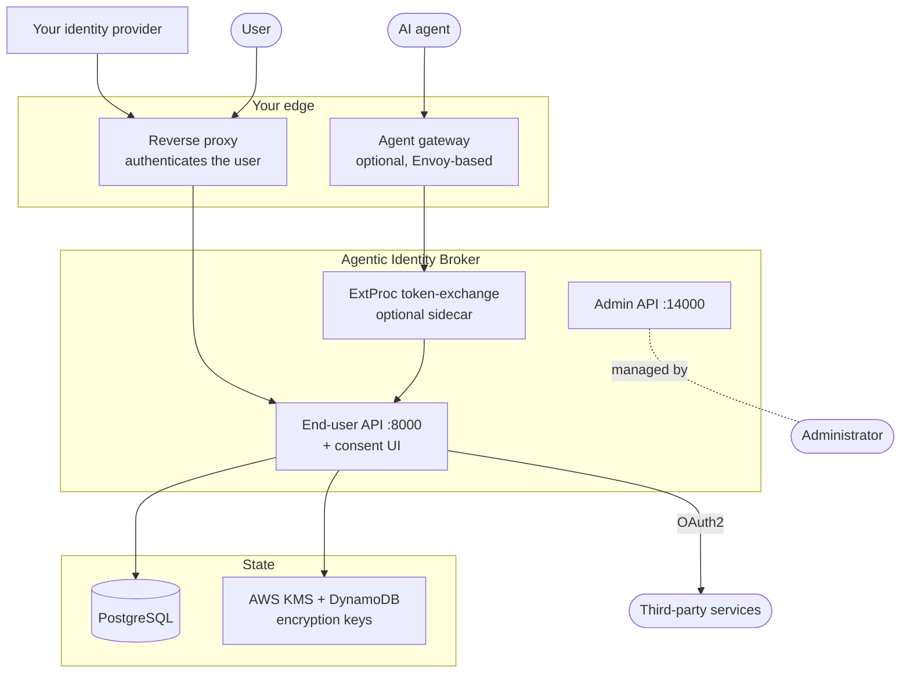
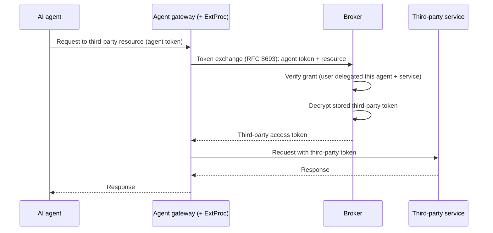

# Architecture

This page describes the broker at the level an operator needs to deploy and reason about it:
the moving parts, the network surfaces, and how a request flows. It deliberately avoids
internal code structure.

## System context

The broker is one component in a larger picture. It relies on an authenticating reverse
proxy in front of it and, optionally, an agent gateway that performs token exchange.

## Components

### The broker service

A single Go service that exposes two independent HTTP ports (see [dual-port topology](#dual-port-topology)).
It handles consent management, third-party OAuth2 sessions, the OAuth2 authorization-server
surface, and token exchange. It also serves the **consent UI**, a React single-page
application, at `/consent` on the end-user port.

### The consent UI

A browser application where users review what an agent is asking for and grant, adjust, or
revoke access. It talks only to the end-user API. Users typically reach it in two ways: on
their own to manage existing delegations, or by redirect in the middle of an agent's
authorization flow when consent is required.

### The ExtProc token-exchange sidecar (optional)

A standalone gRPC service implementing Envoy's External Processor protocol. Deployed beside
an Envoy-based agent gateway, it transparently swaps an agent's bearer token for the correct
third-party token on each request, caches results in memory, and can enforce an
[OPA](https://www.openpolicyagent.org/) policy on the proxied call. See
[token exchange at the gateway](/docs/guides/token-exchange-gateway).

### State

- **PostgreSQL** stores agents, services, permission sets, grants, and encrypted third-party
  sessions. An in-memory backend exists for evaluation and tests.
- **Encryption keys** live in AWS KMS (a customer-managed key) with a DynamoDB table caching
  intermediate keys. In development, a single raw key replaces KMS. See
  [encryption at rest](/docs/concepts/encryption).

## Dual-port topology

The broker separates two audiences onto two ports so they can be exposed, secured, and scaled
independently.

| Port | Surface | Audience | Typical exposure |
|---|---|---|---|
| **8000** | End-user API + consent UI + OAuth2 endpoints | Users and agents | Public, behind the authenticating proxy |
| **14000** | Admin API | Administrators and automation | Internal only, behind stricter access control |

The end-user port hosts:

- `/api/me`, `/api/consent/*` — the consent surface used by the UI.
- `/api/third-party/*` — starting and managing third-party OAuth2 sessions.
- `/oauth2/authorize`, `/oauth2/token`, `/oauth2/jwks.json`,
  `/.well-known/oauth-authorization-server` — the [OAuth2 authorization-server](/docs/concepts/oauth2-server-modes)
  surface.

The admin port hosts CRUD for agents, third-party services, and permission sets, plus
per-agent client credentials and signing keys. Administrative privilege is enforced by your
proxy before requests reach this port.

See the [API reference](/docs/reference/api) for the full contracts.

## Authentication is delegated

The broker does not authenticate users. A trusted reverse proxy — oauth2-proxy, an nginx
`auth_request`, an API gateway, or a service mesh — authenticates the request and injects the
user's identity in a header (`X-Remote-User` by default, configurable). The broker trusts
that header only from a trusted source.

This is a deliberate boundary: keep using your existing identity provider for human login,
and let the broker focus on delegation, consent, and least privilege. An optional JWT
pre-authentication mode lets the broker verify a signed JWT header and extract a richer
profile. See [configure authentication](/docs/guides/configure-authentication).

## How a delegated request flows

A representative end-to-end path, from an agent calling a third-party API through a gateway:

If the user has not yet delegated the required access, the flow instead routes the user to
the consent UI first; once they grant it, the original flow resumes. The
[delegation and consent](/docs/concepts/delegation-and-consent) page covers that path in
detail.

## Deployment shape

The broker ships as containers and is designed to run on Kubernetes, though it runs anywhere
containers do. A typical production deployment includes:

- The broker service (multiple replicas), fronted by the authenticating proxy.
- A separate one-shot migration job image that applies database schema changes with a
  least-privilege database user.
- PostgreSQL, provisioned however you prefer (external, or an operator-managed cluster).
- For encryption, a KMS key and DynamoDB table, with pods authenticating via IRSA on AWS.
- Optionally, the ExtProc sidecar alongside your agent gateway.

See [deploy on Kubernetes](/docs/guides/deploy-on-kubernetes) and the
[deployment checklist](/docs/operations/deployment-checklist) for the operational detail.
