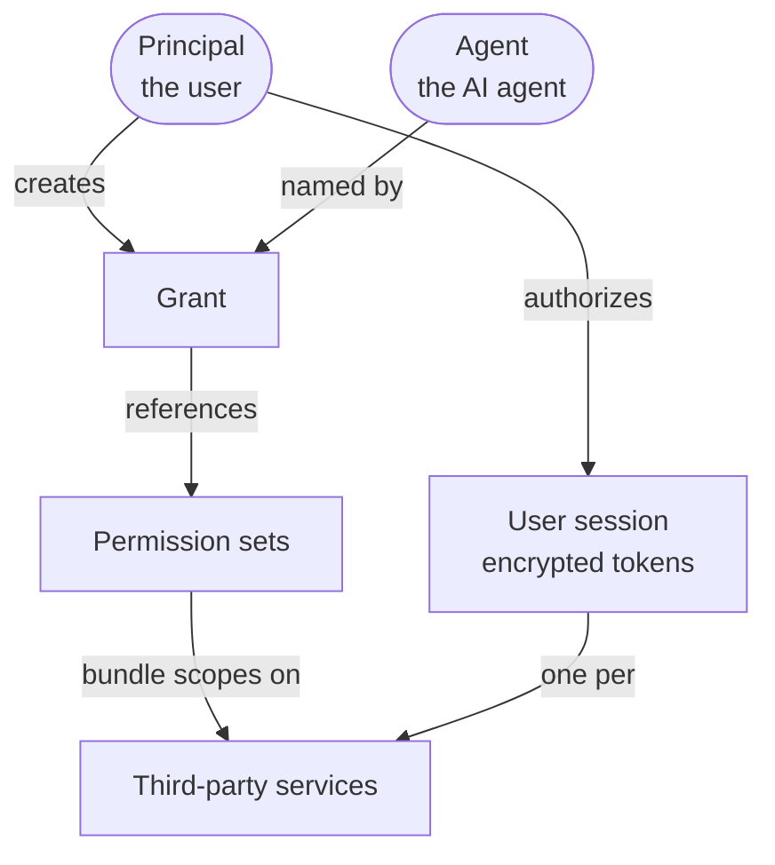
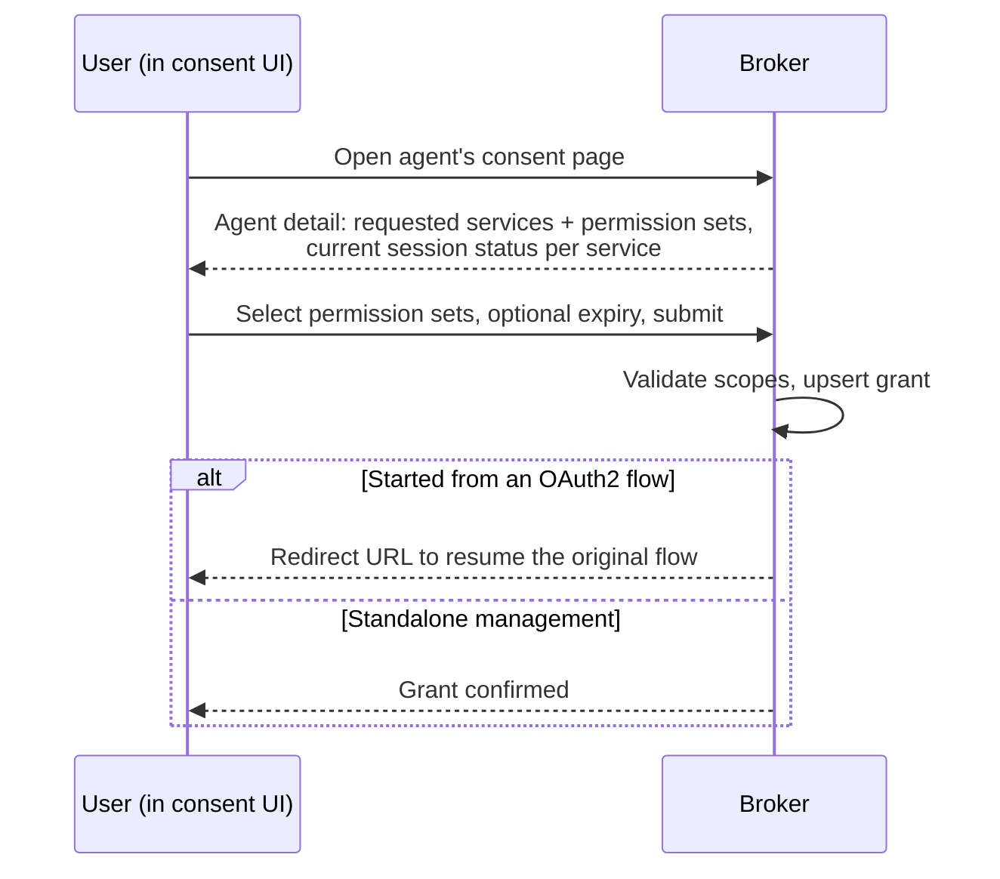

# Delegation and consent

This is the core model. Everything else in the broker exists to create, honor, and revoke the
relationship described here: **a user allowing an agent to use specific permissions on
specific services**.

## The objects

### Principal

The authenticated end user. The broker does not authenticate users itself — a trusted proxy
does, and passes the principal identifier (an email, username, or opaque ID) in a header. A
principal is the subject of every grant and every third-party session.

### Agent

An AI agent registered in the broker. Each agent has a system-generated UUID that serves as
its canonical identifier (and its OAuth2 `client_id` on the authorization endpoint), a display
name, a description, and optional governance and documentation URLs shown to users at consent
time. An agent declares which services and permission sets it needs, and whether each is
**mandatory** or **optional**.

Agents can also identify themselves by an HTTPS URL — a **Client ID Metadata Document (CIMD)**
— which the broker fetches and validates to display trustworthy metadata on the consent
screen. See [OAuth2 server modes](/docs/concepts/oauth2-server-modes#client-identity-and-cimd).

### Third-party service

An external OAuth2 provider the broker integrates with — GitHub, Google, Databricks, an
internal API. A service definition holds the provider's client ID and (encrypted) client
secret, its issuer and endpoints (discovered or explicit), the scopes it offers, and
optionally the resource URIs used to route [token exchange](/docs/concepts/token-exchange).
Administrators register services through the [admin API](/docs/guides/manage-agents-and-services).

### Permission set

An administrator-defined, human-readable bundle of scopes spanning one or more services — for
example, "Read repositories" mapping to a set of GitHub scopes. Permission sets are the unit
users actually consent to, so consent is expressed in business terms rather than raw provider
scopes. An agent references permission sets as mandatory or optional.

### Grant

The record of a principal delegating permission sets to an agent. Key properties:

- **At most one active grant per user and agent.** Updating a grant replaces its contents
  (upsert), so there is always a single, current answer to "what has this user allowed this
  agent to do?"
- **Optional expiry.** A grant can carry a `valid_until` timestamp; omit it for an indefinite
  grant. Expired grants stop being honored automatically.
- **Revocable at any time.** The user can withdraw specific permission sets or revoke the
  grant entirely.

### User session

An authenticated OAuth2 session between a principal and **one** third-party service. It holds
the encrypted access and refresh tokens, their expiry, and the granted scopes. There is
exactly one session per user and service, shared across every agent the user has delegated
that service to. Terminating a session deletes the tokens and, by design, cuts off every
agent that depended on it — the broker warns the user which agents are affected first.

## Mandatory vs optional requirements

An agent rarely needs everything at once. Each service or permission set an agent declares is
either:

- **Mandatory** — the agent cannot function without it. An authorization flow is blocked
  until the user has satisfied it (an active, non-expired session with sufficient scopes).
- **Optional** — the agent uses it if available and degrades gracefully if not. The flow
  proceeds regardless; the consent UI marks these distinctly.

This lets an agent express "I must have repository read access, and I can *also* use calendar
access if you grant it," and lets the broker enforce that distinction at authorization time.

## Creating a delegation

The consent flow is where a user turns a request for access into a grant.

1. The user opens the agent's consent page (on their own, or by redirect during an agent's
   authorization flow).
2. The broker returns the agent's requested services and permission sets, marked mandatory or
   optional, along with the user's current session status for each service.
3. The user selects the permission sets to grant, optionally sets an expiry, and submits.
4. The broker validates and stores the grant. If the flow began as an OAuth2 authorization
   request, the response carries a redirect URL to resume it; otherwise the grant is
   confirmed on its own.

When the consent flow is entered mid-authorization, its context — which agent, which user,
the original request — is sealed server-side in a short-lived encrypted token, so the consent
screen can never be spoofed with attacker-supplied parameters.

If a mandatory service has no session yet, the user is first sent through that service's
[third-party authorization flow](/docs/concepts/architecture#how-a-delegated-request-flows)
to establish one; the resulting tokens are stored encrypted before the delegation completes.

## Using a delegation

Once a grant and the backing sessions exist, an agent's request for a third-party resource is
honored through [token exchange](/docs/concepts/token-exchange): the broker checks that the
principal has an active grant covering that agent and service, then returns the correct
third-party token. The agent never holds the provider credential, and every exchange is tied
to a specific user, agent, and resource.

## Revoking a delegation

Users stay in control through two independent levers:

- **Revoke a grant** — withdraw some or all permission sets from an agent. Empty the grant to
  remove the agent's access entirely.
- **Terminate a session** — delete the stored tokens for a third-party service. This affects
  every agent that relied on that session; the broker lists those agents before it proceeds.

Administrators can also delete an agent, which cascades to remove its grants, or delete a
service (blocked while grants still reference it, to prevent dangling delegations).

## Related

- [OAuth2 server modes](/docs/concepts/oauth2-server-modes) — how authorization requests are
  handled.
- [Token exchange](/docs/concepts/token-exchange) — how a grant becomes a usable token.
- [Manage agents and services](/docs/guides/manage-agents-and-services) — the administrator
  workflow.
- [Glossary](/docs/concepts/glossary) — precise definitions of every term above.
