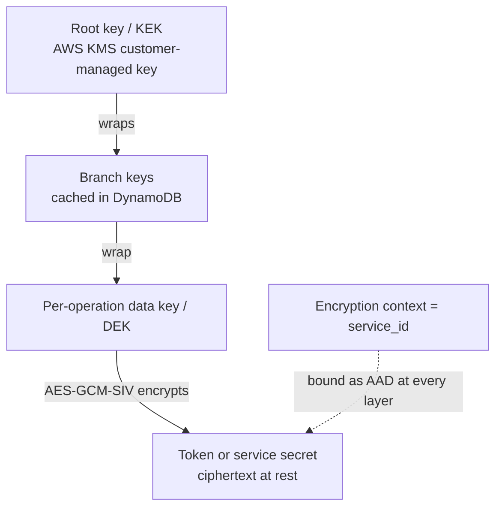

# Encryption at rest

The broker's value depends on it holding third-party tokens and provider secrets that agents
never see. That only holds if those values are unreadable at rest. The broker seals every
third-party access and refresh token, and every service `client_secret`, with **envelope
encryption**, and it binds each ciphertext to the service it belongs to so it cannot be
reused elsewhere.

Encryption is **mandatory**. The broker refuses to start if no encryption backend is
configured — there is no plaintext mode and no fallback. This page explains the model; for
setup, see [configure encryption](/docs/guides/configure-encryption).

## What is protected, and why it matters

Two kinds of sensitive material live in the broker's storage:

- **Third-party tokens** — the access and refresh tokens the broker obtains when a user
  authorizes a service. These are the credentials agents borrow at request time through
  [token exchange](/docs/concepts/token-exchange), so a leak of the datastore would otherwise
  expose live access to every connected provider.
- **Service secrets** — the `client_secret` of each registered third-party service.

Both are encrypted before they reach storage, and both are always **redacted** in API
responses: a service secret reads back as `REDACTED`, never as its value. Encryption at rest
and redaction on read together mean the plaintext exists only transiently, inside the broker,
at the moment it is used.

## Envelope encryption, plainly

Encrypting a large or long-lived secret directly with one master key is fragile: the master
key sees every plaintext, and rotating it means re-encrypting everything. Envelope encryption
avoids that with a layered approach.

- For each encryption operation the broker generates a fresh **data key (DEK)** and uses it to
  encrypt that one value with authenticated encryption (AES-GCM-SIV, which protects both
  confidentiality and integrity).
- The DEK is then **wrapped** — encrypted — by a higher-level key, and in production that key
  is itself wrapped up to a **root key (KEK)** held in a key-management service.
- The stored result is a self-contained envelope: the wrapped DEK travels alongside the
  ciphertext. To read the value, the broker unwraps the DEK through the key hierarchy, then
  uses it to decrypt.

Because every operation gets its own DEK, no single data key protects more than one value, and
the root key never touches the plaintext directly.

## Two backends: production and development

Exactly one backend is configured, and the difference is only where the top of the key
hierarchy lives.

| | Production | Development |
|---|---|---|
| Root key | AWS KMS customer-managed key (an ARN) | A single raw base64-encoded AES-256 key |
| Intermediate keys | DynamoDB-cached **branch keys** (hierarchical keyring) | None |
| Why | HSM-backed root key, audit logging, IAM control, fewer KMS calls via branch-key caching | No cloud dependency; fast local startup for development and CI |
| Configuration | `encryption.aws_kms.key_arn` + branch-key table | `encryption.memory.raw_key` |

In production the **hierarchical keyring** sits between the KMS root key and the per-operation
DEKs: branch keys are cached in a DynamoDB table so the broker does not call KMS for every
encryption, which is what keeps token operations fast at volume. The development backend
replaces all of that with one AES-256 key you supply directly — appropriate for local work and
testing, and never for production, where the key would be visible in the process environment.

:::warning
The memory backend keeps its key in the process environment and provides no HSM protection,
rotation, or centralized audit. Use AWS KMS for any environment that holds real credentials.
:::

## Encryption context binds ciphertext to its service

Layered keys keep the plaintext secret. **Encryption context** keeps a decrypted value from
being used in the wrong place. Each ciphertext is bound to an encryption context — the
`service_id` it belongs to — supplied as additional authenticated data (AAD) at every layer of
the envelope.

The binding is enforced on decryption: the broker must present the same `service_id` to
decrypt that it used to encrypt. A token encrypted for service A therefore **cannot** be
decrypted in the context of service B, even by the same broker with the same keys — the
context mismatch fails the operation. This turns service isolation into a cryptographic
property rather than an application check: even a bug that fetched the wrong ciphertext could
not surface a usable token for a different service.

## Fail-closed by design

The broker treats encryption as a hard boundary:

- **No plaintext fallback.** If encryption or decryption fails — a wrong context, a key that
  cannot be reached, a corrupted envelope — the operation returns an error. The broker never
  degrades to storing or returning plaintext.
- **Mandatory at startup.** With no encryption backend configured, the broker does not start,
  so a deployment can never silently run without protection.
- **Redacted on read.** Secrets are returned as `REDACTED` through the API, so the plaintext is
  never exposed even to an authorized administrator reading a service back.

## Related

- [Configure encryption](/docs/guides/configure-encryption) — set up the AWS KMS or memory
  backend.
- [Token exchange](/docs/concepts/token-exchange) — where the decrypted third-party tokens are
  put to use.
- [Delegation and consent](/docs/concepts/delegation-and-consent) — the sessions whose tokens
  this encryption protects.
