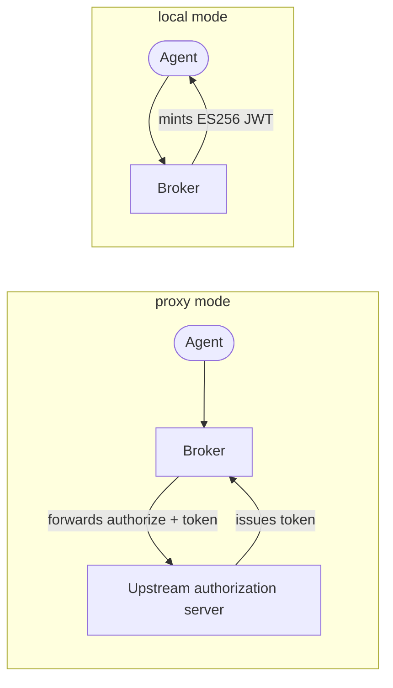

# OAuth2 server modes

The broker exposes a standard OAuth2 **authorization-server surface** so that agents obtain
access through the same protocol your other clients already use. What sits behind that
surface is a choice: the broker can hand authorization off to an authorization server you
already run, mint its own tokens, or do both. This page explains the three modes, why they
exist, and how to pick one. For the step-by-step setup, see
[operate the OAuth2 server modes](/docs/guides/operate-oauth2-server-modes).

The broker runs in exactly one mode for its lifetime, selected by
`oauth2_authorization_server.mode`.

## The public OAuth2 surface

Every mode serves the same four public endpoints on the end-user port (8000). What differs
is only what happens behind them.

| Endpoint | Purpose |
|---|---|
| `GET /oauth2/authorize` | RFC 6749 authorization endpoint — where an agent's authorization request begins. |
| `POST /oauth2/token` | Token endpoint — authorization-code and client-credentials grants, plus [token exchange](/docs/concepts/token-exchange). |
| `GET /oauth2/jwks.json` | The public JSON Web Key Set used to verify tokens the broker vouches for. |
| `GET /.well-known/oauth-authorization-server` | RFC 8414 metadata describing the endpoints, grant types, and PKCE method above. |

Two rules hold in every mode, because they protect the flow regardless of who ultimately
issues the token:

- **PKCE with `S256` is always required.** The authorization endpoint accepts only the
  `S256` code-challenge method; the weaker `plain` method is not offered.
- **`client_id` on `/oauth2/authorize` is the agent's UUID** — the broker's internal
  identifier for the agent — not an upstream OAuth2 client id. The broker resolves the agent
  from that UUID and decides how to handle the request from there.

## The three modes

### Proxy

In `proxy` mode — the default — the broker forwards `/oauth2/authorize` and `/oauth2/token`
to an upstream authorization server you configure, while still enforcing consent through the
grant system. The broker does not mint tokens; the upstream does. The broker continues to
serve its own RFC 8414 metadata and a JWKS endpoint that **republishes the upstream public
keys**, so verifiers can trust one consistent key surface fronted by the broker.

Because the broker depends on the upstream in this mode, it resolves upstream metadata at
startup and fails to start if that discovery fails. If the upstream keys later become
unreachable, the broker fails closed rather than serving stale trust: `/oauth2/jwks.json`
returns `503` and verification-dependent flows reject requests until the upstream recovers.

### Local

In `local` mode the broker is a standalone OAuth2 authorization server. It mints its own JWT
access tokens signed with managed **ES256** keys, and its JWKS and metadata expose only those
broker-managed keys. Local mode supports two grants:

- **`client_credentials`** — an agent authenticates with broker-issued credentials
  (`client_id` = the agent UUID, a `brk_sec_…` secret) and receives a broker-signed token.
- **`authorization_code` with PKCE** — the interactive flow for agents acting on behalf of a
  user.

Signing keys are rotatable and published to the JWKS with a grace period, so verifiers pick
up a new key before it starts signing. This mode makes the broker the authority for agent
tokens end to end, with no external authorization server in the path.

### Hybrid

In `hybrid` mode the broker runs both strategies at once and dispatches **per agent**, based
on how each agent is registered:

- An agent registered with an upstream client id is treated as a proxy client — its requests
  are forwarded upstream.
- An agent registered without one — either a plain local agent or one identifying itself by
  [CIMD](#client-identity-and-cimd) — has its tokens issued locally.

Hybrid lets a single deployment serve a mixed fleet during a migration, or permanently when
some agents belong to an existing upstream and others are broker-native. Both the upstream
configuration and local issuance are active, and the metadata and JWKS expose the verification
surface for both.

### Comparison

| Mode | Who issues tokens | Choose it when |
|---|---|---|
| `proxy` (default) | Your upstream authorization server; the broker forwards requests and republishes upstream keys | You already run a corporate authorization server for agents and want the broker to add consent and delegation without becoming a token issuer. |
| `local` | The broker itself, minting ES256-signed JWT access tokens from managed keys | You have no authorization server for agents, or you want the broker to be the single authority for agent tokens. |
| `hybrid` | Both, dispatched per agent based on how it is registered | You have a mixed fleet — some agents backed by an upstream client, others issued locally (plain or CIMD). |

## Client identity and CIMD

How an agent identifies itself at the authorization endpoint shapes what the broker can tell
a user at consent time. There are two forms of `client_id`:

- **An opaque UUID.** The default. The `client_id` is the agent's internal identifier — a
  UUID minted when an administrator registered the agent. It carries no metadata; everything
  the broker knows about the agent comes from that registration.
- **An HTTPS URL to a Client ID Metadata Document (CIMD).** When CIMD is enabled, an agent
  may present an HTTPS URL as its `client_id`. The broker fetches and validates a JSON
  metadata document from that URL and shows its details — name, description, governance and
  documentation links — on the consent screen.

CIMD adds two things a bare UUID cannot:

- **Self-describing agents.** An agent can be onboarded by URL rather than pre-registered by
  hand, and the broker still has trustworthy metadata to present to the user deciding whether
  to delegate.
- **An SSRF-hardened fetch.** The broker only retrieves the document through a fetch that is
  constrained against server-side request forgery — a configurable blocklist prevents the
  broker from being coerced into reaching internal addresses — so accepting a URL as identity
  does not become a request-forgery vector.

CIMD applies in `local` and `hybrid` modes, where the broker issues the token and therefore
owns the consent experience. See [manage agents and services](/docs/guides/manage-agents-and-services)
for how agents are registered either way.

## Where token issuance meets delegation

Server modes decide *who signs the token an agent presents*. They do not, by themselves,
grant access to a third-party service — that is the job of the
[delegation and consent model](/docs/concepts/delegation-and-consent), which the broker
enforces in every mode before an authorization request proceeds. Once an agent holds a token,
a gateway turns it into a usable third-party credential through
[token exchange](/docs/concepts/token-exchange). The mode determines the shape of the agent's
token; delegation and exchange determine what that token is allowed to reach.

## Related

- [Operate the OAuth2 server modes](/docs/guides/operate-oauth2-server-modes) — configure and
  run each mode.
- [Token exchange](/docs/concepts/token-exchange) — how an agent's token becomes a
  third-party token.
- [Delegation and consent](/docs/concepts/delegation-and-consent) — the consent the broker
  enforces before any authorization request proceeds.
