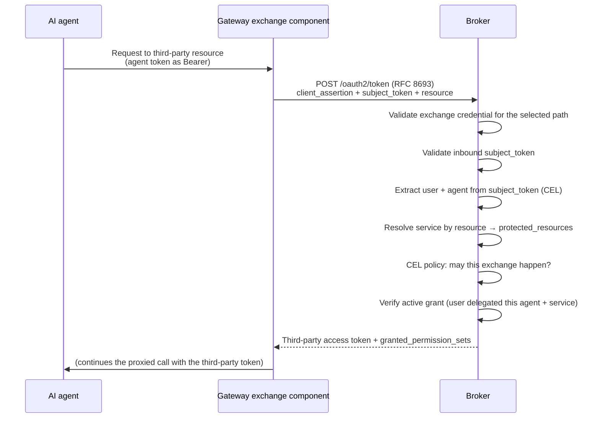

# Token exchange

The broker supports two distinct RFC 8693 flows on `POST /oauth2/token`:

| Flow | Activation | Result |
|---|---|---|
| Third-party token exchange | Standard exchange parameters, including `resource` | A provider credential held in the encrypted token vault. |
| User impersonation | One `audience` equal to `<impersonation.audience_prefix>/<canonical lower-case AgentID UUID or canonical_id>` in local mode | A locally issued broker token with an impersonated `sub`, target-derived UUID `agent_id`, and accountable `act.iss`/`act.sub`. |

This page explains third-party token exchange. User impersonation does not resolve a
third-party resource or return a provider credential. The target agent defines optional
scope policy. The routing audience does not control issued `aud`. See
[user impersonation](/docs/reference/token-exchange#user-impersonation) for its request,
response, error, and audit contract. See [Configuration](/docs/configuration) for its
operator configuration.

## Third-party token exchange

An agent that holds a third-party token has the problems that the broker prevents. The token
can have broad access. You cannot revoke it for one agent. It does not give useful audit
information. Token exchange keeps the provider credential in one controlled place. It
returns access for a request:

- The agent has only its broker-issued or upstream token. It never has a provider
  credential.
- Each exchange uses an active delegation. Revoking a grant stops future exchanges.
- Each exchange identifies a user, agent, and resource. This creates an audit record.

The broker implements this with **RFC 8693 OAuth2 Token Exchange** on its
`POST /oauth2/token` endpoint.

### Gateway exchange paths

Third-party exchange has two gateway integration paths. Select one path for each route.
Both paths call the Broker's existing `POST /oauth2/token` endpoint. Both replace an
inbound credential only after a successful exchange.

| Path | Exchange component | Broker-validated credential |
|---|---|---|
| Direct native exchange | agentgateway's `backendAuth.oauthTokenExchange` policy calls the Broker. The route has no `extProc` policy. | A fresh `privateKeyJwt` client assertion signed by agentgateway. The Broker validates its issuer, audience, and signature against the dedicated HTTPS JWKS. |
| ExtProc exchange | An `extProc` policy sends the request to the `extproc-token-exchange` sidecar. Existing ExtProc routes stay unchanged. | The sidecar's upstream-issued access token, sent as `client_assertion`. The Broker validates it against the upstream issuer. |

In both paths, the Broker separately validates the inbound subject JWT against the
configured upstream issuer and expected audience. It then applies resource, delegation,
and authorization controls.

Do not configure `extProc` and `backendAuth.oauthTokenExchange` on the same route. A
Broker instance has one client-assertion trust anchor. The direct and ExtProc
client-assertion credentials usually have different issuers. Use a separate Broker instance
for each issuer, unless the credentials have the same issuer.

If the Broker rejects or cannot complete an exchange, neither path forwards the inbound
credential or the request to the protected backend.

### The actors

An exchange involves these roles:

- **The exchange component** sends the token request for the agent. On a direct route,
  agentgateway sends a signed `privateKeyJwt` client assertion. On an ExtProc route, the
  sidecar sends its upstream-issued access token as `client_assertion`. The Broker
  validates the credential for the selected path. The credential subject identifies the
  gateway in audit data.
- **The subject token** is the agent token in `subject_token`. The broker uses CEL
  expressions to get the **user** and **agent** identities. The default claims are `sub`
  and `azp`. Together, they identify the delegation.
- **The resource** is the target in `resource`. The broker normalizes it and compares it to
  third-party-service `protected_resources`. This identifies the provider token to return.
- **The broker** validates the subject token. It makes sure that the user has an active
  grant for the agent and service. It retrieves and refreshes the stored third-party token.
  It then returns the token.

`subject_token_type` must be `urn:ietf:params:oauth:token-type:access_token`. This is the
only accepted value.

### How an exchange flows

The response contains the third-party `access_token`, `token_type`, and `issued_token_type`.
It also contains the `granted_permission_sets` used for the exchange. The caller can see
the delegated access.

### Broker and ExtProc policy gates

Every exchange has a Broker CEL policy gate. The token endpoint evaluates a Common
Expression Language policy with the exchange credential claims and RFC 8693 request
fields. By default, the expression is `true`. You can restrict eligible gateways, agents,
and resources.

An ExtProc exchange can also use an optional Open Policy Agent gate. It evaluates the
proxied request and relevant MCP tool calls. It allows or denies the request. This gate is
disabled by default. A direct native route has no `extProc` policy and no ExtProc OPA gate.

For an ExtProc route, both gates form a fail-closed AND condition. ExtProc OPA can restrict
a call that Broker CEL allowed. Broker CEL can reject an exchange even when OPA allows the
downstream call. Neither gate can grant access that the other rejected.

For either path, a Broker rejection returns an error to the agent. The gateway does not
forward the original agent token or the request to the protected backend.

## Related

- [Direct native token exchange at the gateway](/docs/guides/token-exchange-gateway-direct)
  — configure an ExtProc-free route.
- [ExtProc token exchange at the gateway](/docs/guides/token-exchange-gateway) — deploy the
  existing sidecar path.
- [OAuth2 server modes](/docs/concepts/oauth2-server-modes) — how the agent's subject token is
  issued in the first place.
- [Delegation and consent](/docs/concepts/delegation-and-consent) — the grant the broker
  verifies during every exchange.
