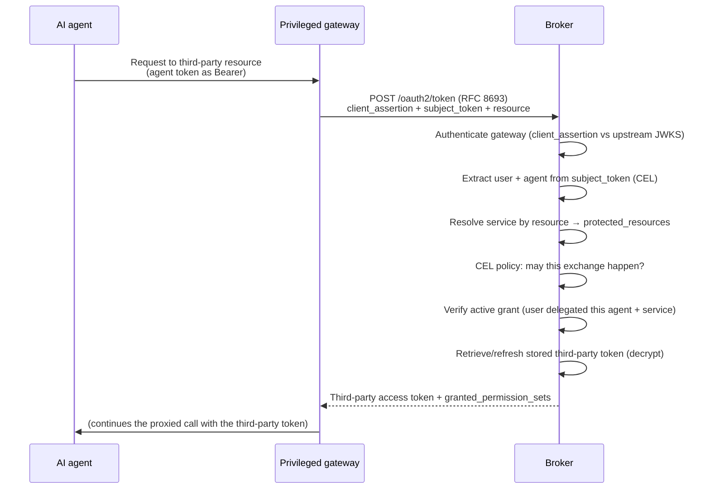

# Token exchange

The broker supports two distinct RFC 8693 flows on `POST /oauth2/token`:

| Flow | Activation | Result |
|---|---|---|
| Third-party token exchange | Standard exchange parameters, including `resource` | A provider credential held in the encrypted token vault. |
| User impersonation | One `audience` equal to `<impersonation.audience_prefix>/<canonical lower-case AgentID UUID or canonical_id>` in local mode | A locally issued broker token with an impersonated `sub`, target-derived UUID `agent_id`, and accountable `act.iss`/`act.sub`. |

This page explains third-party token exchange. User impersonation neither resolves a third-party
resource nor returns a provider credential; its target agent owns optional scope policy and its
routing audience never controls issued `aud`. For its complete request, response, error, and
audit contract, see [user impersonation](/docs/reference/token-exchange#user-impersonation).
For its operator configuration, see [Configuration](/docs/configuration).

## Third-party token exchange

If an agent held a third-party token directly, every problem the broker exists to prevent
would return: the token would be over-broad, hard to revoke per agent, and invisible to
audit. Token exchange keeps the provider credential in one governed place and issues access
per request:

- The agent holds only its own broker-issued or upstream token — never a provider credential.
- Each exchange is checked against a live delegation, so revoking a grant immediately stops
  future exchanges.
- Every exchange names a specific user, agent, and resource, which is exactly what an audit
  trail needs.

The broker implements this with **RFC 8693 OAuth2 Token Exchange** on its
`POST /oauth2/token` endpoint.

### The actors

An exchange involves four parties, and each answers a specific question.

- **The privileged gateway** performs the exchange on the agent's behalf. It authenticates to
  the broker with a signed `client_assertion` JWT (validated against the upstream JWKS), which
  is what makes it *privileged* — only a trusted gateway can ask the broker to unwrap stored
  credentials. The assertion's subject also identifies the gateway for audit.
- **The subject token** is the agent's own token, passed as `subject_token`. The broker reads
  two identities out of it using configurable CEL expressions: the **user** (default claim
  `sub`) and the **agent** (default claim `azp`). Together they name the delegation to check.
- **The resource** is the target the agent wants to call, passed as `resource`. The broker
  normalizes it and matches it against the `protected_resources` registered on a third-party
  service, which is how it decides *which* provider token to return.
- **The broker** verifies the user has an active grant for that agent and service, retrieves
  and refreshes the stored third-party token, and returns it.

`subject_token_type` **must** be `urn:ietf:params:oauth:token-type:access_token`; it is the
only accepted value.

### How an exchange flows

The response carries the third-party `access_token` along with its `token_type`,
`issued_token_type`, and the `granted_permission_sets` the exchange honored — so the caller
can see exactly what access was delegated.

### Two policy gates, composed as fail-closed AND

An exchange can be governed at two independent points, and both must allow the request for it
to succeed:

- **Broker CEL — may this exchange happen?** At the token endpoint, a Common Expression
  Language policy evaluates the gateway's assertion claims and the RFC 8693 request fields.
  It answers whether this gateway is permitted to exchange for this resource at all. By
  default the expression evaluates to `true`, but you can tighten it to restrict which
  gateways, agents, or resources are eligible.
- **ExtProc OPA — may this proxied call proceed?** When you run the
  [ExtProc gateway sidecar](/docs/guides/token-exchange-gateway), an optional Open Policy
  Agent gate can inspect the actual proxied request (including, where relevant, an MCP tool
  call) and allow or deny it. This gate is disabled by default.

The two gates **compose as a fail-closed AND**. ExtProc OPA can only further restrict a call
that broker CEL has already authorized, and broker CEL can still deny an exchange even when
OPA would allow the downstream call. Neither gate can loosen the other, and any exchange
failure returns an error rather than forwarding the agent's original token.

## Related

- [Token exchange reference](/docs/reference/token-exchange) — the request and response
  fields in detail.
- [Token exchange at the gateway](/docs/guides/token-exchange-gateway) — deploy the sidecar
  that performs exchange transparently.
- [OAuth2 server modes](/docs/concepts/oauth2-server-modes) — how the agent's subject token is
  issued in the first place.
- [Delegation and consent](/docs/concepts/delegation-and-consent) — the grant the broker
  verifies during every exchange.
