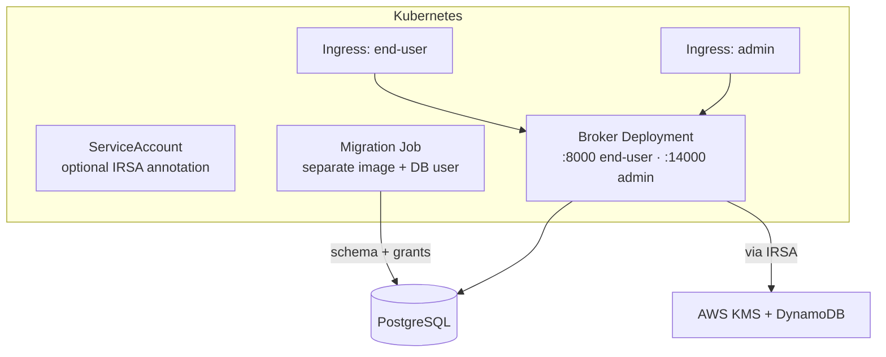

# Deploy on Kubernetes

The broker ships as containers and runs on any Kubernetes cluster through the
Helm chart in `charts/agentic-identity-broker`. This guide takes you from a
throwaway evaluation install to a production layout with external PostgreSQL,
KMS-backed encryption, and least-privilege AWS access.

The chart deploys the broker as a Deployment exposing two ports — the end-user
API on `8000` and the admin API on `14000` — plus the supporting resources for
storage, migrations, ingress, and (on AWS) encryption.

## Prerequisites

- A Kubernetes cluster, version 1.25 or later.
- `kubectl`, configured for that cluster.
- Helm 3.x.

For a production install you also need:

- A PostgreSQL instance, version 12 or later, reachable from the cluster — or
  the Zalando PostgreSQL Operator to provision one.
- Encryption infrastructure. Encryption at rest is mandatory; on AWS this is a
  KMS customer-managed key and a DynamoDB branch-key table. See
  [configure encryption at rest](/docs/guides/configure-encryption) for
  provisioning and the deep dive.

## What the chart deploys



The chart's main options:

| Option | Values key | Purpose |
|---|---|---|
| **Storage** | `storage.type` | `memory` (evaluation) or `postgres` (production). |
| **External PostgreSQL** | `postgresql.external.*` | Point at an existing database with separate migration and broker credentials. |
| **Operator-managed PostgreSQL** | `postgresql.operator.*` | Provision a cluster with the Zalando PostgreSQL Operator, which creates the users and Secrets for you. |
| **Migration Job** | `migration.*` | A one-shot Job, run before the broker, that applies schema changes with a least-privilege database user. |
| **End-user Ingress** | `ingress.enduser.*` | Expose port `8000` publicly, behind your authenticating proxy. |
| **Admin Ingress** | `ingress.admin.*` | Expose port `14000` on a restricted path. |
| **Service account / IRSA** | `serviceAccount.*` | Bind an AWS IAM role for KMS and DynamoDB access. |
| **Encryption** | `broker.encryption.*`, `broker.extraConfig.encryption.*` | The mandatory encryption backend. |

The chart applies restricted Pod Security defaults out of the box: non-root user,
read-only root filesystem, no privilege escalation, all Linux capabilities
dropped.

## Evaluate with in-memory storage

For a quick look, run the broker with in-memory storage and the in-memory
encryption backend. Because encryption is mandatory, supply an encryption key and
a JWE signing key even for evaluation — both are base64-encoded 32-byte keys:

```bash
helm install broker ./charts/agentic-identity-broker \
  --set-string broker.extraConfig.encryption.memory.raw_key="$(openssl rand -base64 32)" \
  --set broker.thirdPartyOauth2.jweSigningKey="$(openssl rand -base64 32)"
```

Check the pod and reach the health endpoint:

```bash
kubectl get pods -l app.kubernetes.io/name=agentic-identity-broker
kubectl port-forward svc/broker-agentic-identity-broker 8000:8000
curl http://localhost:8000/health
```

:::warning
In-memory storage loses all data — agents, services, grants, sessions — when a
pod restarts, and the evaluation key lives in a ConfigMap. Use this mode only to
try the broker out, never for real delegations.
:::

## Deploy for production

A production install uses persistent PostgreSQL, KMS-backed encryption, and
IRSA for AWS access. Build up a values file section by section, then install
once at the end.

### Provision PostgreSQL with two database users

Run the broker against a persistent database with two roles, so the running
broker never holds schema-modification rights:

- A **migration user** with schema privileges (`CREATE`, `ALTER`, `DROP`), used
  only by the migration Job.
- A **broker user** with data privileges only (`SELECT`, `INSERT`, `UPDATE`,
  `DELETE`), used by the running broker.

Create them in your database:

```sql
-- Migration user: schema changes
CREATE USER "broker-migration" WITH PASSWORD 'REPLACE_ME';
GRANT ALL PRIVILEGES ON DATABASE broker TO "broker-migration";
GRANT ALL PRIVILEGES ON SCHEMA public TO "broker-migration";

-- Broker user: data access only
CREATE USER broker WITH PASSWORD 'REPLACE_ME';
GRANT CONNECT ON DATABASE broker TO broker;
GRANT USAGE ON SCHEMA public TO broker;
GRANT SELECT, INSERT, UPDATE, DELETE ON ALL TABLES IN SCHEMA public TO broker;
GRANT SELECT, UPDATE ON ALL SEQUENCES IN SCHEMA public TO broker;
ALTER DEFAULT PRIVILEGES IN SCHEMA public
  GRANT SELECT, INSERT, UPDATE, DELETE ON TABLES TO broker;
```

Store each credential in a Kubernetes Secret:

```bash
kubectl create secret generic broker-db-migration \
  --from-literal=username=broker-migration --from-literal=password=REPLACE_ME
kubectl create secret generic broker-db \
  --from-literal=username=broker --from-literal=password=REPLACE_ME
```

If you prefer the broker to provision the database for you, enable
`postgresql.operator` instead: the Zalando PostgreSQL Operator creates the
cluster, both users, and their Secrets, and the chart wires them up.

### Wire encryption to KMS

Point the broker at your KMS key and branch-key table. Pass the encryption
block through `broker.extraConfig`, which the chart merges into the broker's
configuration:

```yaml
broker:
  extraConfig:
    encryption:
      aws_kms:
        key_arn: "arn:aws:kms:us-east-1:ACCOUNT:key/KEY-ID"
        dynamodb_table_name: "AgenticIdentityBrokerBranchKeys-prod"
        region: "us-east-1"
        branch_key_ttl: "1h"
```

The KMS key and DynamoDB table, along with the IAM role in the next step, can be
provisioned together with the project's AWS CDK stack. See
[configure encryption at rest](/docs/guides/configure-encryption#production-aws-kms-hierarchical-keyring)
for what each resource is, and the
[deployment checklist](/docs/operations/deployment-checklist) for the commands to
create them and read back the ARNs.

### Grant AWS access with IRSA

On EKS, give pods access to KMS and DynamoDB with **IAM Roles for Service
Accounts (IRSA)** rather than static AWS credentials. IRSA maps the broker's
Kubernetes service account to an IAM role through the cluster's OIDC provider;
the AWS SDK obtains and rotates temporary credentials automatically, and
CloudTrail records which pod used the keys.

At the operator level:

1. Provision an IAM role whose trust policy allows the broker's service account
   (`system:serviceaccount:<namespace>:<service-account>`) to assume it, and
   whose permissions cover the KMS key (encrypt, decrypt, generate data keys)
   and the DynamoDB branch-key table (read and write). The CDK stack creates a
   role scoped to exactly these actions on exactly these resources.
2. Tell the chart to create the service account and annotate it with that role:

   ```yaml
   serviceAccount:
     create: true
     name: broker-sa
     irsa:
       enabled: true
       role: "arn:aws:iam::ACCOUNT:role/AgenticIdentityBrokerEncryptionRole-prod"
   ```

The chart adds the IRSA annotation binding the role to the service account, so
every broker pod runs as an identity permitted to use the KMS key and the table.
For the full AWS walkthrough — OIDC provider setup, CDK deployment, and trust
policy verification — see the
[Kubernetes IRSA deployment guide](/docs/deployment/kubernetes-irsa).

### Expose the two APIs separately

The broker's two ports have different audiences, so expose them through separate
Ingress resources and restrict the admin one:

```yaml
ingress:
  enduser:
    enabled: true
    className: nginx
    hosts:
      - host: broker.example.com
        paths:
          - path: /
            pathType: Prefix
    tls:
      - secretName: broker-tls
        hosts:
          - broker.example.com
  admin:
    enabled: true
    className: nginx
    annotations:
      # Restrict the admin API to internal networks.
      nginx.ingress.kubernetes.io/whitelist-source-range: "10.0.0.0/8"
    hosts:
      - host: broker-admin.internal.example.com
        paths:
          - path: /
            pathType: Prefix
```

Put your authenticating reverse proxy in front of the end-user Ingress — the
broker does not authenticate users itself. Keep the admin API off the public
internet. See [configure authentication](/docs/guides/configure-authentication).

### Install

Combine the sections into a `values-production.yaml` (storage, encryption, IRSA,
and ingress) and add the runtime settings:

```yaml
replicaCount: 3

storage:
  type: postgres

postgresql:
  external:
    enabled: true
    host: postgres.database.svc.cluster.local
    port: 5432
    database: broker
    migrationSecretName: broker-db-migration
    brokerSecretName: broker-db

serviceAccount:
  create: true
  name: broker-sa
  irsa:
    enabled: true
    role: "arn:aws:iam::ACCOUNT:role/AgenticIdentityBrokerEncryptionRole-prod"

broker:
  thirdPartyOauth2:
    # Reference the JWE signing key from a Secret rather than inlining it.
    jweSigningKeySecret:
      name: broker-jwe
      key: signing-key
  extraConfig:
    encryption:
      aws_kms:
        key_arn: "arn:aws:kms:us-east-1:ACCOUNT:key/KEY-ID"
        dynamodb_table_name: "AgenticIdentityBrokerBranchKeys-prod"
        region: "us-east-1"

autoscaling:
  enabled: true
  minReplicas: 3
  maxReplicas: 10
podDisruptionBudget:
  enabled: true
  minAvailable: 2
```

Install into a dedicated namespace:

```bash
kubectl create namespace identity-broker
helm install broker ./charts/agentic-identity-broker \
  -n identity-broker -f values-production.yaml
```

## The migration Job

Whenever storage is PostgreSQL, the chart runs a one-shot migration Job before
the broker starts (a Helm pre-install and pre-upgrade hook). The Job:

- Uses a **separate migration image** and its **own service account**, so the
  running broker image never carries schema-migration tooling.
- Applies schema changes with the migration user, then grants the broker user
  its data-access privileges.

The broker Deployment rolls out only after the Job succeeds. Check it with:

```bash
kubectl get jobs -n identity-broker
kubectl logs job/broker-migrate -n identity-broker
```

## Health and verification

The broker serves `GET /health` on the end-user port (`8000`) — use it for both
liveness and readiness probes — and `GET /health` on the admin port (`14000`).

Confirm a deployment is healthy:

```bash
# Pods and the migration Job
kubectl get pods -l app.kubernetes.io/name=agentic-identity-broker -n identity-broker
kubectl get jobs -n identity-broker

# Broker logs — confirm the encryption backend initialized
kubectl logs deployment/broker-agentic-identity-broker -n identity-broker

# Built-in chart tests
helm test broker -n identity-broker
```

At startup the broker logs which encryption backend it initialized. A missing or
misconfigured backend makes the broker exit rather than run unprotected, which
surfaces as a pod in `CrashLoopBackOff` — check the logs for the encryption
error. The [deployment checklist](/docs/operations/deployment-checklist) has a
full post-deployment verification pass, including an encryption smoke test.

## Related

- [Configure encryption at rest](/docs/guides/configure-encryption) — the KMS key,
  DynamoDB table, and JWE signing key this guide references.
- [Configure authentication](/docs/guides/configure-authentication) — the
  reverse-proxy identity header in front of the end-user API.
- [Deployment checklist](/docs/operations/deployment-checklist) — provisioning
  and verification steps for a production rollout.
- [Configuration](/docs/configuration) — the full configuration schema behind the
  chart values.
