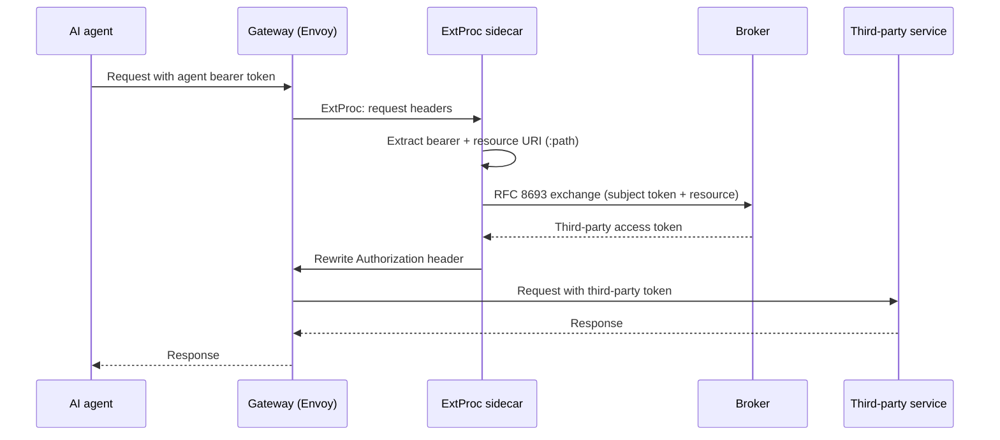

# Set up token exchange at the gateway

The ExtProc token-exchange service (`extproc-token-exchange`) is a standalone gRPC sidecar
that gives an agent gateway transparent [RFC 8693 token exchange](/docs/concepts/token-exchange).
Deployed beside an Envoy-based gateway (such as agentgateway), it intercepts each request,
swaps the agent's bearer token for the correct third-party token against the broker, and
rewrites the `Authorization` header — so the agent never holds the provider credential and
the gateway needs no exchange logic of its own.

This guide shows you how to deploy and configure the sidecar. It stays at the operator level:
what to run, what to set, and how the request flows.

## What you'll need

- An Envoy-based agent gateway that supports the External Processor (ExtProc) filter, pointed
  at the sidecar's gRPC listener.
- A reachable broker with its RFC 8693 token endpoint at `POST /oauth2/token` on the end-user
  port (8000).
- OAuth2 client credentials for the sidecar itself, issued by your upstream OAuth2 server. The
  sidecar uses them to obtain the client assertion it presents to the broker.
- The sidecar container image (`Dockerfile.extproc`). It needs **no database** — all state is
  an in-memory cache.
- Optionally, a [broker CEL policy](#the-two-gate-model) authorizing which gateways may
  perform exchange, and an OPA policy if you want a second gate on the proxied call.

## How the exchange flows

The sidecar processes each request in Envoy's request-headers phase:



1. **Intercept** the request headers from the gateway.
2. **Extract** the bearer token from the `Authorization` header and the target resource URI
   from the `:path` pseudo-header. Requests without a bearer token pass through unchanged.
3. **Exchange** the token against the broker's `/oauth2/token` endpoint, presenting the
   sidecar's client assertion and the resource URI. The broker verifies the user's grant for
   that agent and service and returns the stored third-party token.
4. **Rewrite** the `Authorization` header with `Bearer <exchanged token>` and forward.

The sidecar caches exchanged tokens in memory, keyed by the subject token and resource, and
deduplicates concurrent identical exchanges so a burst of requests triggers exactly one call
to the broker.

### Fail-closed behavior

If the exchange fails, the sidecar returns an error to the gateway and **never forwards the
original agent token** to the third party. A failed or unauthorized exchange stops the
request rather than leaking an unexchanged credential. Only tokens the broker issued for the
target resource ever reach the upstream service.

## Configure the sidecar

The sidecar uses its own configuration, separate from the broker, with the `EXTPROC_`
environment prefix. Every key maps to `EXTPROC_<SECTION>_<KEY>` (for example `grpc.port` →
`EXTPROC_GRPC_PORT`), and string values support `${VAR}` substitution for secret injection.

```yaml
grpc:
  bind: "0.0.0.0"
  port: 50051
  max_concurrent_streams: 100

oauth2:
  # The broker's RFC 8693 token endpoint (required)
  token_endpoint: "https://identity-broker.example.com/oauth2/token"
  # The upstream OAuth2 issuer the sidecar authenticates against (required)
  issuer: "https://upstream-oauth2.example.com"
  # Client credentials for the sidecar itself
  client_id: "extproc-gateway"
  client_secret: "${EXTPROC_OAUTH2_CLIENT_SECRET}"
  # Explicit client_credentials endpoint; defaults to {issuer}/oauth/token
  # client_credentials_endpoint: "https://upstream-oauth2.example.com/oauth/token"
  client_assertion_type: "id_token"
  exchange_timeout: "5s"
  tls:
    # Leave false in production; the endpoints must be https unless this is true
    allow_http: false

cache:
  default_ttl: "5m"   # TTL for a cached token when the response omits expires_in
  max_ttl: "1h"       # hard cap on how long any exchanged token is cached

log:
  level: "info"
  format: "json"
```

Point your gateway's ExtProc filter at `bind:port` (default `0.0.0.0:50051`). Key settings:

- **`oauth2.token_endpoint`** — the broker's `/oauth2/token`; where exchanges are performed.
- **`oauth2.issuer`** and **`client_id`/`client_secret`** — the sidecar obtains a client
  assertion from the upstream server's client-credentials grant and refreshes it in the
  background, so it always presents a valid assertion to the broker.
- **`oauth2.tls.allow_http`** — keep `false`. The token endpoint and issuer must use `https`
  unless you explicitly allow HTTP, which is for local development only.
- **`cache.default_ttl` / `cache.max_ttl`** — bound how long exchanged tokens are cached. The
  cached lifetime is derived from the exchange response's `expires_in`, falling back to
  `default_ttl` and capped at `max_ttl`.

Inject the client secret from the environment rather than committing it. Sensitive values are
redacted from logs.

## The two-gate model

Two independent policy gates can guard a request, and they compose as a fail-closed **AND** —
both must allow it:

| Gate | Where | Question it answers |
|---|---|---|
| Broker CEL | Broker `POST /oauth2/token` | May this gateway perform token exchange for this resource? |
| ExtProc OPA | Sidecar request path | May this proxied request or MCP tool call proceed? |

The broker's CEL policy (configured on the broker, not the sidecar) decides whether the
exchange is allowed at all. The sidecar's optional OPA policy can further restrict the
proxied call after the exchange is authorized — but it can never widen access the broker
denied. See [token exchange](/docs/concepts/token-exchange) for the broker-side CEL policy.

### Enable the OPA gate (optional)

To evaluate the proxied request (including MCP tool calls) against a Rego policy, add an
`authorization` block. Body-bearing requests are buffered and evaluated; the decision is
fail-closed — an undefined result denies.

```yaml
authorization:
  enabled: true
  policy:
    # A local Rego file or directory...
    path: "/etc/extproc/policy.rego"
    # ...or an OPA config file for bundles/discovery (mutually exclusive with path)
    # config_file: "/etc/extproc/opa-config.yaml"
    package: "aib.extproc.authz"
    decision: "result"
  default_decision: "deny"   # keep as deny for fail-closed behavior
  evaluation_timeout: 100ms
  max_body_size: 1048576     # bytes buffered for evaluation (1 MiB)
```

:::warning
Keep `default_decision: "deny"`. It is what makes the OPA gate fail-closed: if the policy is
undefined for a request, or evaluation times out, the request is denied rather than allowed
through.
:::

## Deployment notes

- **No database.** The sidecar keeps only an in-memory cache, so scale it horizontally by
  running one instance per gateway pod; each maintains its own cache.
- **Container image.** To build a release image, run `just docker-build-extproc`. It builds the required Linux artifacts for amd64 and arm64 before packaging the default Dockerfile target. To build a source-based development image instead, run:

  ```bash
  docker build --target development --file Dockerfile.extproc .
  ```

  Provide configuration by YAML file or entirely through `EXTPROC_` environment variables.
- **Placement.** Run it alongside the gateway so exchange happens at the edge, before the
  request leaves for the third-party service. See
  [architecture](/docs/concepts/architecture) for where the sidecar sits.

## Related

- [Token exchange](/docs/concepts/token-exchange) — the concept and the broker-side flow.
- [Token exchange reference](/docs/reference/token-exchange) — the RFC 8693 request and
  response contract.
- [Architecture](/docs/concepts/architecture) — the sidecar's place in the system.
