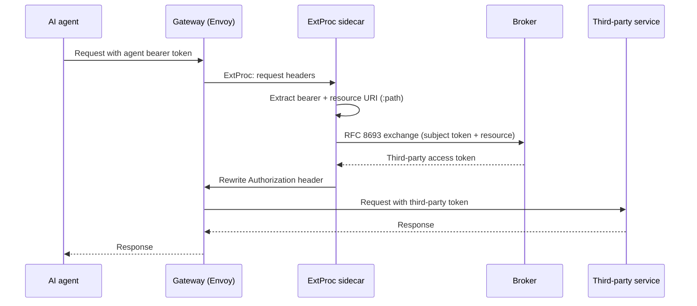

# Set up token exchange at the gateway

The ExtProc token-exchange service (`extproc-token-exchange`) is a standalone gRPC sidecar.
It gives an agent gateway transparent
[RFC 8693 token exchange](/docs/concepts/token-exchange). The sidecar runs beside an
Envoy-based gateway, such as agentgateway. It intercepts each request and exchanges the
agent bearer token for the correct third-party token. It rewrites the `Authorization`
header. The agent never holds the provider credential. The gateway does not require its
own exchange logic.

This guide explains how to deploy and configure the sidecar. It describes the required
settings and request flow.

## What you need

- An Envoy-based agent gateway with the External Processor (ExtProc) filter. Configure the
  filter to use the sidecar gRPC listener.
- A reachable broker token endpoint at `POST /oauth2/token` on end-user port 8000.
- OAuth2 client credentials for the sidecar. Your upstream OAuth2 server issues these
  credentials. The sidecar uses them to obtain a client assertion for the broker.
- The sidecar container image (`Dockerfile.extproc`). The sidecar stores state only in an
  in-memory cache.
- A broker CEL policy if you restrict gateway exchanges. You can also add an OPA policy for
  the proxied request.

## How the exchange flows

The sidecar processes each request in Envoy's request-headers phase:



1. **Intercept** the gateway request headers.
2. **Extract** the bearer token from `Authorization`. Extract the target resource URI from
   `:path`. Requests without a bearer token pass through unchanged.
3. **Exchange** the token through the broker `/oauth2/token` endpoint. Include the sidecar
   client assertion and resource URI. The broker validates the user grant for that agent and
   service. It then returns the stored third-party token.
4. **Replace** the `Authorization` header with `Bearer <exchanged token>`. Then forward the
   request.

The sidecar stores exchanged tokens in memory. Its cache key contains the subject token and
resource. It combines concurrent identical exchanges into one broker request.

### Fail-closed behavior

If exchange fails, the sidecar returns an error to the gateway. It does not forward the
original agent token to the third party. A failed or unauthorized exchange stops the
request. Only a broker-issued token for the target resource reaches the upstream service.

## Configure the sidecar

The sidecar has separate configuration from the broker. Its environment prefix is
`EXTPROC_`. Each key maps to `EXTPROC_<SECTION>_<KEY>`. For example, `grpc.port` maps to
`EXTPROC_GRPC_PORT`. String values support `${VAR}` substitution for secret injection.

```yaml
grpc:
  bind: "0.0.0.0"
  port: 50051
  max_concurrent_streams: 100

oauth2:
  # The broker's RFC 8693 token endpoint (required)
  token_endpoint: "https://identity-broker.example.com/oauth2/token"
  # The upstream OAuth2 issuer the sidecar authenticates against (required)
  issuer: "https://upstream-oauth2.example.com"
  # Client credentials for the sidecar itself
  client_id: "extproc-gateway"
  client_secret: "${EXTPROC_OAUTH2_CLIENT_SECRET}"
  # Explicit client_credentials endpoint; defaults to {issuer}/oauth/token
  # client_credentials_endpoint: "https://upstream-oauth2.example.com/oauth/token"
  client_assertion_type: "id_token"
  exchange_timeout: "5s"
  tls:
    # Leave false in production; the endpoints must be https unless this is true
    allow_http: false

cache:
  default_ttl: "5m"   # TTL for a cached token when the response omits expires_in
  max_ttl: "1h"       # hard cap on how long any exchanged token is cached

log:
  level: "info"
  format: "json"
```

Configure the gateway ExtProc filter to use `bind:port`. The default value is
`0.0.0.0:50051`. Key settings follow:

- **`oauth2.token_endpoint`** — The broker `/oauth2/token` endpoint. The sidecar sends each
  exchange to this endpoint.
- **`oauth2.issuer`**, **`client_id`**, and **`client_secret`** — The sidecar obtains a
  client assertion through the upstream client-credentials grant. It refreshes the
  assertion in the background.
- **`oauth2.tls.allow_http`** — Keep this value `false`. The token endpoint and issuer use
  `https` unless you explicitly allow HTTP for local development.
- **`cache.default_ttl` / `cache.max_ttl`** — These values limit cache lifetime. The
  sidecar derives lifetime from the exchange response `expires_in`. It uses `default_ttl`
  when the response omits that value, then limits it to `max_ttl`.

Inject the client secret through the environment. Do not commit it. The sidecar redacts
sensitive values from logs.

## The two-gate model

Two independent policy gates can guard a request. Both gates must allow the request:

| Gate | Where | Question it answers |
|---|---|---|
| Broker CEL | Broker `POST /oauth2/token` | Can this gateway exchange a token for this resource? |
| ExtProc OPA | Sidecar request path | Can this proxied request or MCP tool call continue? |

The broker CEL policy is configured on the broker. It decides whether exchange is allowed.
The optional sidecar OPA policy can restrict the proxied request after exchange. It cannot
give access that the broker denied. See
[token exchange](/docs/concepts/token-exchange) for the broker CEL policy.

### Optional OPA gate

To evaluate a proxied request, including MCP tool calls, with a Rego policy, add an
`authorization` block. The sidecar buffers and evaluates requests that contain a body. An
undefined result denies the request.

```yaml
authorization:
  enabled: true
  policy:
    # A local Rego file or directory...
    path: "/etc/extproc/policy.rego"
    # ...or an OPA config file for bundles/discovery (mutually exclusive with path)
    # config_file: "/etc/extproc/opa-config.yaml"
    package: "aib.extproc.authz"
    decision: "result"
  default_decision: "deny"   # keep as deny for fail-closed behavior
  evaluation_timeout: 100ms
  max_body_size: 1048576     # bytes buffered for evaluation (1 MiB)
```

:::warning
Keep `default_decision: "deny"`. If a policy result is undefined or evaluation times out,
the OPA gate denies the request.
:::

## Deployment notes

- **No database.** The sidecar stores only an in-memory cache. Start one sidecar instance
  for each gateway pod. Each instance has its own cache.
- **Container image.** To build a release image, use `just docker-build-extproc`. The command
  builds Linux artifacts for amd64 and arm64. Then it packages the default Dockerfile
  target. To build a source-based development image, run:

  ```bash
  docker build --target development --file Dockerfile.extproc .
  ```

  Configure the sidecar with a YAML file or `EXTPROC_` environment variables.
- **Placement.** Start the sidecar with the gateway. Token exchange then occurs at the edge,
  before the request reaches the third-party service. See
  [architecture](/docs/concepts/architecture) for the sidecar location.

## Related

- [Token exchange](/docs/concepts/token-exchange) — the concept and the broker-side flow.
- [Token exchange reference](/docs/reference/token-exchange) — the RFC 8693 request and
  response contract.
- [Architecture](/docs/concepts/architecture) — the sidecar's place in the system.
