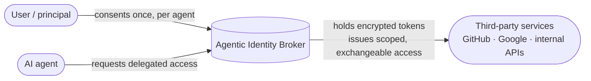

# What is the Agentic Identity Broker?

The Agentic Identity Broker is an open-source **OAuth2 delegation and consent broker** for
AI agents. It gives a human user a governed way to let an AI agent act on their behalf
against third-party services — GitHub, Google, Databricks, an internal API — scoped to
specific permissions, optionally time-limited, and revocable at any time.

The broker sits between three parties:

The user consents once, per agent and per service. The broker holds the third-party tokens
**encrypted at rest** and hands the agent only narrowly-scoped, exchangeable, auditable
access. The agent never sees the user's long-lived credentials.

## The problem

AI agents increasingly need to call real services for the people they work for: read a
repository, file a ticket, query a warehouse, send a calendar invite. Every naive way to
give an agent that access has a failure mode an IAM team will recognize:

| Approach | Why it breaks down |
|---|---|
| Hand the agent the user's OAuth token | Over-broad, can't be revoked per agent, no record of which agent did what, tokens sprawl across every agent. |
| Give each agent its own third-party client | Unmanageable at scale, no shared consent surface, provider secrets copied everywhere. |
| Static API keys or shared service accounts | No per-user delegation, no expiry, no consent, weak audit. |

Each option trades away either **least privilege**, **user consent**, **revocability**, or
**auditability** — usually several at once. As soon as more than a handful of agents act for
more than a handful of users, the token sprawl becomes an operational and security problem.

## The approach

The broker inserts a single, governed trust boundary:

- **The user consents** to a specific bundle of permissions (a *permission set*) for a
  specific agent and service, with an optional expiry.
- **The broker holds the third-party tokens**, encrypted with per-service envelope
  encryption, and refreshes them as needed.
- **Agents receive scoped access** — and at request time a gateway can exchange an agent's
  token for exactly the right third-party token using [RFC 8693 token exchange](/docs/concepts/token-exchange),
  so the agent never holds the provider credential at all.
- **Every delegation is recorded** and revocable: the user can withdraw a grant or terminate
  a third-party session, and dependent agents lose access.

The broker speaks standard OAuth2. It exposes an [authorization-server surface](/docs/concepts/oauth2-server-modes)
(RFC 6749 authorization code + PKCE, RFC 8414 metadata, a JWKS endpoint) and can either
**proxy** an existing corporate authorization server or **issue** its own tokens.

## Who it is for

- **IAM and security teams** who need to bring AI agents under the same consent, least-
  privilege, and audit disciplines they already apply to human access.
- **Platform and infrastructure operators** building or running an agent platform who need
  a credential broker their agents can integrate against — instead of every agent
  re-implementing token storage and refresh.
- **Teams adopting an agent gateway** (for example an Envoy-based gateway) that want
  transparent, policy-checked token exchange at the edge.

## What it is not

- It is **not a user identity provider**. The broker does not authenticate humans. A trusted
  reverse proxy in front of it authenticates the user and passes the identity in a header.
  Keep using Keycloak, Auth0, Okta, or your corporate IdP for human login — see
  [Why not a traditional IdP?](/docs/introduction/why-not-idp).
- It is **not a general secrets manager**. It manages OAuth2 delegations and the third-party
  tokens that result from them, not arbitrary application secrets.

## Where to go next

- **[Use cases](/docs/introduction/use-cases)** — concrete scenarios where delegated agent
  access is the hard part.
- **[Why not a traditional IdP?](/docs/introduction/why-not-idp)** — how the broker
  complements, rather than replaces, your identity provider.
- **[Concepts](/docs/concepts)** — the delegation model, architecture, server modes, token
  exchange, and encryption.
- **[Get started](/docs/get-started)** — run the full stack locally and walk a delegation
  end to end.
