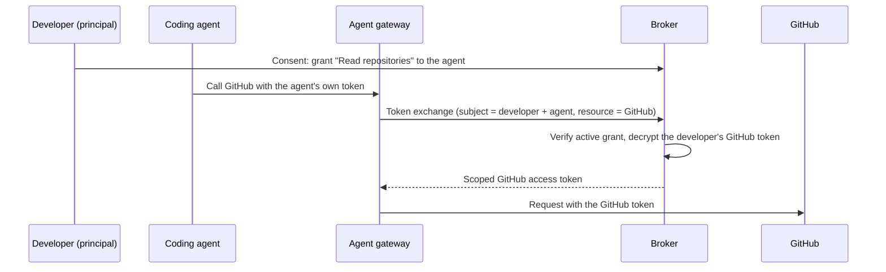

# Use cases

The broker earns its place wherever an AI agent has to call a real third-party service —
GitHub, Databricks, Google — for the person it works for, and doing that safely is the hard
part. The pattern repeats: many agents act for many users, each agent needs a narrow slice
of access, and someone has to consent, hold the tokens, and be able to revoke.

The scenarios below are the shapes that recur in practice. Each one names the identity
problem an IAM team will recognize, then shows how the broker's
[delegation model](/docs/concepts/delegation-and-consent) answers it.

## A coding agent acting for many developers

### The scenario

You run a coding agent that reviews pull requests, opens issues, and reads repositories on
GitHub. It works on behalf of hundreds of developers, and each developer expects it to see
only what they can see. The agent runs as a shared service, but its access must be scoped to
whichever developer's request it is currently handling.

### The identity challenge

The naive fix — copy each developer's GitHub token into the agent — creates token sprawl:
long-lived, over-broad credentials duplicated across a service, with no way to revoke one
developer's access without disturbing the rest, and no record of which developer's authority
the agent used for a given call. A single leaked process exposes every developer's token.

### How the broker solves it

An administrator defines a permission set — say, **Read repositories** — that bundles the
GitHub scopes it needs (`repo:status`, `read:org`). Each developer consents to that
permission set for the agent, which creates a per-developer, per-agent grant. GitHub tokens
never touch the agent: the broker holds them encrypted, one session per developer, and a
gateway swaps the agent's own token for the right developer's GitHub token at request time
using [token exchange](/docs/concepts/token-exchange).

Revoking one developer's access is a single grant revocation; it stops the exchange
immediately and touches no one else. See
[Token exchange at the gateway](/docs/guides/token-exchange-gateway) for the deployment.

## An internal copilot reading the warehouse per analyst

### The scenario

Your analytics team builds an internal copilot that answers questions by querying a
Databricks warehouse. Each analyst is entitled to different data, and the copilot must
inherit exactly the calling analyst's entitlements — never more.

### The identity challenge

Wiring the copilot to a single shared service account collapses every analyst into one
identity: the warehouse sees one caller, least privilege disappears, and there is no way to
tell which analyst a query ran for or to cut off one analyst who leaves the team. It is
per-user delegation and audit that the service-account approach cannot express.

### How the broker solves it

Databricks is registered as a third-party OAuth2 service, and a read-only permission set
maps to the warehouse scopes analysts are allowed to use. Each analyst grants that
permission set to the copilot, producing a distinct grant per analyst. When the copilot
queries the warehouse, the gateway exchanges its token for the calling analyst's Databricks
token — so the query runs under that analyst's real entitlements, and every exchange is tied
to a specific analyst, agent, and resource. When an analyst leaves, revoking their grant
severs the copilot's access to the warehouse on their behalf without redeploying anything.

## A personal assistant with time-boxed Google access

### The scenario

A personal-assistant agent schedules meetings and drafts email for its user against Google
Calendar and Gmail. Users want to grant it access for a defined window — a project, a
quarter — and expect that access to lapse on its own.

### The identity challenge

Handing the assistant a broad Google token gives it standing access to a user's whole
mailbox and calendar with no expiry and no surface where the user can see or narrow what they
allowed. There is no consent artifact and nothing that ends the access without the user
remembering to intervene.

### How the broker solves it

An administrator defines permission sets in business terms — for example **Read calendar**
and **Send mail** — so users consent to meaningful bundles rather than raw provider scopes.
Each user grants the assistant the sets they choose and sets an expiry (`valid_until`) on the
grant; the broker stops honoring it automatically when the window closes. Google tokens are
held encrypted in the broker, refreshed as needed, and never exposed to the assistant. A
user can review the delegation and revoke it at any time from the consent surface.

:::note
An agent can mark some access as mandatory and some as optional. The assistant might require
calendar access to function while treating mail access as optional, so a user who declines
mail still gets a working assistant. See
[mandatory vs optional requirements](/docs/concepts/delegation-and-consent#mandatory-vs-optional-requirements).
:::

## An agent platform serving many agents and many users

### The scenario

You operate an agent platform or marketplace: many agents, published by different teams,
each acting for many users against a range of third-party services. You need one place where
users consent, one place where access is revoked, and one record of who delegated what.

### The identity challenge

Left to each agent, delegation fragments: every agent ships its own token storage and
consent prompt, users have no single view of what they have allowed, and there is no central
lever to revoke an agent across all its users or to answer "which agents can act for this
user?". Consent, revocation, and audit end up inconsistent and unaccountable.

### How the broker solves it

The broker is the shared trust boundary for the whole platform. Permission sets are the unit
every agent requests and every user approves, so consent reads the same across agents. Agents
can identify themselves with a Client ID Metadata Document, letting the consent screen show
trustworthy, validated metadata about who is asking. Every grant is recorded and independently
revocable; terminating a user's session with a third-party service cascades to every agent
that depended on it, and the broker names the affected agents before it proceeds. The result
is one consent surface, one revocation model, and one delegation record for the platform.

## When this fits

- An AI agent must call a third-party OAuth2 service on a user's behalf, and access has to
  track the individual user.
- You need per-agent, per-service consent that a user can review, time-box, and revoke.
- You want third-party tokens held in one encrypted vault instead of copied into agents.
- You run a gateway that can exchange an agent's token for the right third-party token at
  request time.
- You need every delegation recorded and every agent revocable without redeploys.

If you are weighing this against your existing identity stack, read
[Why not a traditional IdP?](/docs/introduction/why-not-idp) — the broker complements your
IdP rather than replacing it.
