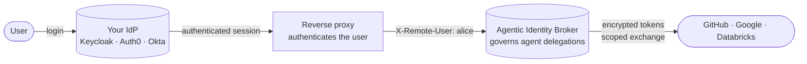

# Why not a traditional IdP?

If you already run Keycloak, Auth0, Okta, or a corporate identity provider, you might expect
an "identity broker for agents" to compete with it. It does not. The broker **complements**
your IdP and depends on it. Your IdP answers a question the broker never tries to: *who is
this human?* The broker answers a different one: *what may this agent do on that human's
behalf, against which third-party service?*

Keep your IdP for human login. Add the broker to govern agent delegation. They sit in one
request path and own different concerns.

## The IdP authenticates people; the broker governs agents

A traditional IdP is built to authenticate humans and federate their sessions across your
applications: login, single sign-on, multi-factor challenges, the user directory. The broker
does none of that. It **never authenticates a human** — it trusts an already-authenticated
identity handed to it by a proxy, and from there decides which agents may act for that person
and with which third-party permissions.

That split is deliberate. The broker's whole job begins after the person is authenticated:
it manages consent, holds third-party tokens encrypted, and exchanges an agent's token for
the correct third-party token at request time. It has no login page, no password store, and
no user directory of its own.

## Division of responsibilities

| Your identity provider owns | The broker owns |
|---|---|
| Human login and credential verification | Per-agent, per-service delegation |
| Single sign-on across your applications | Consent expressed as permission sets |
| Multi-factor and step-up authentication | An encrypted vault of third-party tokens |
| The user directory and profile source of truth | RFC 8693 token exchange at the gateway |
| Password reset, social login, account lifecycle | Per-agent revocation and grant expiry |

The two columns do not overlap. The IdP establishes identity; the broker governs what that
identity's agents are allowed to reach.

## They work together

The broker sits **behind** your IdP-backed reverse proxy. The proxy authenticates the user —
often against your IdP — and forwards the authenticated principal to the broker in a request
header (`X-Remote-User` by default). The broker trusts that header only from a trusted proxy
and uses it as the principal for every grant and every third-party session. Admin privilege
is enforced at the proxy, before requests reach the broker's admin API.

The broker optionally verifies a signed JWT the proxy forwards and reads a display profile
(name, email, picture) from its claims. Even then it is verifying a token your IdP or proxy
already issued — it still runs no login of its own. Human authentication stays entirely with
your existing stack.

## Choose the broker when, and keep your IdP for

### Choose the broker when

- You need to let AI agents act on a user's behalf against third-party OAuth2 services.
- You need per-agent, per-service consent that a user can review, time-box, and revoke.
- You want third-party tokens held in one encrypted vault instead of scattered across agents.
- You want a gateway to exchange an agent's token for the right third-party token at request
  time — see [token exchange](/docs/concepts/token-exchange).

### You still need your IdP for

- Authenticating humans: login, passwordless, social, and enterprise credentials.
- Single sign-on across your applications.
- Multi-factor and step-up authentication.
- Being the source of truth for who your users are — their directory and profile.

The broker assumes all of this is already handled. It has no ambition to replace it, and it
is not a high-throughput machine-to-machine auth layer, a federation fabric, or an
offline-verification system — those are not what it does.

## Related

- [What is the Agentic Identity Broker?](/docs/introduction) — the one-paragraph picture.
- [Use cases](/docs/introduction/use-cases) — where delegated agent access is the hard part.
- [Delegation and consent](/docs/concepts/delegation-and-consent) — the model the broker
  governs.
- [Architecture](/docs/concepts/architecture) — how the pieces fit at an operator level.
