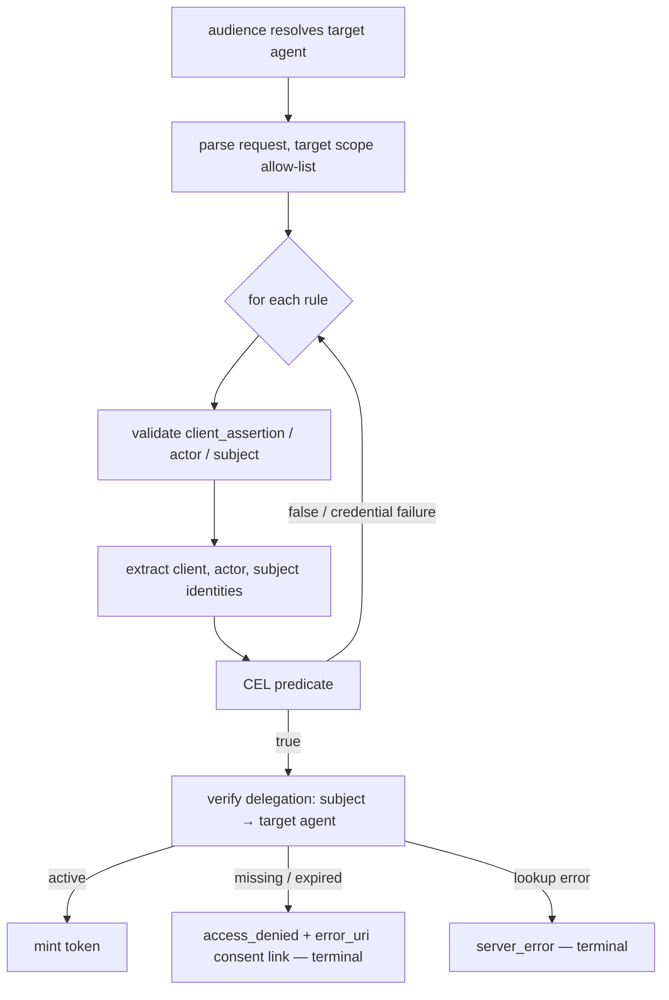

# Plan: Consent (UserGrant) Enforcement for OAuth2 User Impersonation

**Feature**: `specs/037-oauth2-user-impersonation/`
**Type**: security fix + specification amendment (feature is on-branch, not released)

> **Spec status**: `specs/037-oauth2-user-impersonation/spec.md` **has been amended** as part of this
> planning turn (47 insertions / 11 modified lines): new clarification session, User Story 5,
> FR-017/017a/017b, FR-018, FR-019, CR-010, three edge cases, SC-006, the `User Delegation` entity,
> and corrected Assumptions / Out-of-Scope wording. No code has been changed.

## Context

Impersonation mints a broker token for any subject a configured rule authorizes, with **no check
that the impersonated user ever delegated the target agent**.

Evidence:

- `internal/adapters/http/enduser/oauth2_token.go:137-146` — an activated suffixed audience routes
  straight to `Impersonate`, bypassing the rest of the token-exchange path.
- `internal/domain/impersonation/service.go:18-43` + `internal/app/builder.go:974-998` — the service
  receives only `ports.AgentRepository` and `ports.ImpersonationTokenIssuer`. No
  `UserGrantRepository`, no `consent.Service`.
- `internal/domain/impersonation/service.go:234-260` — CEL predicate true → mint. No grant check.
- `tests/e2e/impersonation_test.go:163-177,279-301` — the green success scenario seeds **only** the
  target agent into fresh storage; no `UserGrant` exists and the request returns `200` with a token
  (re-run and confirmed green during this investigation).

The two comparable flows do enforce consent:

- Authorization code: `internal/domain/oauth2/service.go:226-260` → `redirect_to_consent` when the
  grant is missing or inactive.
- Third-party RFC 8693 exchange: `internal/domain/tokenexchange/service.go:237-287` →
  `consentService.VerifyAgentAccess`, mapped to `access_denied` for missing/expired grants.

## v1 contract (decided — no configuration knob)

1. **Consent is mandatory for every impersonation rule.** There is no per-rule or global opt-out; a
   bypass switch would reinstate exactly the vulnerability being fixed (Constitution Principle I).
2. **The extracted subject identity is the consent principal.** The same value minted as `sub`
   (`internal/domain/impersonation/service.go:210-215`) is used verbatim as `id.Principal` for the
   `(principal, target AgentID)` lookup — for signed *and* unverified subjects. Unverified bridge
   subjects with no matching broker delegation are denied like any other identity.
3. **The gate is an existence + active check only.** No permission-set completeness guard, no
   scope↔grant intersection (explicit non-goals below).
4. **Failure response**: `access_denied` (HTTP 403) with a generic description, plus `error_uri`
   pointing at the broker consent page for the target agent. Missing and expired delegations are
   indistinguishable in the response; the audit event distinguishes them.
5. **Storage/lookup failure** fails closed as `server_error` (500) with **no** `error_uri`.
6. **The check is terminal, not fall-through.** It runs after a rule's predicate has authorized the
   request and before minting; it does not continue to later rules (see Placement below).

## Signalling mechanism: `error_uri`, not `WWW-Authenticate`

`WWW-Authenticate` is a resource-server challenge header — it tells a client how to authenticate to
a protected resource. The failing exchange here is at the **token endpoint**, where this system
already has an established, wired-through signal: RFC 6749 §5.2 `error_uri` inside the RFC 8693
error body.

That path exists end to end today:

- `TokenExchangeError.errorURI` + `WithErrorURI` — `internal/domain/tokenexchange/errors.go:34-37,341-351`
- already serialized on the impersonation error path —
  `internal/adapters/http/enduser/oauth2_token.go:365-367`
- already documented — `api/enduser/openapi.yaml` (`error_uri` on the 4xx error schemas, lines ~2821, ~3407)
- already produced for "user must act" cases — `internal/domain/tokenexchange/service.go:320-332,377-378`
  (re-authentication URL from `oauth2session.ServiceAuthorizeURL`)
- already **consumed**: ExtProc converts a non-transient broker error carrying `error_uri` into an
  MCP `URLElicitationRequiredError` (JSON-RPC `-32042`) —
  `internal/extproc/server/exchanger.go:103-116,258-262`, `internal/extproc/server/server.go:778-790`;
  a 403 with `error_uri` is explicitly authoritative (`isTransientBrokerError`, `exchanger.go:353-370`).

`WWW-Authenticate` appears nowhere in `internal/`, `tests/`, `api/`, or `docs/`. Introducing it would
add a second convention that no existing client parses, against the repo rule "Extend, do not
duplicate" (`AGENTS.md` → Code Style).

### Does that consent URL work when consent is missing? — verified yes

`<server.enduser.public_url>/consent/agent/<target agent UUID>` is the SPA consent page for that
agent, and it is exactly the page used to grant a *first* delegation:

- The route is served: `r.Handle("/consent/*", h.SPA)`
  (`internal/adapters/http/routing/enduser.go:171-180`); the React app uses `basename="/consent"`
  with route `/agent/:agentId` (`web/src/App.tsx:51-58`).
- Nothing on it requires an existing grant: `GET /api/consent/agents/{id}/grants` returns `200` with
  `data: null` when the user has none (`grants_handler_get_test.go:89-122`, `TestGetGrant_EmptyGrants`),
  the page models it as `grants: UserGrant | null` — "null if no grant exists"
  (`web/src/hooks/useAgentGrants.ts:29-30`) — and agent detail comes from
  `consent.GetAgentConsentDetail`, which needs no grant (`internal/domain/consent/service.go:122-160`).
- Proven in the existing frontend E2E suite: a direct navigation to
  `/consent/agent/<agent without grant>` renders and is asserted
  (`tests/e2e/frontend/revoke_grant_flow_test.go:144-148`), and the ordinary "grant consent" journeys
  navigate to the same path before any grant exists
  (`tests/e2e/frontend/consent_flow_test.go:120-145` via `ConsentPage.NavigateToAgent`, path
  `/consent/agent/%s` — `tests/e2e/pages/consent_page.go:22,88-96`).
- Submitting from that page needs no session token: `GrantsHandler` validates `session_token` only
  when present (`grants_handler.go:125-129`), and `grants_integration_test.go` covers creation
  without one ("redirect_uri_without_session_token_is_ignored").

Consequence: **no frontend or consent-API change is required**, and the link is actionable. It is
browser/user-facing (consent routes sit behind `RequirePrincipal`), which is the intent: the
privileged client relays it to the user out-of-band.

A JWE authorization-session token (ADR 016) is deliberately **not** used: ADR 016 seals
authorization-resumption state (`redirect_uri`, PKCE, `state`, CIMD metadata) for a browser flow
resuming `/authorize`. Impersonation has no such state and no browser at the failure point.

## Placement in the flow



The gate must run after identity extraction (the principal only exists then) and after the
predicate (so an unauthorized caller learns nothing about a user's delegation state). It is terminal
because the decision is rule-independent: falling through would let later rules re-probe the same
identity and would pollute the FR-004a no-match precedence.

## Contract placement — new port + app-boundary classifier

`internal/domain/impersonation` is an independent bounded context. Its delegation-verification
contract belongs in `internal/ports`, **not** in a direct dependency on `internal/domain/consent`:
importing `consent.Service` plus its sentinel errors would couple two bounded contexts and leak
`consent`'s error vocabulary into impersonation's error taxonomy.

- **Port** — `internal/ports/oauth2.go`, beside the `ImpersonationTokenIssuer` this feature already
  added there. A narrow, ISP-sized contract returning a classified result rather than foreign
  sentinels:

  ```go
  type UserDelegationStatus string

  const (
      UserDelegationActive  UserDelegationStatus = "active"
      UserDelegationMissing UserDelegationStatus = "missing"
      UserDelegationExpired UserDelegationStatus = "expired"
  )

  // UserDelegationVerifier reports whether a principal currently delegates an agent.
  type UserDelegationVerifier interface {
      VerifyUserDelegation(ctx context.Context, principal id.Principal, agentID id.AgentID) (UserDelegationStatus, error)
  }
  ```

  A non-nil `error` means the delegation state is unknown (storage failure) and MUST fail closed.
- **Classifier at the composition boundary** — `internal/app/impersonation_delegation.go`: a small
  type wrapping the existing `*consent.Service`, mapping `nil` → `UserDelegationActive`,
  `consent.ErrAgentAccessDenied` → `UserDelegationMissing`, `consent.ErrGrantExpired` →
  `UserDelegationExpired`, anything else → wrapped error. Error translation lives where composition
  already happens (Principle XII), so neither domain context imports the other.
- **Domain** — `internal/domain/impersonation` depends only on `ports.UserDelegationVerifier` and
  switches on the status; it never imports `internal/domain/consent`.
- **ADR** — `internal/ports/AGENTS.md` requires an ADR for a new architectural boundary and
  Constitution Principle II requires one for a security-model decision of this weight. Add
  `adrs/032-impersonation-requires-user-delegation.md` (Accepted, merged with this change) recording:
  the delegation gate is mandatory and un-disableable, the subject identity is the consent principal,
  the contract is a port with an app-boundary classifier, and `error_uri` is the consent signal.
- **OpenAPI** — keep the existing `impersonation_access_denied` example and add a sibling
  `impersonation_consent_required` example under the `403` response of `POST /oauth2/token`
  (`api/enduser/openapi.yaml` ~1481-1497) carrying `error`, a generic `error_description`, and
  `error_uri`; extend the `error_uri` property description (~3407-3410) to name the impersonation
  consent page as one of its meanings.

## Files to modify

| Path | Change |
|---|---|
| `internal/ports/oauth2.go` | New `UserDelegationVerifier` port + `UserDelegationStatus` enum beside `ImpersonationTokenIssuer` |
| `internal/app/impersonation_delegation.go` (new) + `_test.go` | `consent.Service` → port classifier; sentinel-to-status mapping |
| `internal/domain/impersonation/service.go` | Constructor takes `ports.UserDelegationVerifier` + consent base URL (both mandatory, fail closed); delegation gate before mint; generalize `ruleResult.serverErr` into a terminal `abort` channel |
| `internal/domain/impersonation/errors.go` | `consentRequired(consentURL, details)` = `accessDenied(generic).WithErrorURI(url)` |
| `internal/domain/impersonation/service_test.go`, `audience_test.go` (shared helpers) | Update `NewService`/`newTestService` call sites; add delegation-gate cases with a stub verifier |
| `internal/app/builder.go` (~974-1000) | Require `app.ConsentService` + non-empty `Server.EndUser.PublicURL` when impersonation is configured; wrap the consent service in the classifier and inject it |
| `adrs/032-impersonation-requires-user-delegation.md` (new) | Accepted ADR: mandatory delegation gate, port boundary, `error_uri` signal |
| `tests/e2e/impersonation_test.go` | Seed a grant for existing success scenarios; add US5 scenarios asserting `error_uri` |
| `specs/037-oauth2-user-impersonation/plan.md` | Summary + Constitution Check + Testing Strategy rows for the delegation gate |
| `specs/037-oauth2-user-impersonation/data-model.md` | Delegation verification in the in-flight model + sequence diagram |
| `specs/037-oauth2-user-impersonation/quickstart.md` | Delegation prerequisite in setup, US5 scenario rows, two-phase smoke test |
| `specs/037-oauth2-user-impersonation/tasks.md` | New phase (T086+) mirroring the steps below |
| `api/enduser/openapi.yaml` | `impersonation_consent_required` 403 example + `error_uri` description |
| `docs/configuration.md` (§`oauth2_authorization_server.impersonation`) | Mandatory delegation requirement + `server.enduser.public_url` startup dependency |
| `examples/config/impersonation.yaml`, `examples/config/README.md` | Comment that every rule additionally requires an active user delegation |
| `ARCHITECTURE.md` | Impersonation flow: delegation gate before mint |
| ~~`specs/037-oauth2-user-impersonation/spec.md`~~ | **Done** in this planning turn (see Spec status above) |

## Reuse (found in repo — do not reimplement)

- `consent.Service.VerifyAgentAccess(ctx, principal, agentID)` — grant existence + active check,
  fails closed, returns `ErrAgentAccessDenied` / `ErrGrantExpired`
  (`internal/domain/consent/service.go:641-682`). Consumed **only** by the app-boundary classifier,
  which translates it into `ports.UserDelegationStatus`.
- `tokenexchange.NewAccessDeniedErrorWithDetails(...)` + `.WithErrorURI(uri)`
  (`internal/domain/tokenexchange/errors.go:255-264,341-351`), wrapped by the existing
  `accessDenied` helper (`internal/domain/impersonation/errors.go:29-31`).
- Error serialization incl. `error_uri` — `internal/adapters/http/enduser/oauth2_token.go:352-393`
  (**no handler change required**).
- Audit plumbing — `impersonation.AuditRecord` (`service.go:74-88`), `failureAudit` (`service.go:323`),
  `logImpersonationDecision` (`oauth2_token.go:307-349`); failure category flows from
  `TokenExchangeError.Details()`.
- Consent deep-link construction precedent — `internal/domain/approval/service.go:407-408`.
- Startup guard precedent — token exchange refusing to build without the consent service
  (`internal/app/builder.go:1068-1071`).
- Public URL already configured — `b.config.Server.EndUser.PublicURL`
  (`internal/app/builder.go:299,477,555,765`).
- E2E grant fixtures — `fixtures.SeedPlaceholderGrantData`, `fixtures.ActiveGrant`,
  `fixtures.ExpiredGrant` (`tests/e2e/fixtures/grants.go:37-118`).

## Steps

Design artefacts first, then TDD (Constitution VIII/XIII: tests compile and fail semantically first).

- [x] Amend `specs/037-oauth2-user-impersonation/spec.md` (clarifications, US5, FR-017/017a/017b,
      FR-018, FR-019, CR-010, edge cases, SC-006, entity, Assumptions/Out-of-Scope).
- [ ] Write `adrs/032-impersonation-requires-user-delegation.md` (Accepted) and reference it from
      `AGENTS.md`'s ADR index and `ARCHITECTURE.md`.
- [ ] Update `plan.md`, `data-model.md` (delegation verification + sequence diagram) and
      `quickstart.md` (delegation prerequisite, US5 rows, two-phase smoke test).
- [ ] Add the `tasks.md` phase (T086+) mirroring these steps.
- [ ] Merge the API contract change: `impersonation_consent_required` 403 example with `error_uri`
      and the extended `error_uri` description in `api/enduser/openapi.yaml`.
- [ ] Document the behaviour in `docs/configuration.md`, `examples/config/impersonation.yaml`,
      `examples/config/README.md`, and `ARCHITECTURE.md`.
- [ ] **E2E red**: in `tests/e2e/impersonation_test.go` seed `fixtures.SeedPlaceholderGrantData` +
      `fixtures.ActiveGrant("user-1", targetAgent.ID.String(), …)` for the existing success
      scenarios, and add US5 scenarios (no delegation, expired delegation, unverified-subject without
      delegation, audit failure category) asserting 403, `error` = `access_denied`, `error_uri` ==
      `<public URL>/consent/agent/<target id>`, and no `access_token`. Verify semantic failure.
- [ ] **Unit red**: extend `internal/domain/impersonation/service_test.go` with a stub verifier —
      `UserDelegationActive` mints; `UserDelegationMissing` and `UserDelegationExpired` both produce
      `access_denied` with a populated `ErrorURI` and identical descriptions; a verifier error
      produces `server_error` without `ErrorURI`; the verifier is never called when the predicate
      denies; no later rule is evaluated after a delegation denial. Add
      `internal/app/impersonation_delegation_test.go` for sentinel→status classification.
- [ ] Add `consentRequired` to `internal/domain/impersonation/errors.go`.
- [ ] Add the `UserDelegationVerifier` port + `UserDelegationStatus` enum to
      `internal/ports/oauth2.go` and the classifier in `internal/app/impersonation_delegation.go`.
- [ ] Implement the gate in `internal/domain/impersonation/service.go`: depend on
      `ports.UserDelegationVerifier` (+ consent base URL, both validated in the constructor), rename
      `ruleResult.serverErr` to a terminal `abort` channel, switch on the returned status between
      the predicate and `IssueImpersonationToken`.
- [ ] Wire it in `internal/app/builder.go`: fail startup when impersonation is configured without
      `app.ConsentService` or with an empty `Server.EndUser.PublicURL`; inject the classifier.
- [ ] Turn unit + E2E green; confirm the audit event carries the failure category and no credentials.

## Verification

- `just check` — fmt → vet → lint.
- `just test` — domain/unit/config (`internal/domain/impersonation`, `internal/app`, `internal/ports`).
- Focused E2E: `just test-e2e-backend`, or the command proven in this session when the local
  `ginkgo` CLI version mismatches the module:
  `GOEXPERIMENT=jsonv2 go test ./tests/e2e -ginkgo.v -ginkgo.focus='OAuth2 User Impersonation'`.
- Regression proof (the exact scenario that exposed the gap): with **no** delegation seeded, the US1
  mint scenario must now return 403 `access_denied` with `error_uri`; with a seeded active delegation
  it must return 200 with the claims asserted today (`sub`, `agent_id`, `act.iss`, `act.sub`, `scope`).
- `just verify` — full gate before handoff.
- Manual smoke (quickstart): run the signed-subject `curl` twice — before delegating (expect 403 +
  `error_uri`), then after approving the agent at that `error_uri` (expect 200 + token).

## Non-goals (recorded deliberately)

- No permission-set completeness guard and no scope↔delegation intersection for impersonation; the
  check is agent-level. (Third-party exchange keeps its own PS guard,
  `internal/domain/tokenexchange/service.go:289-298`.)
- No new consent UI, no new consent API endpoint, no `WWW-Authenticate` header.
- No configuration flag to disable, weaken, or scope the check.

## Spec amendments already applied (for review)

`specs/037-oauth2-user-impersonation/spec.md` — 47 insertions, 11 modified lines:

- **Clarifications → Session 2026-09-04**: delegation is mandatory (no opt-out, no unverified-subject
  exemption; subject identity is the consent principal); the signal is `error_uri`, not
  `WWW-Authenticate`.
- **User Story 5 — Impersonation Honors the Impersonated User's Delegation (P1)** with five
  acceptance scenarios (active, missing, expired, unverified-without-delegation, lookup failure).
- **User Story 1** narrative, independent test, and scenarios 1 and 6 now state the delegation
  precondition.
- **Edge Cases**: missing/expired delegation, delegation-lookup failure, and the terminal
  (non-fall-through) nature of the decision.
- **FR-017 / FR-017a / FR-017b / FR-018 / FR-019**; FR-003d, FR-011, FR-013, FR-014 updated to
  reference the delegation gate and its consent `error_uri`.
- **CR-010**: delegation storage and a non-empty end-user public base URL are startup requirements.
- **Key Entities**: `User Delegation (UserGrant)` added; `Subject Identity` notes its dual role.
- **SC-006**; **Assumptions** (cumulative authorization + actionable consent page); **Out of Scope**
  (consent *enforcement* is in scope; PS/scope intersection explicitly excluded).
