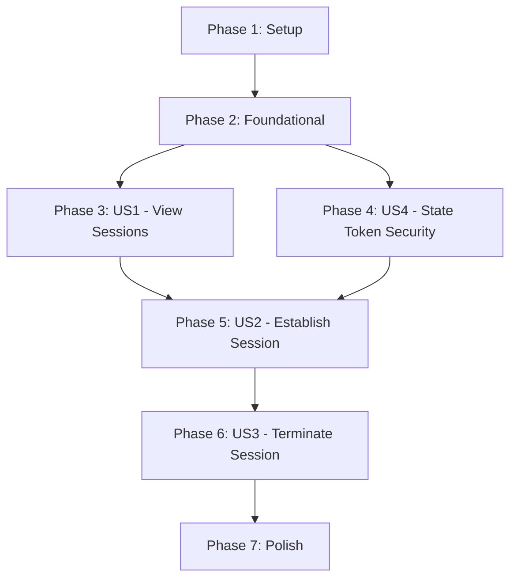

# Tasks: Third-Party OAuth2 Session Management

**Feature**: 008-thirdparty-oauth2-sessions  
**Input**: Design documents from [/specs/008-thirdparty-oauth2-sessions/](.)  
**Prerequisites**: [plan.md](plan.md), [spec.md](spec.md), [data-model.md](data-model.md), [contracts/oauth2-sessions.yaml](contracts/oauth2-sessions.yaml), [quickstart.md](quickstart.md)

## Format: `- [ ] [ID] [P?] [Story?] Description`

- **Checkbox**: `- [ ]` (markdown checkbox, REQUIRED)
- **[ID]**: Task ID (T001, T002, T003...)
- **[P]**: Can run in parallel (different files, no dependencies)
- **[Story]**: User story label (US1, US2, US3, US4) for user story phase tasks only
- Include exact file paths in descriptions

---

## Phase 1: Setup (Shared Infrastructure)

**Purpose**: Project initialization and dependency setup

- [ ] T001 Add Go dependencies: `golang.org/x/oauth2` and `github.com/lestrrat-go/jwx/v3` to go.mod
- [ ] T002 [P] Create directory structure: internal/domain/oauth2session/, internal/adapters/http/oauth2_sessions/
- [ ] T003 [P] Create frontend directory structure: web/src/pages/sessions/, web/src/components/sessions/, web/src/hooks/sessions/

---

## Phase 2: Foundational (Blocking Prerequisites)

**Purpose**: Shared infrastructure that all user stories depend on

### Domain Foundation

- [ ] T004 Create UserSession entity in internal/domain/storage/user_session.go with validation methods
- [ ] T005 [P] Create OAuth2StateTokenClaims value object in internal/domain/oauth2session/state_token.go
- [ ] T006 [P] Create domain errors in internal/domain/oauth2session/errors.go (ErrUnauthenticated, ErrInvalidStateToken, etc.)

### Repository Interface

- [ ] T007 Add UserSessionRepository interface to internal/ports/storage.go with Create/Get/FindByPrincipalAndService/Delete/ListByPrincipal/CountByService methods

### Database Migration

- [ ] T008 Create migration 004_create_user_sessions.up.sql with user_sessions table schema
- [ ] T009 [P] Create migration 004_create_user_sessions.down.sql for rollback

### Configuration

- [ ] T010 Add ThirdPartyOAuth2Config struct to internal/config/schema.go (jwe_signing_key, state_token_ttl, pkce_verifier_length)
- [ ] T011 [P] Create example configuration file examples/config/third-party-oauth2.yaml

### State Token Service (Foundational Security Component)

- [ ] T012 Implement StateTokenService in internal/domain/oauth2session/state_token.go with Create and Validate methods using jwx library
- [ ] T013 [P] Write unit tests for StateTokenService in internal/domain/oauth2session/state_token_test.go (test expiration, tampering, validation)

### Repository Adapters

- [ ] T014 Implement in-memory UserSessionRepository in internal/adapters/storage/memory/user_session.go
- [ ] T015 [P] Implement PostgreSQL UserSessionRepository in internal/adapters/storage/postgres/user_session.go with ON CONFLICT handling

---

## Phase 3: User Story 1 - View Available Third-Party Services (P1)

**Goal**: Users can see which third-party services are registered and understand their current session status

**Independent Test**: User navigates to third-party sessions page and sees list of services with status indicators

### Backend (US1)

- [ ] T016 [US1] Implement ListSessions method in OAuth2SessionService in internal/domain/oauth2session/service.go
- [ ] T017 [US1] Implement HTTP handler for GET /api/third-party/sessions in internal/adapters/http/oauth2_session_handlers.go
- [ ] T018 [US1] Register /api/third-party/sessions route in HTTP router setup

### Frontend (US1)

- [ ] T019 [P] [US1] Create useThirdPartySessions hook in web/src/hooks/sessions/useThirdPartySessions.ts with React Query
- [ ] T020 [P] [US1] Create SessionStatusBadge component in web/src/components/sessions/SessionStatusBadge.tsx
- [ ] T021 [US1] Create ServiceSessionCard component in web/src/components/sessions/ServiceSessionCard.tsx displaying service info and session status
- [ ] T022 [US1] Create ThirdPartySessionsPage in web/src/pages/ThirdPartySessionsPage.tsx with grid of service cards
- [ ] T023 [US1] Add route for /consent/sessions to frontend router

### Integration (US1)

- [ ] T024 [US1] Write integration test for GET /api/third-party/sessions endpoint in tests/integration/oauth2_session_test.go
- [ ] T025 [US1] Test session list endpoint with no sessions, with active session, and with expired session

---

## Phase 4: User Story 4 - Secure State Token Management (P2)

**Goal**: System securely manages OAuth2 state parameters during authorization flow

**Independent Test**: System creates JWE state tokens, validates all parameters on callback, rejects mismatched/tampered tokens

**Note**: This is infrastructure for US2 but isolated here for focused testing

### Domain Service Setup

- [ ] T026 [US4] Create OAuth2SessionService struct in internal/domain/oauth2session/service.go with dependencies (sessionRepo, serviceRepo, encryption, stateToken)
- [ ] T027 [US4] Implement Config struct for OAuth2SessionService (CallbackURLTemplate, StateTokenTTL, RetryMaxAttempts, RetryBaseDelay)
- [ ] T028 [US4] Implement NewService constructor in internal/domain/oauth2session/service.go with config defaults
- [ ] T028a [US4] Wire UserGrantRepository and ThirdpartyOAuth2ServiceRepository dependencies into NewService constructor in internal/domain/oauth2session/service.go

### State Token Security

- [ ] T029 [US4] Implement validateRedirectURI helper function for same-origin validation
- [ ] T030 [P] [US4] Implement PKCE helper functions (extractScopeValues, validatePrincipal, validateServiceID)
- [ ] T031 [US4] Write unit tests for state token security in internal/domain/oauth2session/service_test.go (principal mismatch, service ID mismatch, expired token)

---

## Phase 5: User Story 2 - Establish OAuth2 Session via Authorization Code Flow (P2)

**Goal**: Users can authenticate with third-party services via OAuth2 authorization code flow with PKCE

**Independent Test**: User clicks Login, redirects to third-party, approves, returns with session established and tokens encrypted

### Backend - Initiate Flow (US2)

- [ ] T032 [US2] Implement InitiateOAuth2Flow method in OAuth2SessionService in internal/domain/oauth2session/service.go
- [ ] T033 [US2] Generate PKCE verifier using oauth2.GenerateVerifier() in InitiateOAuth2Flow
- [ ] T034 [US2] Create JWE state token with claims (principal, pkce_verifier, service_id, redirect_uri) in InitiateOAuth2Flow
- [ ] T035 [US2] Build authorization URL with oauth2.Config and S256ChallengeOption in InitiateOAuth2Flow
- [ ] T036 [US2] Implement HTTP handler for GET /api/third-party/:serviceId/oauth2/authorize in internal/adapters/http/oauth2_session_handlers.go
- [ ] T037 [US2] Register /api/third-party/:serviceId/oauth2/authorize route in HTTP router

### Backend - Complete Flow (US2)

- [ ] T038 [US2] Implement CompleteOAuth2Flow method in OAuth2SessionService in internal/domain/oauth2session/service.go
- [ ] T039 [US2] Validate state token and check principal/service ID match in CompleteOAuth2Flow
- [ ] T040 [US2] Implement exchangeWithRetry helper for token exchange with exponential backoff in internal/domain/oauth2session/service.go
- [ ] T041 [US2] Exchange authorization code with PKCE verifier using config.Exchange with oauth2.VerifierOption in exchangeWithRetry
- [ ] T042 [US2] Implement createSession helper to encrypt tokens using EncryptionPort and store UserSession
- [ ] T043 [US2] Implement HTTP handler for GET /api/third-party/:serviceId/oauth2/callback in internal/adapters/http/oauth2_session_handlers.go
- [ ] T044 [US2] Register /api/third-party/:serviceId/oauth2/callback route in HTTP router

### Error Handling (US2)

- [ ] T045 [P] [US2] Handle OAuth2 errors from third-party (access_denied, invalid_scope) in CompleteOAuth2Flow
- [ ] T046 [P] [US2] Handle network failures with retry logic (3 attempts, exponential backoff 1s/2s/4s) in exchangeWithRetry
- [ ] T047 [P] [US2] Implement extractRedirectURI helper to extract redirect_uri from state token for post-callback redirect

### Frontend (US2)

- [ ] T048 [P] [US2] Implement handleLogin function in ServiceSessionCard.tsx to redirect to /api/third-party/:serviceId/oauth2/authorize
- [ ] T049 [P] [US2] Add callback success/error handling in ThirdPartySessionsPage.tsx (parse query params, show toast notifications)

### Audit Logging (US2)

- [ ] T050 [P] [US2] Implement logSecurityEvent helper for state token validation failures
- [ ] T051 [P] [US2] Implement logAuditEvent helper for session establishment events

### Integration (US2)

- [ ] T052 [US2] Write integration test for full OAuth2 flow in tests/integration/oauth2_session_test.go (initiate → mock third-party → callback → verify session)
- [ ] T053 [US2] Test race condition handling (multiple simultaneous flows for same service) with UNIQUE constraint
- [ ] T054 [US2] Test OAuth2 error handling (access_denied, server_error)
- [ ] T055 [US2] Test network retry logic with mock failing token endpoint

---

## Phase 6: User Story 3 - Terminate Third-Party Session with Warnings (P3)

**Goal**: Users can revoke sessions with warnings about affected agents

**Independent Test**: User clicks Terminate, sees warning with affected agents, confirms, session deleted with tokens removed

### Backend (US3)

- [ ] T056 [US3] Implement GetAffectedAgents method in OAuth2SessionService to query UserGrantRepository
- [ ] T057 [US3] Implement TerminateSession method in OAuth2SessionService in internal/domain/oauth2session/service.go
- [ ] T058 [US3] Implement HTTP handler for GET /api/third-party/:serviceId/session/affected-agents in internal/adapters/http/oauth2_session_handlers.go
- [ ] T059 [US3] Implement HTTP handler for DELETE /api/third-party/:serviceId/session in internal/adapters/http/oauth2_session_handlers.go
- [ ] T060 [US3] Register /api/third-party/:serviceId/session/affected-agents and DELETE routes in HTTP router

### Frontend (US3)

- [ ] T061 [P] [US3] Create useTerminateSession hook in web/src/hooks/sessions/useTerminateSession.ts with mutation
- [ ] T062 [P] [US3] Create useAffectedAgents hook in web/src/hooks/sessions/useAffectedAgents.ts to fetch affected agents
- [ ] T063 [US3] Create TerminateDialog component in web/src/components/sessions/TerminateDialog.tsx with warning and agent list
- [ ] T064 [US3] Wire TerminateDialog into ServiceSessionCard.tsx on "Terminate Session" button click

### Audit Logging (US3)

- [ ] T065 [P] [US3] Implement logAuditEvent for session termination in OAuth2SessionService

### Integration (US3)

- [ ] T066 [US3] Write integration test for session termination in tests/integration/oauth2_session_test.go
- [ ] T067 [US3] Test affected agents endpoint returns correct agent count
- [ ] T068 [US3] Test deletion removes tokens and session record from database

---

## Phase 7: Polish & Cross-Cutting Concerns

**Purpose**: Documentation, API integration, configuration examples, glossary updates

### API Documentation

- [ ] T069 Merge contracts/oauth2-sessions.yaml into /api/enduser/openapi.yaml
- [ ] T070 [P] Add OAuth2 session management examples to docs/api/

### Glossary & Architecture

- [ ] T071 Add new domain terms to ARCHITECTURE.md Glossary: UserSession, OAuth2StateToken, OAuth2SessionService, PKCE Flow, JWE State Binding
- [ ] T072 [P] Update ARCHITECTURE.md with OAuth2SessionService domain service description

### Configuration Documentation

- [ ] T073 Update docs/configuration.md with third_party_oauth2 configuration section
- [ ] T074 [P] Document JWE signing key setup in docs/security/best-practices.md

### End-to-End Testing

- [ ] T075 Write end-to-end test for complete user journey (view sessions → login → see active session → terminate) in tests/integration/e2e_oauth2_test.go

### Deployment Validation

- [ ] T076 Run database migrations against test PostgreSQL instance and verify: (1) migrations apply cleanly, (2) rollback works without data loss, (3) can apply/rollback repeatedly
- [ ] T077 [P] Verify JWE signing key configuration from environment variable
- [ ] T078 [P] Test API endpoints with actual OAuth2 provider (e.g., GitHub OAuth App in dev environment)

---

## Dependencies Between User Stories

**Completion Order**:
1. **Setup** → **Foundational** (MUST complete first - blocking for all user stories)
2. **US1** + **US4** (can run in parallel, both needed before US2)
3. **US2** (depends on US1 for UI, US4 for security)
4. **US3** (depends on US2 - must have sessions to terminate)
5. **Polish** (after all user stories complete)

---

## Parallel Execution Opportunities

### Within Foundational Phase

Can be implemented in parallel:
- T004 (UserSession entity) + T005 (OAuth2StateTokenClaims) + T006 (errors)
- T008 (migration up) + T009 (migration down)
- T010 (config schema) + T011 (config examples)
- T014 (in-memory adapter) + T015 (PostgreSQL adapter)

### Within US1

Can be implemented in parallel after T016-T018 (backend) complete:
- T019 (useThirdPartySessions hook)
- T020 (SessionStatusBadge)
- T021-T023 (Service card and page - depends on T019-T020)

### Within US2

Can be implemented in parallel:
- T045 (OAuth2 error handling) + T046 (network retry) + T047 (redirect URI extraction)
- T048 (frontend login) + T049 (callback handling)
- T050 (security logging) + T051 (audit logging)

### Within US3

Can be implemented in parallel after T056-T060 (backend) complete:
- T061 (useTerminateSession)
- T062 (useAffectedAgents)
- T063-T064 (dialog - depends on T061-T062)

---

## Implementation Strategy

### MVP Scope (Minimum Viable Product)

**MVP = User Story 1 ONLY**:
- Users can view available third-party services
- Users can see which services they have sessions with
- Basic session status indicators (initiated_at, expired status)

**Rationale**: US1 provides immediate value (visibility) and can be demonstrated without completing the entire OAuth2 flow. It allows stakeholders to validate the UI/UX before investing in the complex OAuth2 flow implementation.

### Incremental Delivery

1. **Sprint 1**: Setup + Foundational + US1 (MVP) - ~40 tasks
   - Delivers: Session list view, foundational infrastructure
   - Value: Users can see available services and understand current state

2. **Sprint 2**: US4 + US2 - ~30 tasks
   - Delivers: Full OAuth2 flow with PKCE, token storage
   - Value: Users can establish sessions with third-party services

3. **Sprint 3**: US3 + Polish - ~20 tasks
   - Delivers: Session termination, complete documentation
   - Value: Users can manage session lifecycle, complete feature

### Testing Strategy

- **Unit tests**: Created alongside implementation (T013, T031, etc.)
- **Integration tests**: Written after each user story phase completes (T024-T025, T052-T055, T066-T068)
- **E2E tests**: Written in Polish phase after all user stories complete (T075)

---

## Task Count Summary

- **Phase 1 (Setup)**: 3 tasks
- **Phase 2 (Foundational)**: 12 tasks
- **Phase 3 (US1 - View Sessions)**: 10 tasks
- **Phase 4 (US4 - State Token Security)**: 6 tasks
- **Phase 5 (US2 - Establish Session)**: 24 tasks
- **Phase 6 (US3 - Terminate Session)**: 13 tasks
- **Phase 7 (Polish)**: 10 tasks

**Total**: 79 tasks

**Parallelizable tasks**: 28 tasks marked with [P]

**Estimated effort**:
- MVP (US1): ~25 tasks = 1-2 weeks
- Full feature: ~79 tasks = 3-4 weeks
