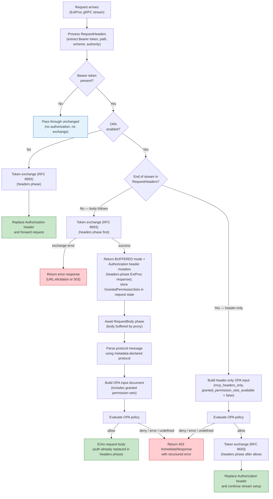
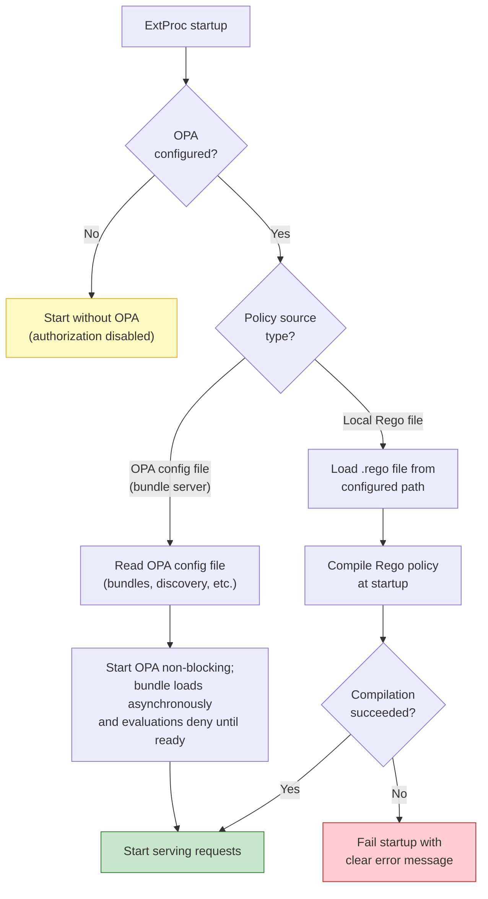
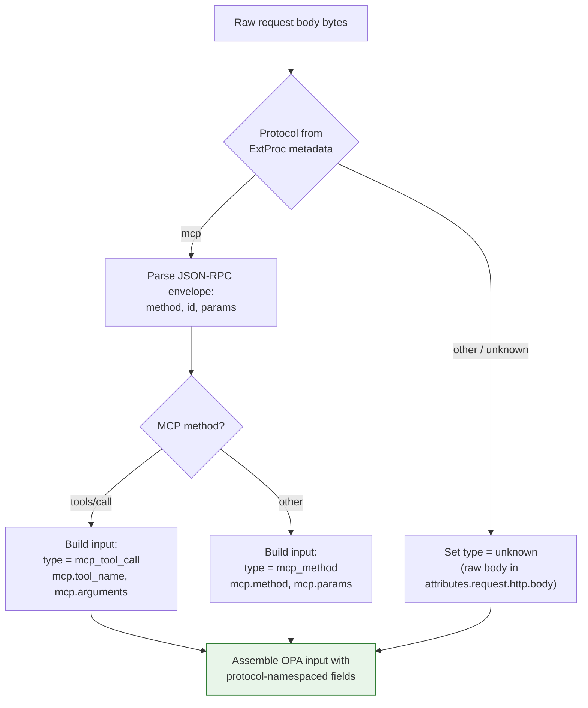
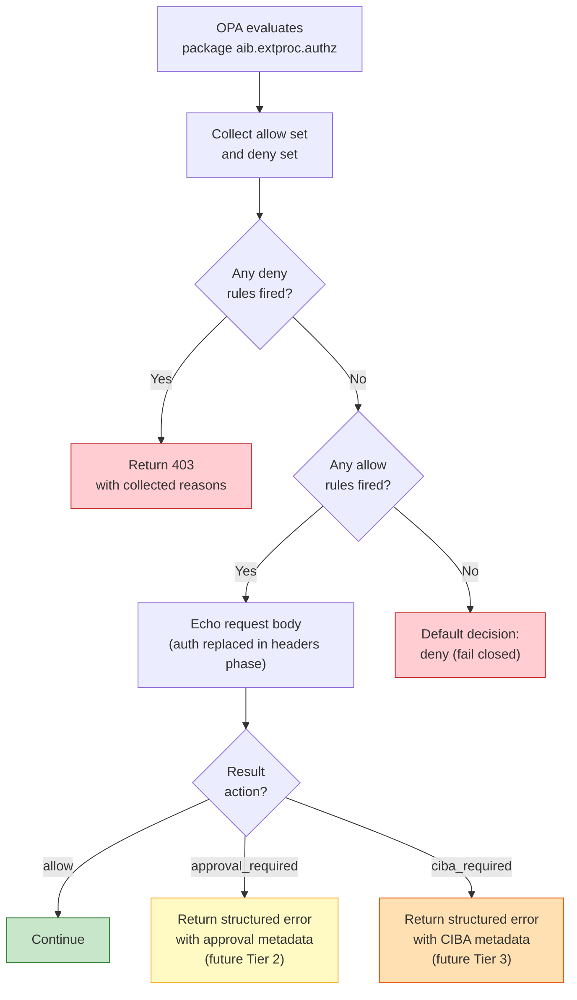

# Feature Specification: OPA-Based Authorization in ExtProc

**Feature Branch**: `020-extproc-opa-authorization`  
**Created**: 2026-03-14  
**Status**: Draft  
**Input**: User description: "Implement OPA-based authorization in the ExtProc application as described in issue #200. Authorization is optional. Support OPA config file for bundle pulling or a local Rego file. Input should reflect ExtProc attributes similar to the OPA Envoy plugin. MCP and A2A protocol specifics should be extracted in ExtProc and passed as structured input to OPA."
**Related**: [Issue #200 — Permission Sets & Three-Tier Tool Authorization](https://github.com/zalando-incubator/agentic-identity-broker/issues/200)

## Clarifications

### Session 2026-03-14

- Q: How should ExtProc know the request protocol (MCP vs A2A)? → A: Via ExtProc metadata field from agentgateway, not content-type sniffing or body inspection
- Q: How should the OPA input model tool calls — flat HTTP-centric, action-centric, or protocol-namespaced? → A: Protocol-namespaced (Option B): separate top-level objects per protocol (`mcp.*`, `a2a.*`) discriminated by `input.type`. Policies reference `input.mcp.tool_name` directly.
- Q: Should the Bearer token be redacted in the OPA input? → A: No. The token is passed unredacted so policies can identify user and agent. Masking in decision logs and traces is OPA's responsibility, not ExtProc's.
- Q: Behavior when protocol metadata from agentgateway is missing? → A: Reject with 403 immediately (no OPA evaluation) and log the misconfiguration as a warning. Metadata is mandatory when OPA is enabled.
- Q: Should A2A protocol support be included in this feature or deferred? → A: MCP first, A2A deferred. Implement MCP parsing only. The protocol-namespaced schema already accommodates A2A — just add an `a2a.*` namespace later.
- Q: How should the Rego policy decision pattern work to avoid rule conflicts? → A: Set-based `allow`/`deny` sets with an aggregation `result` rule. Policy authors write `allow contains {...}` and `deny contains {...}`. A single `result` rule aggregates: any deny → deny (with collected reasons); no deny + any allow → allow; nothing → default deny. Composable and conflict-free.

## Overview

This feature adds optional Open Policy Agent (OPA) authorization to the ExtProc application. When enabled, OPA evaluates every request body passing through ExtProc against a configurable policy. The protocol type (e.g., MCP) is communicated via ExtProc metadata from agentgateway — no content-type sniffing or body-based detection is needed. ExtProc uses this metadata to parse MCP protocol messages and provides structured, protocol-aware input to OPA so that policies can reason about tool names, method types, and protocol-specific attributes without understanding raw JSON-RPC.

The OPA input document uses an **opa-envoy-plugin compatible** base layout (`input.attributes.request.http.*`, `input.parsed_path`, `input.parsed_body`, etc.) so that existing Envoy-oriented Rego libraries work without modification. On top of this base, ExtProc adds MCP-specific extensions (`input.type`, `input.mcp.*`) for protocol-aware authorization. Additional protocols can be added later via new namespaces (e.g., `a2a.*`) without breaking existing policies.

This feature lays the groundwork for the three-tier authorization model described in issue #200 by establishing the OPA evaluation pipeline (Tier 1: consent boundary enforcement). Future features will build on this to add Tier 2 (runtime approval) and Tier 3 (CIBA strong authentication).

## Activity Diagrams

### Request Processing with OPA Authorization


 

### OPA Policy Loading



### Protocol-Specific Input Extraction




### OPA Decision Flow (Four-Valued)



## User Scenarios & Testing *(mandatory)*

### User Story 1 — OPA Policy Evaluation for Tool Calls (Priority: P1)

An operator deploys the ExtProc service with an OPA policy that controls which MCP tool calls are allowed. When an agent invokes a body-bearing tool call, ExtProc exchanges the token in the `RequestHeaders` phase, parses the MCP JSON-RPC body, builds a structured input document, and evaluates the OPA policy in `RequestBody`. Allowed calls continue with the exchanged authorization header; denied calls are rejected with a structured error.

**Why this priority**: This is the core capability — without policy evaluation, none of the authorization tiers can function. It enables operators to enforce tool-level access control at the gateway without modifying agents.

**Independent Test**: Send an MCP `tools/call` request through ExtProc with OPA enabled and a policy that allows `list_repositories` but denies `delete_repository`. Verify the allowed call reaches the upstream with the exchanged authorization header and the denied call returns a 403.

**Acceptance Scenarios**:

1. **Given** OPA is enabled with a policy that allows `list_repositories`, **When** an MCP `tools/call` request for `list_repositories` arrives with a valid Bearer token, **Then** ExtProc replaces the authorization header with the exchanged token in the `RequestHeaders` phase and forwards the request body when OPA allows it
2. **Given** OPA is enabled with a policy that denies `delete_repository`, **When** an MCP `tools/call` request for `delete_repository` arrives with a valid Bearer token, **Then** ExtProc returns a 403 Forbidden ImmediateResponse with a JSON body containing the denial reasons array from all matching deny rules
3. **Given** OPA is enabled and the policy does not match any rule for the incoming tool, **When** the request is evaluated, **Then** the default deny decision applies and the request is rejected with a 403
4. **Given** OPA is enabled with a Rego policy, **When** a non-`tools/call` MCP method (e.g., `initialize`, `resources/list`) arrives, **Then** the full parsed MCP message is available to the policy for evaluation (the policy decides whether to allow or deny)

---

### User Story 2 — Protocol-Aware Input Extraction (Priority: P2)

An operator writes OPA policies that reference MCP tool names by their semantic names without parsing raw JSON-RPC themselves. ExtProc extracts protocol-specific fields from the request body and presents them in dedicated `mcp.*` fields.

**Why this priority**: Policies that work with raw bytes are fragile and error-prone. Structured extraction makes policies readable, testable, and portable. This directly enables the permission set boundary checks from issue #200.

**Independent Test**: Send an MCP `tools/call` request and verify the OPA input document contains `type = "mcp_tool_call"`, `mcp.tool_name`, and `mcp.arguments` with correct values.

**Acceptance Scenarios**:

1. **Given** an MCP `tools/call` request with tool name `create_issue` and arguments `{"title": "Bug", "repo": "acme/app"}`, **When** OPA evaluates the request, **Then** the input document contains `type = "mcp_tool_call"`, `mcp.tool_name = "create_issue"`, and `mcp.arguments.title = "Bug"` as top-level fields
2. **Given** a request whose protocol metadata indicates an unrecognized protocol, **When** OPA evaluates the request, **Then** `type = "unknown"` and the raw body is available as a string in `input.attributes.request.http.body` for the policy to inspect
3. **Given** an MCP `initialize` request, **When** OPA evaluates the request, **Then** the input document contains `type = "mcp_method"`, `mcp.method = "initialize"`, and `mcp.params` with the initialization parameters

---

### User Story 3 — Local Rego File for Quick Setup (Priority: P3)

An operator getting started with authorization can place a `.rego` file next to the ExtProc binary (or at any filesystem path) and point the configuration to it. The ExtProc service loads and compiles the policy at startup without needing a bundle server.

**Why this priority**: Lowers the barrier to entry — operators can experiment with policies using a single file before setting up OPA bundle infrastructure.

**Independent Test**: Start ExtProc with a local `.rego` file path in the configuration and verify the policy is compiled and applied to incoming requests.

**Acceptance Scenarios**:

1. **Given** a valid Rego file at the configured path, **When** ExtProc starts, **Then** the policy is compiled successfully and the service starts normally
2. **Given** a Rego file with syntax errors, **When** ExtProc starts, **Then** the service fails to start with a clear error message referencing the file path and the compilation error
3. **Given** a configured Rego file path that does not exist, **When** ExtProc starts, **Then** the service fails to start with a clear error indicating the file was not found

---

### User Story 4 — OPA Configuration File for Bundle Pulling (Priority: P4)

An operator managing policies centrally can provide an OPA configuration file that defines bundle servers, discovery endpoints, or other OPA-native configuration. ExtProc initializes OPA with this configuration for automatic policy distribution.

**Why this priority**: Enables production-grade policy management with central bundle servers, versioning, and hot-reload — but requires more infrastructure than the local file approach.

**Independent Test**: Start ExtProc with an OPA config file that references a bundle server, verify that OPA initializes and pulls the bundle.

**Acceptance Scenarios**:

1. **Given** a valid OPA configuration file with bundle server settings, **When** ExtProc starts, **Then** OPA initializes with the provided configuration and pulls the policy bundle
2. **Given** an OPA configuration file that references an unreachable bundle server, **When** ExtProc starts, **Then** the startup behavior follows OPA's own retry/failure semantics (configurable via the OPA config)

---

### User Story 5 — Authorization is Optional (Priority: P5)

An operator who does not need authorization can run ExtProc without OPA. The existing token exchange behavior is completely unchanged when OPA is not configured.

**Why this priority**: Backward compatibility — existing deployments must not break when upgrading to a version that includes OPA support.

**Independent Test**: Start ExtProc without any OPA configuration and verify that token exchange works exactly as before.

**Acceptance Scenarios**:

1. **Given** no OPA configuration is provided, **When** ExtProc starts, **Then** the service starts successfully and processes requests using only token exchange (no authorization evaluation)
2. **Given** OPA is explicitly disabled in the configuration, **When** a request with a Bearer token arrives, **Then** the request proceeds directly to token exchange without any body inspection or policy evaluation

---

### Edge Cases

- What happens when the request body exceeds a reasonable size limit during buffering? The request is rejected with a 403 Forbidden ImmediateResponse when the body exceeds `max_body_size`. Truncation is explicitly not used — evaluating a partial body could allow a policy-evasion attack where a malicious payload is appended after the truncation point.
- What happens when OPA policy evaluation takes too long? A configurable evaluation timeout applies; on timeout the request is denied (fail closed).
- What happens when the MCP JSON-RPC body contains a batch of requests (JSON array)? Each message in the batch is evaluated independently; if any is denied, the entire batch is denied.
- What happens when the request body is empty (e.g., for `initialize` with no body)? The `mcp` namespace is populated from the empty/minimal JSON; policy decides based on `type` and available fields.
- What happens when both a local Rego file and an OPA config file are specified? The configuration is invalid — startup fails with a clear error indicating only one policy source may be configured.
- What happens when the protocol metadata from agentgateway is missing? The request is rejected with 403 immediately (no OPA evaluation) and a warning is logged indicating the misconfiguration.

## Requirements *(mandatory)*

### Functional Requirements

- **FR-001**: OPA authorization MUST be optional — when not configured, ExtProc MUST behave identically to its current token-exchange-only mode with no body inspection overhead
- **FR-002**: When OPA is enabled, ExtProc MUST buffer the request body during the `RequestBody` processing phase and parse it before evaluating the OPA policy
- **FR-003**: ExtProc MUST read the protocol type from the ExtProc metadata provided by agentgateway (not from content-type sniffing or body inspection) and parse MCP (JSON-RPC 2.0) messages accordingly, extracting at minimum: `jsonrpc` version, `method`, `id`, and `params` (including nested `name` and `arguments` for `tools/call`). When OPA is enabled and the protocol metadata is absent, ExtProc MUST reject the request with 403 Forbidden without OPA evaluation and MUST log a warning indicating the misconfiguration.
- **FR-004**: When the metadata indicates an unrecognized protocol (including A2A in this initial implementation), ExtProc MUST set `type = "unknown"` and rely on the envoy-compatible HTTP request fields for request data, including the raw body at `input.attributes.request.http.body`. The `a2a.*` namespace is reserved for a future feature.
- **FR-005**: ExtProc MUST construct an OPA input document using an **opa-envoy-plugin compatible** base layout (`attributes.request.http.*`, `parsed_path`, `parsed_query`, `parsed_body`, `truncated_body`, `version`) so that existing Envoy-oriented Rego libraries work without modification. On top of this base, ExtProc adds protocol-specific extensions: a top-level `type` discriminator (e.g., `mcp_tool_call`, `mcp_method`, `unknown`), a protocol-specific top-level object (`mcp`) containing parsed fields as first-class attributes, and a `context` object. The schema reserves the `a2a` namespace for future use.
- **FR-006**: The OPA input document MUST place MCP-specific data in a dedicated top-level `mcp` namespace so that policies can reference fields like `input.mcp.tool_name` directly without traversing nested structures. HTTP request attributes MUST be accessible via both `input.attributes.request.http.*` (envoy-compatible) and `input.parsed_body` / `input.parsed_path` (envoy-plugin convenience fields)
- **FR-007**: ExtProc MUST support loading OPA policy from a local Rego file specified via configuration
- **FR-008**: ExtProc MUST support loading OPA policy via an OPA configuration file that enables bundle pulling, discovery, and other OPA-native features
- **FR-009**: Only one policy source MUST be active at a time — specifying both a local Rego file and an OPA config file MUST cause a startup validation error
- **FR-010**: When OPA returns a deny decision, ExtProc MUST return a 403 Forbidden ImmediateResponse with a JSON body containing at minimum `error` and `error_description` fields. The `error_description` SHOULD include the denial reasons from the `reasons` array in the OPA decision.
- **FR-011**: When OPA evaluation fails or no policy rule matches, the default decision MUST be deny (fail closed, per security-first principle)
- **FR-012**: OPA policy evaluation MUST be subject to a configurable timeout; evaluation exceeding the timeout MUST result in a deny decision
- **FR-013**: ExtProc MUST compile/validate Rego policies at startup and fail fast with a descriptive error if compilation fails
- **FR-014**: The OPA policy package MUST be configurable (default: `aib.extproc.authz`) and the decision document path MUST be configurable (default: `result`). The recommended policy pattern uses set-based `allow` and `deny` rules with a single `result` aggregation rule (deny wins over allow). ExtProc reads only the `result` document.
- **FR-015**: The OPA decision (the `result` document) MUST support a structured object with at minimum an `action` field (`"allow"` or `"deny"`) and an optional `reasons` field (array of strings). When the action is `"deny"`, the `reasons` array SHOULD contain human-readable explanations collected from all matching deny rules.
- **FR-016**: The OPA decision MAY return future-oriented actions (`"approval_required"`, `"ciba_required"`) which ExtProc recognizes but treats as deny in this initial implementation, logging the action for observability
- **FR-017**: When OPA is not enabled and a request has a Bearer token, ExtProc MUST NOT inspect or buffer the request body — it MUST proceed directly to token exchange in the `RequestHeaders` phase as it does today
- **FR-018**: The OPA input MUST include a `type` discriminator field that combines the protocol and operation type (e.g., `mcp_tool_call`, `mcp_method`, `mcp_headers_only`, `unknown`) as determined by the ExtProc metadata from agentgateway and body parsing. For MCP GET requests that arrive end-of-stream in the RequestHeaders phase (SSE stream setup), the type MUST be `mcp_headers_only`.
- **FR-019**: For MCP `tools/call` requests the `mcp` namespace MUST include `tool_name` (string) and `arguments` (object) extracted from the JSON-RPC params, with `type` set to `mcp_tool_call`
- **FR-020**: For MCP requests the `mcp` namespace MUST include `session_id` if the `Mcp-Session-Id` header is present in the request
- **FR-021**: OPA authorization decisions MUST be logged as structured log entries including: tool name (if applicable), protocol, action, reasons (array), and evaluation duration
- **FR-022**: ExtProc MAY expose the OPA decision action as a gRPC processing response header (e.g., `x-opa-action: allow|deny`) for upstream observability. This is explicitly deferred from the initial implementation — no metadata key or format is defined yet. Decisions are observable via structured logs (FR-021). See Out of Scope.
- **FR-023**: When OPA is enabled and the request body is a JSON array (batch JSON-RPC), ExtProc MUST detect the batch format, evaluate each JSON-RPC message in the array independently using the same policy, and reject the entire batch with a 403 response if any individual message results in a deny decision. The 403 response body MUST include reasons from all denying messages.
- **FR-024**: When the RFC 8693 token exchange response includes a `granted_permission_sets` field (map of permission set UUID string → array of service UUID strings), ExtProc MUST extract it and expose `context.granted_permission_sets_available = true` in the OPA input document so that policies can enforce permission-set-based access control. `context.granted_permission_sets` MUST carry the returned snapshot when it is non-empty and MAY be omitted when the authoritative snapshot is empty due to JSON `omitempty`; policies MUST rely on the availability flag rather than object presence. When the field is absent, `context.granted_permission_sets_available` MUST be `false` and `context.granted_permission_sets` MUST be omitted. For header-only `mcp_headers_only` requests, OPA evaluates before token exchange by design, so `context.granted_permission_sets_available` MUST be `false` during that pre-exchange evaluation. Permission set data MUST be cached alongside the access token in the token cache so that cache hits return the same permission-set availability and data as the original live exchange.

### Domain Model

**Value Objects** (things without identity):

- **OPAInput**: The structured document passed to OPA for evaluation. Uses protocol-namespaced layout: a `type` discriminator, protocol-specific top-level namespace (`mcp`; `a2a` reserved for future), the envoy-compatible HTTP request base (`attributes.request.http.*`, `parsed_*`), and `context`. Immutable per evaluation.
- **OPADecision**: The result of OPA policy evaluation. Contains `action` (allow/deny/approval_required/ciba_required), optional `reasons` array of strings, and optional structured metadata. Immutable once returned.

*Domain terms to add to ARCHITECTURE.md Glossary:*

- **OPAInput**: Protocol-namespaced document constructed by ExtProc for OPA policy evaluation. Top-level `type` discriminator plus protocol-specific namespace (`mcp.*`; `a2a.*` reserved for future), the envoy-compatible HTTP request base (`input.attributes.request.http.*`, `input.parsed_*`), and `context`.
- **OPADecision**: Result of OPA policy evaluation — a structured object with an action (allow/deny) and optional reasons array

### Configuration Requirements

**Configuration Parameters**:

- **authorization.enabled**: (boolean) Enable or disable OPA authorization. Default: `false`
- **authorization.policy.path**: (string) Filesystem path to a local Rego policy file. Mutually exclusive with `config_file`.
- **authorization.policy.config_file**: (string) Filesystem path to an OPA configuration file (for bundles, discovery, etc.). Mutually exclusive with `path`.
- **authorization.policy.package**: (string) OPA policy package name. Default: `"aib.extproc.authz"`
- **authorization.policy.decision**: (string) OPA decision document name within the package. Default: `"result"`
- **authorization.default_decision**: (string) Decision when the policy result is undefined. It MUST remain `"deny"` in this implementation so undefined results fail closed. Default: `"deny"`
- **authorization.evaluation_timeout**: (duration) Maximum time for a single OPA evaluation. Default: `100ms`
- **authorization.max_body_size**: (integer, bytes) Maximum request body size to buffer for OPA evaluation. Default: `1048576` (1 MiB)

**Example YAML Configuration** (local Rego file):

```yaml
# ExtProc configuration with OPA authorization via local policy file
authorization:
  enabled: true
  policy:
    path: "/etc/extproc/policy.rego"
    package: "aib.extproc.authz"
    decision: "result"
  default_decision: "deny"
  evaluation_timeout: 100ms
  max_body_size: 1048576
```

**Example YAML Configuration** (OPA bundle server):

```yaml
# ExtProc configuration with OPA authorization via OPA config file
authorization:
  enabled: true
  policy:
    config_file: "/etc/extproc/opa-config.yaml"
    package: "aib.extproc.authz"
    decision: "result"
  default_decision: "deny"
  evaluation_timeout: 100ms
  max_body_size: 1048576
```

**Example OPA config file** (`opa-config.yaml`):

```yaml
services:
  bundleserver:
    url: https://bundle-server.example.com
    credentials:
      bearer:
        token: "${BUNDLE_SERVER_TOKEN}"
bundles:
  extproc:
    service: bundleserver
    resource: "bundles/extproc-authz"
    polling:
      min_delay_seconds: 30
      max_delay_seconds: 120
```

**Configuration Location**: Will be added to `examples/config/extproc-opa-authorization.yaml` and referenced in `examples/config/README.md`

### OPA Input Document Schema

The input document uses an **opa-envoy-plugin compatible** base layout so that existing Envoy-oriented Rego libraries work without modification. Policies can `import input.attributes.request.http as http_request` and reference `input.parsed_path`, `input.parsed_body` etc. exactly as they would with the OPA Envoy plugin.

On top of the envoy-compatible base, ExtProc adds **protocol-specific extensions**: a `type` discriminator, protocol-specific top-level namespace (`mcp`; `a2a` reserved for future), and `context`. The `a2a` namespace is reserved for a future feature.

#### Envoy-Compatible Base Fields

| Field | Type | Description |
| ----- | ---- | ----------- |
| `attributes.request.http.method` | string | HTTP method (from `:method` pseudo-header) |
| `attributes.request.http.path` | string | Full request path including query string |
| `attributes.request.http.headers` | object | All request headers (keys lowercased, Bearer token included unredacted) |
| `attributes.request.http.host` | string | Request host (from `:authority` pseudo-header) |
| `attributes.request.http.scheme` | string | Request scheme (from `:scheme` pseudo-header) |
| `attributes.request.http.body` | string | Raw request body string |
| `attributes.request.http.protocol` | string | HTTP protocol version (e.g. `"HTTP/1.1"`, `"HTTP/2"`) |
| `attributes.source` | object | Source peer attributes (empty in ExtProc mode) |
| `attributes.destination` | object | Destination attributes (empty in ExtProc mode) |
| `attributes.metadataContext` | object | Envoy metadata context (empty in ExtProc mode) |
| `parsed_path` | array | URL path split into segments (e.g. `["mcp"]` for `/mcp`) |
| `parsed_query` | object | Parsed query parameters (key → array of values) |
| `parsed_body` | any | Parsed body content (JSON object if body is JSON, null otherwise) |
| `truncated_body` | boolean | True if request body was truncated |
| `version.ext_authz` | string | Always `"v3"` for compatibility |
| `version.encoding` | string | `"extproc"` to distinguish from native ext_authz encoding |

#### ExtProc MCP Extension Fields

| Field | Type | Description |
| ----- | ---- | ----------- |
| `type` | string | Discriminator combining protocol + operation (e.g., `mcp_tool_call`) |
| `mcp.jsonrpc` | string | JSON-RPC version (`"2.0"`); omitted for `mcp_headers_only` |
| `mcp.method` | string | MCP method (e.g., `"tools/call"`, `"initialize"`); omitted for `mcp_headers_only` |
| `mcp.id` | any | JSON-RPC request ID; omitted for `mcp_headers_only` |
| `mcp.tool_name` | string | Tool name (present only when `type` is `mcp_tool_call`) |
| `mcp.arguments` | object | Tool arguments (present only when `type` is `mcp_tool_call`) |
| `mcp.params` | object | JSON-RPC params (present only when `type` is `mcp_method`) |
| `mcp.session_id` | string | MCP session ID (from `Mcp-Session-Id` header, if present) |
| `a2a.*` | — | *Reserved for future feature* (A2A method, task_id, message, etc.) |
| `context.granted_permission_sets_available` | boolean | Whether the permission-set snapshot is authoritative for this request. `false` for broker omission and pre-exchange `mcp_headers_only` evaluation. |
| `context.granted_permission_sets` | object | Permission sets from the RFC 8693 token exchange response. Keys are permission set UUID strings; values are arrays of service UUID strings. Present when the authoritative snapshot is non-empty; policies MUST rely on `context.granted_permission_sets_available` rather than object presence. |

**MCP tool call** (`type: mcp_tool_call`):

```json
{
  "attributes": {
    "request": {
      "http": {
        "method": "POST",
        "path": "/mcp",
        "headers": {
          "content-type": "application/json",
          "mcp-session-id": "session-abc-123",
          "authorization": "Bearer ..."
        },
        "host": "mcp-server.example.com",
        "scheme": "https",
        "body": "{\"jsonrpc\":\"2.0\",\"id\":1,\"method\":\"tools/call\",\"params\":{\"name\":\"create_issue\",\"arguments\":{\"title\":\"Bug report\",\"repo\":\"acme/app\"}}}",
        "protocol": ""
      }
    },
    "source": {},
    "destination": {},
    "metadataContext": {}
  },
  "parsed_path": ["mcp"],
  "parsed_query": {},
  "parsed_body": {
    "jsonrpc": "2.0",
    "id": 1,
    "method": "tools/call",
    "params": {
      "name": "create_issue",
      "arguments": {"title": "Bug report", "repo": "acme/app"}
    }
  },
  "truncated_body": false,
  "version": {
    "ext_authz": "v3",
    "encoding": "extproc"
  },
  "type": "mcp_tool_call",
  "mcp": {
    "jsonrpc": "2.0",
    "method": "tools/call",
    "id": 1,
    "tool_name": "create_issue",
    "arguments": {
      "title": "Bug report",
      "repo": "acme/app"
    },
    "session_id": "session-abc-123"
  },
  "context": {
    "granted_permission_sets_available": true,
    "granted_permission_sets": {
      "f47ac10b-58cc-4372-a567-0e02b2c3d479": ["service-uuid-1", "service-uuid-2"],
      "550e8400-e29b-41d4-a716-446655440000": ["service-uuid-3"]
    }
  }
}
```

**MCP method call** (`type: mcp_method`) — non-tool-call MCP methods like `initialize`, `resources/list`:

```json
{
  "attributes": {
    "request": {
      "http": {
        "method": "POST",
        "path": "/mcp",
        "headers": { "..." : "all headers" },
        "host": "mcp-server.example.com",
        "scheme": "https",
        "body": "<raw body string>",
        "protocol": ""
      }
    },
    "source": {},
    "destination": {},
    "metadataContext": {}
  },
  "parsed_path": ["mcp"],
  "parsed_query": {},
  "parsed_body": { "jsonrpc": "2.0", "method": "initialize", "id": 1, "params": { "..." : "..." } },
  "truncated_body": false,
  "version": { "ext_authz": "v3", "encoding": "extproc" },
  "type": "mcp_method",
  "mcp": {
    "jsonrpc": "2.0",
    "method": "initialize",
    "id": 1,
    "params": {
      "protocolVersion": "2025-03-26",
      "clientInfo": {"name": "my-agent", "version": "1.0"}
    },
    "session_id": "session-abc-123"
  },
  "context": { "granted_permission_sets_available": false }
}
```

**A2A request** — *reserved for future feature*. A2A traffic is treated as `type = "unknown"` in this implementation. The `a2a.*` namespace will follow the same protocol-namespaced pattern when added:

```json
// Future (not implemented in this feature):
// {
//   "attributes": { "request": { "http": { ... } }, ... },
//   "parsed_path": [...], "parsed_body": { ... }, ...
//   "type": "a2a_task_send",
//   "a2a": { "method": "tasks/send", "task_id": "...", "message": { ... } },
//   "context": { ... }
// }
```

**Unknown protocol** (`type: unknown`) — when metadata is absent or unrecognized:

```json
{
  "attributes": {
    "request": {
      "http": {
        "method": "POST",
        "path": "/api/something",
        "headers": { "..." : "all headers" },
        "host": "service.example.com",
        "scheme": "https",
        "body": "<raw body string>",
        "protocol": ""
      }
    },
    "source": {},
    "destination": {},
    "metadataContext": {}
  },
  "parsed_path": ["api", "something"],
  "parsed_query": {},
  "parsed_body": null,
  "truncated_body": false,
  "version": { "ext_authz": "v3", "encoding": "extproc" },
  "type": "unknown",
  "context": { "granted_permission_sets_available": false }
}
```

**`type` discriminator values**:

| Type | Protocol | When |
| ---- | -------- | ---- |
| `mcp_tool_call` | MCP | `method` is `tools/call` |
| `mcp_method` | MCP | Any other MCP JSON-RPC method |
| `mcp_headers_only` | MCP | MCP GET request, end-of-stream in RequestHeaders phase (SSE stream setup) |
| `unknown` | — | Non-MCP protocol (including A2A), metadata absent, unrecognized, or body unparseable |

*Future discriminators (reserved, not implemented):*

| Type | Protocol | When |
| ---- | -------- | ---- |
| `a2a_task_send` | A2A | A2A `tasks/send` |
| `a2a_task_get` | A2A | A2A `tasks/get` |
| `a2a_*` | A2A | Other A2A methods (naming follows A2A spec) |

#### Using Existing opa-envoy-plugin Rego Libraries

The envoy-compatible base layout enables reuse of existing Rego libraries written for the OPA Envoy plugin. For example:

```rego
package aib.extproc.authz

import rego.v1

# Standard opa-envoy-plugin import — works with both ext_authz and ExtProc
import input.attributes.request.http as http_request

# Use parsed_path and parsed_body exactly like the envoy plugin
allow contains {"reason": "health check"} if {
    input.parsed_path[0] == "health"
    http_request.method == "GET"
}

# ExtProc MCP extensions — protocol-aware tool authorization
deny contains {"reason": "destructive tool blocked"} if {
    input.type == "mcp_tool_call"
    input.mcp.tool_name in {"delete_repository", "force_push"}
}
```

### Example Rego Policy

The recommended policy pattern uses **set-based `allow` and `deny` rules** with a single `result` aggregation rule. This avoids Rego v1 complete rule conflicts — multiple rules can fire for the same input without error. Deny always wins over allow.

The policy below demonstrates both **opa-envoy-plugin compatible** field access (via `import input.attributes.request.http`) and **ExtProc MCP extensions** (via `input.type`, `input.mcp.*`).

```rego
package aib.extproc.authz

import rego.v1

# Standard opa-envoy-plugin import — works with both ext_authz and ExtProc
import input.attributes.request.http as http_request

# --- allow / deny sets (policy authors add rules here) ---

# Allow MCP initialize and ping (safe, non-tool operations)
allow contains {"reason": "safe MCP lifecycle method"} if {
    input.type == "mcp_method"
    input.mcp.method in {"initialize", "ping", "notifications/initialized"}
}

# Allow read-only MCP tool calls
allow contains {"reason": "read-only tool"} if {
    input.type == "mcp_tool_call"
    input.mcp.tool_name in {"list_repositories", "get_file_contents", "search_code"}
}

# Deny destructive tool calls with explicit reason
deny contains {"reason": "destructive operations are not permitted"} if {
    input.type == "mcp_tool_call"
    input.mcp.tool_name in {"delete_repository", "force_push"}
}

# Allow all non-MCP traffic (passthrough, including A2A until future feature)
allow contains {"reason": "non-MCP passthrough"} if {
    input.type == "unknown"
}

# Envoy-plugin compatible: allow health check endpoints using parsed_path
allow contains {"reason": "health check endpoint"} if {
    input.parsed_path[0] == "health"
    http_request.method == "GET"
}

# --- aggregation (deny wins, then allow, then default deny) ---

result := {"action": "deny", "reasons": _deny_reasons} if {
    count(deny) > 0
    _deny_reasons := [r | some entry in deny; r := entry.reason]
}

result := {"action": "allow"} if {
    count(deny) == 0
    count(allow) > 0
}

# Default: deny (fail closed) — no rule matched
default result := {"action": "deny", "reasons": ["no policy rule matched"]}
```

### Security Requirements

- **SR-001**: When OPA authorization is enabled, the default decision MUST be deny (fail closed) — no request passes without an explicit allow from the policy
- **SR-002**: OPA policy evaluation MUST be sandboxed — policies cannot access the filesystem, network, or system resources beyond the provided input document
- **SR-003**: OPA evaluation MUST be time-bounded to prevent denial-of-service via expensive policies
- **SR-004**: Authorization decisions (allow, deny, error) MUST be logged as structured audit entries including the tool name, protocol, action, and evaluation duration
- **SR-005**: The Bearer token MUST be passed unredacted in `attributes.request.http.headers.authorization` so that policies can identify the user and agent. Masking of token values in OPA decision logs and traces is OPA's responsibility (via OPA's decision log masking configuration), not ExtProc's.
- **SR-006**: Request body content passed to OPA MUST be bounded by `max_body_size` to prevent memory exhaustion attacks
- **SR-007**: Policy paths MUST reject path traversal sequences (`../`), and the configured path MUST exist and be readable at startup. In this implementation, relative paths resolve against the ExtProc process working directory. `authorization.policy.path` may be a file or directory; `authorization.policy.config_file` MUST be a file.

### Key Entities

- **OPA Engine**: The embedded OPA evaluation engine within the ExtProc process. Loaded at startup, evaluates policies against the input document on each request. No external network calls for evaluation (bundles are pulled asynchronously by OPA's own runtime if configured).
- **Protocol Parser**: Component that reads the protocol type from ExtProc metadata and uses it to parse the request body into semantic fields within the `ParsedBody` structure.
- **Authorization Middleware**: The integration point in the ExtProc processing pipeline that orchestrates token exchange, body buffering, protocol parsing, OPA evaluation, and decision enforcement. For body-bearing requests, token exchange runs first in the headers phase so the Authorization mutation is included in the first ExtProc response; OPA evaluation then runs in the body phase against the buffered body. For header-only requests (`end_of_stream=true`), OPA evaluates first with `context.granted_permission_sets_available = false` and `context.granted_permission_sets` omitted, and token exchange runs only after allow.

## Assumptions

- The OPA Go library (`github.com/open-policy-agent/opa`) is used as an embedded library, not as a separate sidecar process, consistent with the single-binary deployment model (ADR 011).
- The A2A protocol format follows the Google A2A specification. The `a2a.*` namespace is reserved in the OPA input schema for a future feature; in this implementation A2A traffic is treated as `type = "unknown"`.
- The OPA input derives permission-set availability from the `granted_permission_sets` field of the RFC 8693 token exchange response. When the broker omits the field, ExtProc sets `context.granted_permission_sets_available = false` and omits `context.granted_permission_sets`. When the broker supplies an authoritative empty snapshot, the availability flag remains `true` even though `encoding/json` may omit the empty map. Because ExtProc caches this state alongside the exchanged access token, operators who need faster revocation visibility should lower `cache.max_ttl` rather than introducing a separate permission-set cache policy.
- OPA bundle pulling (via OPA config file) relies on OPA's own bundle management and does not require ExtProc to implement custom bundle fetching logic.
- The request body is available to ExtProc because agentgateway is configured to send the body in the `RequestBody` processing phase. This may require agentgateway ExtProc configuration to include `processing_mode.request_body_mode: BUFFERED`.
- agentgateway passes the protocol type (e.g., `mcp`, `a2a`) to ExtProc via the ExtProc metadata mechanism. The metadata is accessed at `MetadataContext.FilterMetadata["agentgateway"]["protocol"]`. The filter namespace key is `"agentgateway"` and the field key is `"protocol"` — defined as constants `agentgatewayProtocolMetadataKey` and `agentgatewayProtocolFieldKey` in `internal/extproc/server/server.go`.

## Success Criteria *(mandatory)*

### Measurable Outcomes

- **SC-001**: An operator can enable OPA authorization by adding a single configuration section and a Rego file, with the ExtProc service processing requests within 5 minutes of configuration change
- **SC-002**: OPA policy evaluation adds less than 10ms of latency to the request processing pipeline for typical policies (under 50 rules) at the 99th percentile
- **SC-003**: 100% of denied tool calls produce a structured 403 response with a machine-readable error body containing the denial reason
- **SC-004**: The ExtProc service starts successfully with no OPA configuration and behaves identically to the pre-OPA version (zero behavioral regression)
- **SC-005**: Policy authors can write rules using `input.mcp.tool_name` and `input.type == "mcp_tool_call"` without any knowledge of JSON-RPC framing or raw bytes
- **SC-006**: A Rego syntax error in the configured policy file causes a startup failure with a clear, actionable error message referencing the file and line number

## Out of Scope

- Permission set management in the identity broker (issue #200 Phase 1 — separate feature)
- Tier 2 runtime approval service and approval UI (issue #200 Phase 3)
- Tier 3 CIBA transaction approval (issue #200 Phase 5)
- Risk-based auto-approval and risk scoring (issue #200 Phase 4)
- Hot-reload of local Rego files (restart required for local file changes; OPA bundle server handles hot-reload natively)
- OPA decision logging to external sinks (decisions are logged via ExtProc's structured logger; integration with OPA Decision Logs is a future enhancement)
- Changes to the identity broker's token exchange response format (the `granted_permission_sets` field is planned for a future feature)
- Frontend or consent UI changes
- A2A protocol parsing (the `a2a.*` namespace in the OPA input schema is reserved but not implemented; A2A requests are treated as `type = "unknown"` with raw body available to policies)
- gRPC response metadata exposure of OPA decisions (FR-022 — no concrete metadata key or format defined for this feature; decisions are observable via structured logs per FR-021; a follow-on feature will define the metadata contract)
