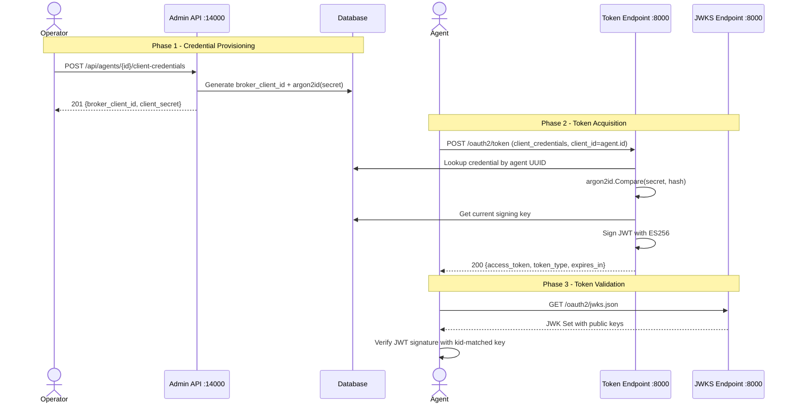
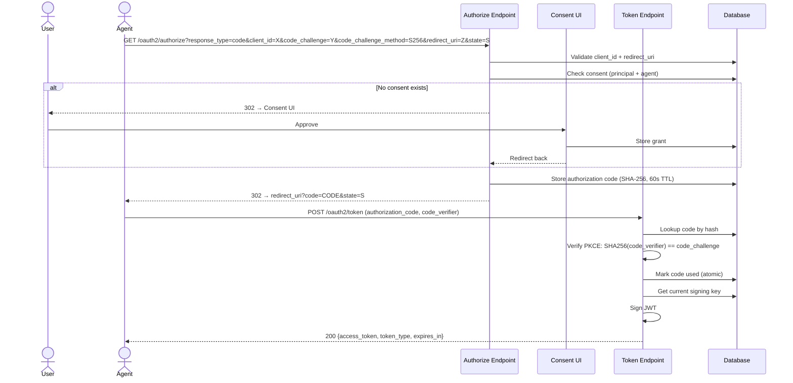

# API Contracts: OAuth2 Server Mode

**Branch**: `025-oauth2-server` | **Date**: 2026-03-28

## Admin API Endpoints (`:14000`)

All admin endpoints require admin-level access (no principal authentication — admin port is network-isolated).

---

### POST `/api/agents/{agent_id}/client-credentials`

**Purpose**: Generate (or rotate) broker-issued OAuth2 client credentials for an agent.

**Path Parameters**:
| Parameter | Type | Description |
|---|---|---|
| `agent_id` | UUID | The agent's unique identifier |

**Request**: No body required.

**Response `201 Created`** (generation):
```json
{
  "broker_client_id": "broker_7k4Hx9pQ2mLv3nWs5tYz1a",
  "client_secret": "dGhpc19pc19hX3NlY3JldF90aGF0X2lzXzMyX2J5dGVz",
  "created_at": "2026-03-28T12:00:00Z"
}
```

**Response `200 OK`** (rotation — previous credentials invalidated):
```json
{
  "broker_client_id": "broker_9m2Kx7rS4nPw1qYt6vBz3e",
  "client_secret": "bmV3X3NlY3JldF9hZnRlcl9yb3RhdGlvbl8zMl9ieXRlcw",
  "created_at": "2026-03-28T13:00:00Z",
  "previous_invalidated_at": "2026-03-28T13:00:00Z"
}
```

**Error Responses**:
| Status | Error | Description |
|---|---|---|
| `404 Not Found` | `agent_not_found` | Agent with given ID does not exist |
| `400 Bad Request` | `invalid_agent_id` | `agent_id` is not a valid UUID |

**Notes**:
- The `client_secret` is returned **once only** — it is never retrievable after this response
- On rotation (credentials already exist), the old secret is immediately invalidated
- The response uses `201` for first generation and `200` for rotation

---

### GET `/api/agents/{agent_id}/client-credentials`

**Purpose**: Retrieve broker-issued credential metadata for an agent (never returns the secret).

**Path Parameters**:
| Parameter | Type | Description |
|---|---|---|
| `agent_id` | UUID | The agent's unique identifier |

**Response `200 OK`**:
```json
{
  "broker_client_id": "broker_7k4Hx9pQ2mLv3nWs5tYz1a",
  "created_at": "2026-03-28T12:00:00Z",
  "rotated_at": "2026-03-28T13:00:00Z"
}
```

**Error Responses**:
| Status | Error | Description |
|---|---|---|
| `404 Not Found` | `credentials_not_found` | No credentials exist for this agent |
| `404 Not Found` | `agent_not_found` | Agent with given ID does not exist |
| `400 Bad Request` | `invalid_agent_id` | `agent_id` is not a valid UUID |

**Notes**:
- `rotated_at` is `null` if credentials have never been rotated

---

### DELETE `/api/agents/{agent_id}/client-credentials`

**Purpose**: Revoke broker-issued credentials for an agent.

**Path Parameters**:
| Parameter | Type | Description |
|---|---|---|
| `agent_id` | UUID | The agent's unique identifier |

**Response `204 No Content`**: Credentials successfully revoked.

**Error Responses**:
| Status | Error | Description |
|---|---|---|
| `404 Not Found` | `credentials_not_found` | No credentials exist for this agent |
| `404 Not Found` | `agent_not_found` | Agent with given ID does not exist |
| `400 Bad Request` | `invalid_agent_id` | `agent_id` is not a valid UUID |

---

### POST `/api/oauth2-server/signing-keys`

**Purpose**: Add a new signing key. The new key immediately becomes the current signing key.

**Request Body**:
```json
{
  "algorithm": "ES256"
}
```

| Field | Type | Required | Description |
|---|---|---|---|
| `algorithm` | string | No | Signing algorithm. Default: `ES256`. Allowed: `ES256`, `RS256` |

**Notes**: The broker generates the key pair server-side. Private key material is never provided by the client — this prevents exposure risks from key material in transit. The broker generates a CSPRNG key, encrypts the private material via `EncryptionPort`, and stores it.

**Response `201 Created`**:
```json
{
  "kid": "a1b2c3d4-e5f6-7890-abcd-ef1234567890",
  "algorithm": "ES256",
  "is_current": true,
  "created_at": "2026-03-28T12:00:00Z"
}
```

**Error Responses**:
| Status | Error | Description |
|---|---|---|
| `400 Bad Request` | `invalid_algorithm` | Unsupported algorithm |

---

### GET `/api/oauth2-server/signing-keys`

**Purpose**: List all active signing keys (never returns private key material).

**Response `200 OK`**:
```json
{
  "items": [
    {
      "kid": "a1b2c3d4-e5f6-7890-abcd-ef1234567890",
      "algorithm": "ES256",
      "is_current": true,
      "created_at": "2026-03-28T12:00:00Z"
    },
    {
      "kid": "f9e8d7c6-b5a4-3210-9876-543210fedcba",
      "algorithm": "ES256",
      "is_current": false,
      "created_at": "2026-03-20T10:00:00Z"
    }
  ]
}
```

**Notes**:
- Only active keys (`removed_at IS NULL`) are returned
- Response follows Zalando guidelines `items` wrapper
- No private key material is ever included

---

### PUT `/api/oauth2-server/signing-keys/{kid}/current`

**Purpose**: Promote an existing signing key to current. New tokens will be signed with this key.

**Path Parameters**:
| Parameter | Type | Description |
|---|---|---|
| `kid` | string | The key's unique `kid` identifier |

**Request**: No body required.

**Response `200 OK`**:
```json
{
  "kid": "f9e8d7c6-b5a4-3210-9876-543210fedcba",
  "algorithm": "ES256",
  "is_current": true,
  "created_at": "2026-03-20T10:00:00Z"
}
```

**Error Responses**:
| Status | Error | Description |
|---|---|---|
| `404 Not Found` | `key_not_found` | No active key with this `kid` exists |

---

### DELETE `/api/oauth2-server/signing-keys/{kid}`

**Purpose**: Remove a signing key from JWKS. Tokens signed with this key immediately fail validation.

**Path Parameters**:
| Parameter | Type | Description |
|---|---|---|
| `kid` | string | The key's unique `kid` identifier |

**Response `204 No Content`**: Key successfully removed.

**Error Responses**:
| Status | Error | Description |
|---|---|---|
| `404 Not Found` | `key_not_found` | No active key with this `kid` exists |
| `409 Conflict` | `last_key` | Cannot remove the last remaining active key — at least one must exist |

---

## End-User API Endpoints (`:8000`)

### POST `/oauth2/token`

**Purpose**: OAuth2 token endpoint supporting `client_credentials` and `authorization_code` grant types (in `issue_token` mode), plus existing token exchange (all modes).

**Content-Type**: `application/x-www-form-urlencoded`

#### Client Credentials Grant

**Request Parameters**:
| Parameter | Type | Required | Description |
|---|---|---|---|
| `grant_type` | string | Yes | Must be `client_credentials` |
| `client_id` | string | Yes | Agent UUID (broker-internal identifier, `agent.id`) |
| `client_secret` | string | Yes | Broker-issued client secret |
| `scope` | string | No | Space-delimited requested scopes |

**Response `200 OK`**:
```json
{
  "access_token": "eyJhbGciOiJFUzI1NiIsInR5cCI6IkpXVCIsImtpZCI6ImExYjJjM2Q0LWU1ZjYtNzg5MC1hYmNkLWVmMTIzNDU2Nzg5MCJ9...",
  "token_type": "Bearer",
  "expires_in": 3600
}
```

**JWT Access Token Claims**:
```json
{
  "iss": "https://broker.example.com",
  "sub": "550e8400-e29b-41d4-a716-446655440001",
  "iat": 1711612800,
  "exp": 1711616400,
  "jti": "unique-token-id",
  "kid": "a1b2c3d4-e5f6-7890-abcd-ef1234567890",
  "agent_id": "550e8400-e29b-41d4-a716-446655440001",
  "scope": "read write"
}
```

- `sub`: For `client_credentials` grants: the agent UUID. For `authorization_code` grants: the authenticated principal (user identity), per FR-008.
- `agent_id`: Always the agent UUID, regardless of grant type
- `kid`: Signing key identifier (in JWT header, not payload)

**Error Responses**:
| Status | Error Code | Description |
|---|---|---|
| `401 Unauthorized` | `invalid_client` | Unknown client_id or incorrect secret |
| `400 Bad Request` | `invalid_scope` | Requested scopes exceed permitted scopes |
| `400 Bad Request` | `unsupported_grant_type` | Grant type not supported |

#### Authorization Code Grant

**Request Parameters**:
| Parameter | Type | Required | Description |
|---|---|---|---|
| `grant_type` | string | Yes | Must be `authorization_code` |
| `code` | string | Yes | Authorization code from `/oauth2/authorize` |
| `redirect_uri` | string | Yes | Must match the URI from the authorization request |
| `client_id` | string | Yes | Agent UUID (broker-internal identifier, `agent.id`) |
| `code_verifier` | string | Yes | PKCE code verifier (RFC 7636) |

**Response `200 OK`**: Same format as client credentials grant, except `sub` is the authenticated principal (user identity) and `agent_id` carries the agent UUID.

**Error Responses**:
| Status | Error Code | Description |
|---|---|---|
| `400 Bad Request` | `invalid_grant` | Code expired (>60s), already used, or PKCE mismatch |
| `401 Unauthorized` | `invalid_client` | Unknown or invalid client_id |
| `400 Bad Request` | `invalid_request` | Missing required parameters |

---

### GET `/oauth2/authorize`

**Purpose**: OAuth2 authorization endpoint for authorization code flow with PKCE (in `issue_token` mode).

**Query Parameters**:
| Parameter | Type | Required | Description |
|---|---|---|---|
| `response_type` | string | Yes | Must be `code` |
| `client_id` | string | Yes | Agent UUID (broker-internal identifier, `agent.id`) |
| `redirect_uri` | string | Yes | Must match a registered redirect URI |
| `state` | string | Recommended | CSRF protection value |
| `code_challenge` | string | Yes | PKCE code challenge (S256) |
| `code_challenge_method` | string | Yes | Must be `S256` |
| `scope` | string | No | Space-delimited requested scopes |

**Success Response `302 Found`**:
```
Location: https://agent.example.com/callback?code=AUTH_CODE&state=STATE_VALUE
```

**Error Responses**:

Direct JSON responses (no redirect):
```json
HTTP 400
{
  "error": "invalid_client",
  "error_description": "client_id must be a valid agent UUID"
}
```

Redirect responses (error appended to `redirect_uri` as query params):
```
Location: https://agent.example.com/callback?error=ERROR_CODE&error_description=DESCRIPTION&state=STATE_VALUE
```

| Error Code | Delivery | Description |
|---|---|---|
| `invalid_client` | Direct JSON 400 | `client_id` is not a valid UUID |
| `invalid_redirect_uri` | Direct JSON 400 | `redirect_uri` not registered on agent — no redirect performed |
| `invalid_request` | Direct JSON 400 | Missing `code_challenge` or `code_challenge_method` |
| `unsupported_response_type` | Direct JSON 400 | `response_type` is not `code` |
| `server_error` | Direct JSON 500 | Internal infrastructure failure |
| `invalid_client` | Redirect to `redirect_uri` | Well-formed UUID but no registered agent (redirect_uri taken from request, not validated against agent) |
| `invalid_scope` | Redirect to `redirect_uri` | Requested scopes exceed the agent's `allowed_scopes` (agent found; redirect_uri validated) |
| `access_denied` | Redirect to `redirect_uri` | User explicitly denied consent |

**Flow**:
1. Validate `client_id` → parse as agent UUID → resolve agent from `AgentRepository` → resolve credentials from `BrokerClientCredentialRepository`
2. Validate `redirect_uri` → exact match against agent's `redirect_uris`
3. Validate PKCE → `code_challenge` and `code_challenge_method=S256` required
4. Check consent → redirect to consent UI if no active grant
5. Issue code → generate authorization code, store with TTL, redirect

---

### GET `/oauth2/jwks.json`

**Purpose**: Serve all currently active public signing keys in JWK Set format.

**Response `200 OK`**:
```json
{
  "keys": [
    {
      "kty": "EC",
      "crv": "P-256",
      "x": "...",
      "y": "...",
      "kid": "a1b2c3d4-e5f6-7890-abcd-ef1234567890",
      "use": "sig",
      "alg": "ES256"
    }
  ]
}
```

**Headers**:
- `Cache-Control: public, max-age=300` (5 minutes)
- `Content-Type: application/json`

**Notes**:
- Only active keys (`removed_at IS NULL`) are included
- Only public key material is served — never private keys
- Available only in `issue_token` mode; returns `404` in `proxy` mode

---

### GET `/.well-known/oauth-authorization-server`

**Purpose**: RFC 8414 OAuth2 Authorization Server Metadata discovery.

**Response `200 OK`**:
```json
{
  "issuer": "https://broker.example.com",
  "authorization_endpoint": "https://broker.example.com/oauth2/authorize",
  "token_endpoint": "https://broker.example.com/oauth2/token",
  "jwks_uri": "https://broker.example.com/oauth2/jwks.json",
  "response_types_supported": ["code"],
  "grant_types_supported": ["authorization_code", "client_credentials"],
  "token_endpoint_auth_methods_supported": ["client_secret_post"],
  "code_challenge_methods_supported": ["S256"],
  "scopes_supported": []
}
```

**Headers**:
- `Cache-Control: public, max-age=3600` (1 hour)

**Notes**:
- Available only in `issue_token` mode; returns `404` in `proxy` mode
- `jwks_uri` points to `/oauth2/jwks.json` on the same host
- `openid-configuration` is **not** exposed (this is not an OIDC provider)

---

## Agent Entity API Changes (Existing Endpoints)

### PATCH `/api/agents/{agent_id}` — Modified

**New optional fields in request body**:
```json
{
  "redirect_uris": ["https://agent.example.com/callback"],
  "allowed_scopes": ["read", "write"]
}
```

**Validation**:
- `redirect_uris`: Each URI must be a valid HTTPS URL (or `http://localhost:*` for development). Empty array is valid — authorization requests will be rejected at the endpoint
- `allowed_scopes`: List of scope strings the agent is permitted to request. Empty array means unrestricted (all scopes allowed). When non-empty, token/authorize requests with scopes not in this list are rejected with `invalid_scope`

### POST `/api/agents` — Modified

**New optional fields in request body**:
```json
{
  "redirect_uris": ["https://agent.example.com/callback"],
  "allowed_scopes": ["read", "write"]
}
```

**Defaults**: Both default to empty array `[]`

---

## Error Response Format

All error responses follow the standard OAuth2 error format (RFC 6749 Section 5.2) for token/authorize endpoints:

```json
{
  "error": "error_code",
  "error_description": "Human-readable description"
}
```

Admin API errors follow the existing project error format:

```json
{
  "error": {
    "code": "error_code",
    "message": "Human-readable description"
  }
}
```

---

## Sequence Diagrams

### Client Credentials Grant Flow



### Authorization Code Flow with PKCE


