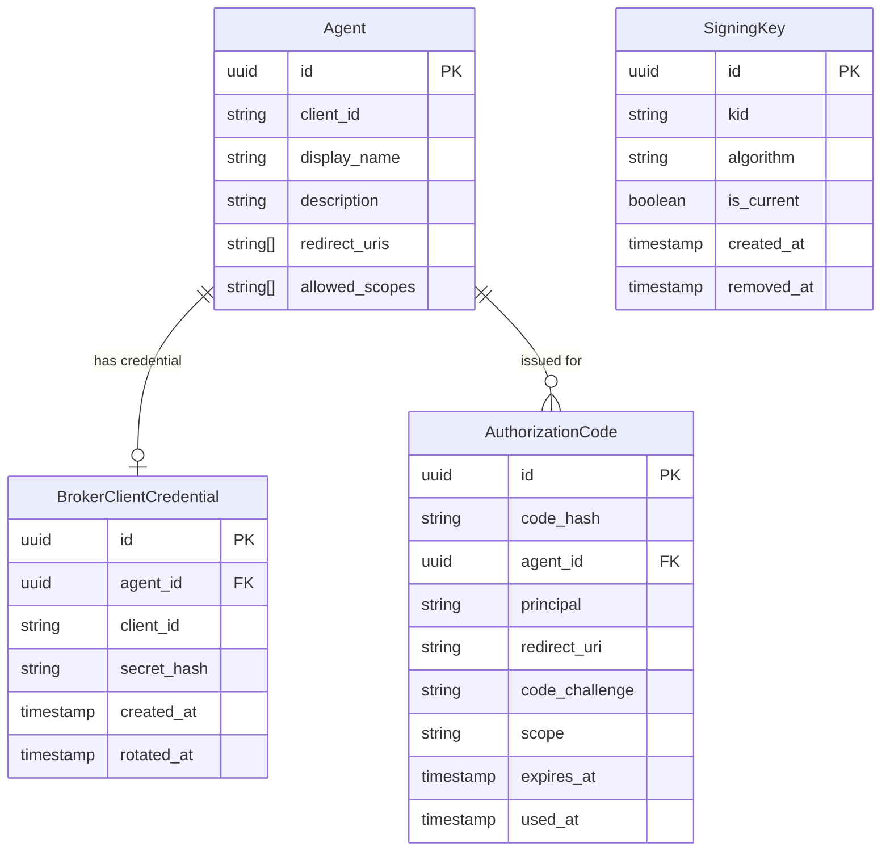

# Data Model: OAuth2 Server Mode

**Branch**: `025-oauth2-server` | **Date**: 2026-03-28

## Domain Entities

### 1. BrokerClientCredential

OAuth2 client credentials generated by the broker and bound to exactly one Agent. Lifecycle: created on demand via Admin API, replaced atomically on rotation, cascade-deleted when the associated Agent is deleted.

| Field | Type | Constraints | Description |
|---|---|---|---|
| `id` | `CredentialID` (UUID) | PK | Unique identifier |
| `agent_id` | `AgentID` (UUID) | FK → agents.id, UNIQUE, CASCADE DELETE | Owning agent |
| `client_id` | `ClientID` (string) | UNIQUE, NOT NULL | Opaque client identifier for OAuth2 flows |
| `secret_hash` | `string` | NOT NULL | Argon2id hash of the client secret (PHC string format) |
| `created_at` | `time.Time` | NOT NULL, DEFAULT NOW() | Creation timestamp |
| `rotated_at` | `*time.Time` | NULLABLE | Last rotation timestamp (nil if never rotated) |

**Validation rules**:
- `agent_id` must reference an existing Agent
- `client_id` must be non-empty and globally unique
- `secret_hash` must be a valid Argon2id PHC string (`$argon2id$v=19$...`)
- One credential set per agent (enforced by UNIQUE on `agent_id`)

**State transitions**:
```
[Created] → POST /agents/{id}/client-credentials → [Active]
[Active]  → POST /agents/{id}/client-credentials → [Rotated] (old invalidated, new active)
[Active]  → DELETE /agents/{id}/client-credentials → [Revoked]
[Active]  → DELETE /agents/{id} → [Cascade Deleted]
```

### 2. SigningKey

Asymmetric key pair used to sign locally-issued JWT access tokens. Exactly one key is marked `is_current` at any time. Private material is stored PEM-encoded and encrypted via `EncryptionPort`. Keys remain in JWKS until explicitly removed.

| Field | Type | Constraints | Description |
|---|---|---|---|
| `id` | `SigningKeyID` (UUID) | PK | Unique identifier |
| `kid` | `KeyID` (string) | UNIQUE, NOT NULL | JWT Key ID (`kid` claim) |
| `algorithm` | `string` | NOT NULL, DEFAULT 'ES256' | Signing algorithm (ES256, RS256) |
| `private_key_encrypted` | `[]byte` | NOT NULL | PEM PKCS#8 private key, encrypted via EncryptionPort |
| `is_current` | `bool` | NOT NULL, DEFAULT false | Whether this is the active signing key |
| `created_at` | `time.Time` | NOT NULL, DEFAULT NOW() | Creation timestamp |
| `removed_at` | `*time.Time` | NULLABLE | Soft-delete timestamp (removed from JWKS) |

**Invariants**:
- Exactly one key has `is_current = true` and `removed_at IS NULL` at any time
- Keys with `removed_at IS NOT NULL` are excluded from JWKS and never used for signing
- Private key material must decrypt successfully or startup fails (SR-006)
- `kid` is immutable after creation

**State transitions**:
```
[Auto-generated at startup] → [Current, Active]
[Added via Admin API] → [Current, Active] (previous current → [Non-current, Active])
[Current, Active] → PUT /{kid}/current (another key) → [Non-current, Active]
[Non-current, Active] → DELETE /{kid} → [Removed]
[Current, Active] → DELETE /{kid} → 409 Conflict (cannot remove last/current key)
```

**Encryption context**: `{"kid": "<kid>"}`

### 3. AuthorizationCode

Ephemeral, single-use code issued by the authorization endpoint and exchanged for an access token. Stored with SHA-256 hash of the code value. Expires after 60 seconds. Invalidated atomically on first use.

| Field | Type | Constraints | Description |
|---|---|---|---|
| `id` | `AuthorizationCodeID` (UUID) | PK | Unique identifier |
| `code_hash` | `string` | UNIQUE, NOT NULL | SHA-256 hash of the authorization code |
| `agent_id` | `AgentID` (UUID) | FK → agents.id, NOT NULL | Agent that requested authorization |
| `principal` | `Principal` (string) | NOT NULL | Authenticated user identity |
| `redirect_uri` | `string` | NOT NULL | Redirect URI from the authorization request |
| `code_challenge` | `string` | NOT NULL | PKCE S256 code challenge |
| `scope` | `string` | NOT NULL, DEFAULT '' | Requested scopes (space-delimited) |
| `expires_at` | `time.Time` | NOT NULL | Absolute expiry (created_at + 60s) |
| `used_at` | `*time.Time` | NULLABLE | Timestamp of first use (nil if unused) |
| `created_at` | `time.Time` | NOT NULL, DEFAULT NOW() | Creation timestamp |

**Validation rules**:
- `code_challenge_method` is always S256 (enforced at authorization endpoint, not stored)
- `redirect_uri` must exactly match one of the agent's registered redirect URIs
- `principal` extracted from preauth (X-Remote-User or JWT)

**State transitions**:
```
[Issued] → authorize endpoint → [Active, Unused]
[Active, Unused] → token exchange (within 60s) → [Used] (returns token)
[Active, Unused] → 60s passes → [Expired] (exchange returns invalid_grant)
[Used] → second exchange attempt → [Rejected] (invalid_grant)
```

### 4. Agent (MODIFIED — existing entity)

**New field**: `redirect_uris`, `allowed_scopes`

| Field | Type | Constraints | Description |
|---|---|---|---|
| `redirect_uris` | `[]string` | NOT NULL, DEFAULT '{}' | Registered OAuth2 redirect URIs (exact match validation) |
| `allowed_scopes` | `[]string` | NOT NULL, DEFAULT '{}' | Maximum set of scopes the agent may request; empty means unrestricted |

**Validation**: Each redirect URI must be a valid HTTPS URL (or `http://localhost:*` for development). Empty list is allowed — authorization requests are rejected at the endpoint if no URIs are registered. When `allowed_scopes` is non-empty, token/authorize requests with scopes not in this list are rejected with `invalid_scope`.

## Value Objects

### ClientID (credential)

Opaque string identifier uniquely identifying a broker-issued OAuth2 client. Format: `broker_` prefix + 22 character base64url random string (e.g., `broker_7k4Hx9pQ2mLv3nWs5tYz1a`). Immutable after generation. Uses the existing `id.ClientID` type.

**Type**: `type ClientID string` in `internal/domain/id/string_ids.go`

### KeyID (`kid`)

Opaque string uniquely identifying a signing key within JWKS. Format: UUID v4 string (e.g., `a1b2c3d4-e5f6-7890-abcd-ef1234567890`). Immutable after creation.

**Type**: `type KeyID string` in `internal/domain/id/string_ids.go`

### HashedSecret

One-way Argon2id hash of a client secret. Stored in PHC string format (`$argon2id$v=19$m=65536,t=3,p=4$<salt>$<hash>`). Never stored alongside the plaintext.

**Not a separate type** — represented as `string` field on `BrokerClientCredential`.

## Typed Entity IDs (ADR 013)

### New UUID types (add to `gen_ids.go`):

| Type | Entity | Package |
|---|---|---|
| `CredentialID` | BrokerClientCredential | `internal/domain/id` |
| `SigningKeyID` | SigningKey | `internal/domain/id` |
| `AuthorizationCodeID` | AuthorizationCode | `internal/domain/id` |

### New string types (add to `string_ids.go`):

| Type | Purpose | Package |
|---|---|---|
| `ClientID` | OAuth2 client identifier (shared by Agent and BrokerClientCredential) | `internal/domain/id` |
| `KeyID` | JWT `kid` claim value identifying a signing key | `internal/domain/id` |

## Repository Interfaces

All added to `internal/ports/storage.go` following ISP (max 5-7 methods per interface).

### BrokerClientCredentialRepository

```go
type BrokerClientCredentialRepository interface {
    Create(ctx context.Context, credential *storage.BrokerClientCredential) error
    GetByAgentID(ctx context.Context, agentID id.AgentID) (*storage.BrokerClientCredential, error)
    GetByClientID(ctx context.Context, clientID id.ClientID) (*storage.BrokerClientCredential, error)
    Delete(ctx context.Context, agentID id.AgentID) error
}
```

### SigningKeyRepository

```go
type SigningKeyRepository interface {
    Create(ctx context.Context, key *storage.SigningKey) error
    GetByKID(ctx context.Context, kid id.KeyID) (*storage.SigningKey, error)
    GetCurrent(ctx context.Context) (*storage.SigningKey, error)
    ListActive(ctx context.Context) ([]*storage.SigningKey, error)
    SetCurrent(ctx context.Context, kid id.KeyID) error
    Delete(ctx context.Context, kid id.KeyID) error
    CountActive(ctx context.Context) (int, error)
}
```

### AuthorizationCodeRepository

```go
type AuthorizationCodeRepository interface {
    Create(ctx context.Context, code *storage.AuthorizationCode) error
    FindByCodeHash(ctx context.Context, codeHash string) (*storage.AuthorizationCode, error)
    MarkUsed(ctx context.Context, id id.AuthorizationCodeID) error
    DeleteExpired(ctx context.Context) (int, error)
}
```

## Database Migrations

### Migration 009: Add redirect_uris to agents

```sql
-- 009_add_agent_redirect_uris.up.sql
ALTER TABLE agents ADD COLUMN redirect_uris TEXT[] NOT NULL DEFAULT '{}';
ALTER TABLE agents ADD COLUMN allowed_scopes TEXT[] NOT NULL DEFAULT '{}';

-- 009_add_agent_redirect_uris.down.sql
ALTER TABLE agents DROP COLUMN allowed_scopes;
ALTER TABLE agents DROP COLUMN redirect_uris;
```

### Migration 010: Create broker_client_credentials

```sql
-- 010_create_broker_client_credentials.up.sql
CREATE TABLE broker_client_credentials (
    id            UUID PRIMARY KEY DEFAULT gen_random_uuid(),
    agent_id      UUID NOT NULL UNIQUE REFERENCES agents(id) ON DELETE CASCADE,
    client_id VARCHAR(255) NOT NULL UNIQUE,
    secret_hash   TEXT NOT NULL,
    created_at    TIMESTAMPTZ NOT NULL DEFAULT NOW(),
    rotated_at    TIMESTAMPTZ
);

CREATE INDEX idx_broker_client_credentials_client_id ON broker_client_credentials(client_id);

-- 010_create_broker_client_credentials.down.sql
DROP TABLE IF EXISTS broker_client_credentials;
```

### Migration 011: Create signing_keys

```sql
-- 011_create_signing_keys.up.sql
CREATE TABLE signing_keys (
    id                    UUID PRIMARY KEY DEFAULT gen_random_uuid(),
    kid                   VARCHAR(255) NOT NULL UNIQUE,
    algorithm             VARCHAR(10) NOT NULL DEFAULT 'ES256',
    private_key_encrypted BYTEA NOT NULL,
    is_current            BOOLEAN NOT NULL DEFAULT false,
    created_at            TIMESTAMPTZ NOT NULL DEFAULT NOW(),
    removed_at            TIMESTAMPTZ
);

CREATE INDEX idx_signing_keys_active ON signing_keys(removed_at) WHERE removed_at IS NULL;

-- 011_create_signing_keys.down.sql
DROP TABLE IF EXISTS signing_keys;
```

### Migration 012: Create authorization_codes

```sql
-- 012_create_authorization_codes.up.sql
CREATE TABLE authorization_codes (
    id              UUID PRIMARY KEY DEFAULT gen_random_uuid(),
    code_hash       VARCHAR(64) NOT NULL UNIQUE,
    agent_id        UUID NOT NULL REFERENCES agents(id) ON DELETE CASCADE,
    principal       VARCHAR(255) NOT NULL,
    redirect_uri    TEXT NOT NULL,
    code_challenge  VARCHAR(128) NOT NULL,
    scope           TEXT NOT NULL DEFAULT '',
    expires_at      TIMESTAMPTZ NOT NULL,
    used_at         TIMESTAMPTZ,
    created_at      TIMESTAMPTZ NOT NULL DEFAULT NOW()
);

CREATE INDEX idx_authorization_codes_expires ON authorization_codes(expires_at) WHERE used_at IS NULL;

-- 012_create_authorization_codes.down.sql
DROP TABLE IF EXISTS authorization_codes;
```

## Entity Relationship Diagram


