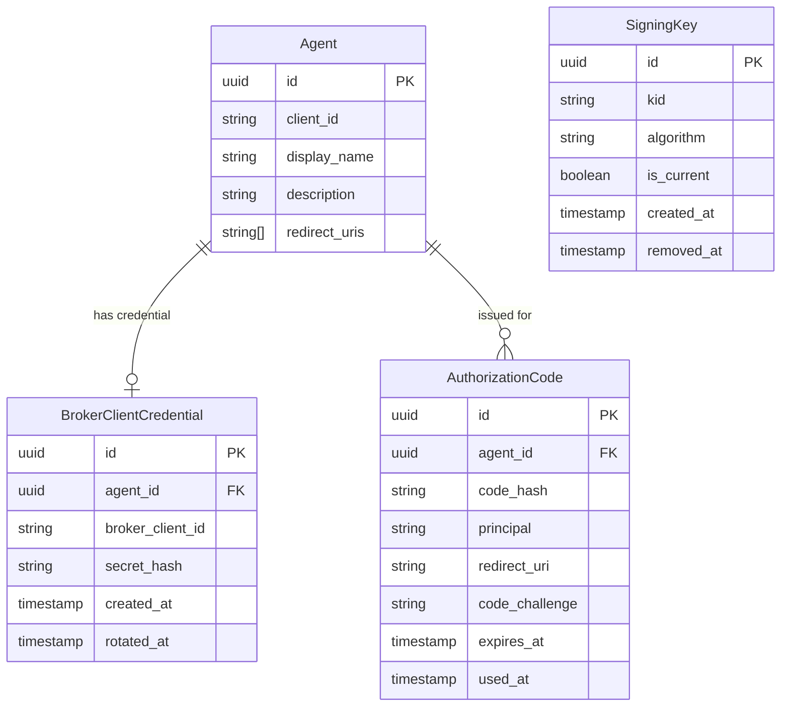
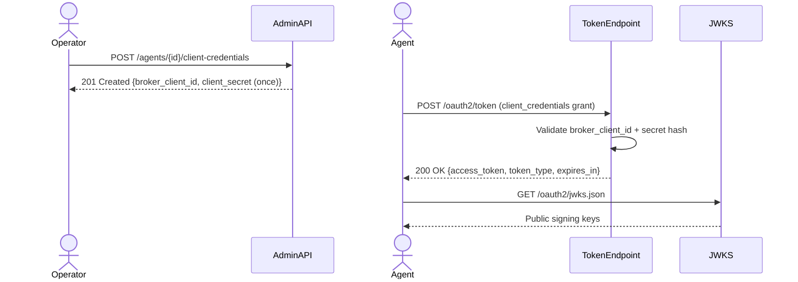

# Feature Specification: Broker OAuth2 Server Mode

**Feature Branch**: `025-oauth2-server`
**Created**: 2026-03-28
**Status**: Draft
**Input**: User description: "Add local token minting mode to identity broker, enabling it to operate as a standalone OAuth2 server in addition to the existing upstream proxy mode. Broker must support local token minting, client management, and mapping of locally issued client IDs to agents. Admin API extended to generate and obtain client credentials per agent."

## Clarifications

### Session 2026-03-28

- Q: In `issue_token` mode, does the broker issue authorization codes itself or proxy the authorization step upstream? → A: Broker issues authorization codes itself — fully standalone. Identity is derived from the configured preauth method (X-Remote-User reverse-proxy header or JWT preauth), not from an upstream OAuth2 server redirect.
- Q: What is the JWK rotation strategy? → A: Overlapping keys via `kid` — broker always signs new tokens with the current (latest) key but publishes and validates all configured active keys; old tokens remain valid until natural expiry.
- Q: Which OAuth2 discovery document standard should the broker expose? → A: RFC 8414 only — `/.well-known/oauth-authorization-server`, including a `jwks_uri` field pointing to the JWKS endpoint.
- Q: How should signing keys be stored and managed? → A: Database-persisted — signing keys are stored in PostgreSQL, managed via Admin API (add/remove/set-current). No env-var key at startup; Admin API is the sole provisioning surface.
- Q: What is the authorization code lifespan and is PKCE required? → A: Short-lived codes (60 seconds), PKCE required for all authorization code flows (RFC 7636 / RFC 9700).
- Q: What happens at startup in `issue_token` mode if no signing key exists? → A: Broker auto-generates an initial signing key rather than failing to start.
- Q: Where are redirect URIs registered and validated? → A: Redirect URIs are registered on the Agent entity (via the existing agent Admin API, new `redirect_uris` field); the authorization endpoint validates exact match against the registered list.
- Q: Where are in-flight authorization codes stored? → A: Database-persisted in an `authorization_codes` table with TTL; survives restarts and supports multi-replica deployments.
- Q: What is the JWKS endpoint path? → A: `/oauth2/jwks.json` on the end-user server, consistent with existing `/oauth2/` routing.
- Q: When are `redirect_uris` enforced on agents? → A: At authorization request time only — agents may be created/updated with an empty `redirect_uris` list; the authorization endpoint rejects the request if no redirect URIs are registered for the agent.

## User Scenarios & Testing *(mandatory)*

### User Story 1 - Operator Generates Client Credentials for an Agent (Priority: P1)

An operator administering the identity broker needs to provision OAuth2 client credentials for a registered agent so that the agent can authenticate against the broker's locally-issued token endpoint. The operator calls the Admin API to generate a new client ID and client secret bound to a specific agent.

**Why this priority**: This is the prerequisite for all local token minting. Without provisioned credentials, no agent can request locally-minted tokens. Delivers immediate, demonstrable value to operators configuring the broker as a standalone server.

**Independent Test**: Can be fully tested by calling the Admin API to generate credentials for an existing agent and verifying that a unique client ID and secret are returned. Delivers value by enabling credential provisioning independently of the token minting implementation.

**Acceptance Scenarios**:

1. **Given** an agent exists and the broker is configured in `issue_token` mode, **When** an operator sends a POST to `/agents/{agent_id}/client-credentials`, **Then** the system generates and stores a new broker-issued client ID and hashed client secret, returning the plaintext secret once in the response
2. **Given** client credentials already exist for an agent, **When** an operator generates new credentials (rotates), **Then** the previous credentials are invalidated and the new credentials are returned
3. **Given** an agent that does not exist, **When** an operator attempts to generate credentials, **Then** the system returns 404 Not Found
4. **Given** newly generated credentials, **When** an operator retrieves the credentials via GET `/agents/{agent_id}/client-credentials`, **Then** the system returns the client ID and credential metadata (creation time, last rotation time) but never the plaintext secret

---

### User Story 2 - Operator Configures Broker to Issue Tokens Locally (Priority: P2)

An operator wants to run the identity broker without depending on an upstream OAuth2 server for token minting. They configure the broker's `oauth2_authorization_server` block with `mode: issue_token`, provide signing key material, and the broker begins minting and validating its own access tokens.

**Why this priority**: This is the mode-switch enabler. It allows operators to validate the full local minting stack end-to-end and is the core deliverable of this feature.

**Independent Test**: Can be fully tested by starting the broker with `mode: issue_token`, hitting the token endpoint with valid client credentials, and verifying a locally-signed token is returned. Delivers value by proving the broker can operate fully standalone.

**Acceptance Scenarios**:

1. **Given** the broker is configured with `oauth2_authorization_server.mode: issue_token` and valid signing key material, **When** the broker starts, **Then** it starts successfully and token and metadata endpoints are available
2. **Given** the broker is in `issue_token` mode with no upstream issuer URI configured, **When** the broker starts, **Then** it starts without error (upstream URI is not required in this mode)
3. **Given** the broker is in `proxy` mode (existing behavior), **When** no mode is set (default), **Then** existing proxy behavior is unchanged and no breaking change is introduced
4. **Given** `mode: issue_token` is set but no signing key exists in the database, **When** the broker starts, **Then** it automatically generates an initial signing key, stores it encrypted in the database, marks it as current, and logs that auto-generation occurred

---

### User Story 3 - Agent Obtains a Locally-Minted Access Token (Priority: P3)

An AI agent authenticates to the identity broker using its broker-issued client credentials (client credentials grant flow) and receives a locally-minted access token signed by the broker.

**Why this priority**: This is the full end-to-end scenario that proves local minting delivers a usable token. Depends on P1 (credentials provisioned) and P2 (mode configured) but is independently testable once those are in place.

**Independent Test**: Can be fully tested using the broker's token endpoint with a valid client_id and client_secret, verifying a signed access token is returned that can be validated using the broker's JWKS endpoint.

**Acceptance Scenarios**:

1. **Given** a registered agent with provisioned client credentials and the broker in `issue_token` mode, **When** the agent sends a POST to `/oauth2/token` with `grant_type=client_credentials` and its credentials, **Then** the broker returns a signed access token, token type, and expiry
2. **Given** an agent presents invalid or unknown client credentials, **When** the token request is processed, **Then** the broker returns an OAuth2 `invalid_client` error response (401)
3. **Given** a locally-minted access token, **When** a consumer validates the token using the broker's JWKS endpoint, **Then** the token signature is valid and the token contains the agent's broker-internal ID as a claim
4. **Given** an agent requests a token with scopes, **When** the requested scopes exceed what is permitted for that agent, **Then** the broker returns an `invalid_scope` error

---

### User Story 4 - Agent Obtains a Token via Authorization Code Flow (Priority: P4)

A user-facing AI agent needs to obtain an access token on behalf of an authenticated user. The agent initiates an authorization code flow with PKCE through the broker. The broker derives the user's identity from the configured preauth method, checks consent, issues an authorization code, and exchanges it for a locally-minted access token — entirely without delegating to an upstream OAuth2 server.

**Why this priority**: This is the primary flow currently in use via the proxy mode. In `issue_token` mode it must continue to work end-to-end, now with the broker as the authoritative token issuer. Depends on P1 (credentials) and P2 (mode configured).

**Independent Test**: Can be fully tested by initiating a full authorization code + PKCE flow with a valid authenticated user (X-Remote-User or JWT preauth), verifying a broker-signed access token is returned after code exchange.

**Acceptance Scenarios**:

1. **Given** an authenticated user and a registered agent with provisioned credentials and at least one registered redirect URI, **When** the agent sends a GET to `/oauth2/authorize` with `response_type=code`, `client_id`, `redirect_uri`, `state`, `code_challenge`, and `code_challenge_method=S256`, **Then** the broker validates the client, verifies `redirect_uri` is in the agent's registered redirect URIs, checks consent, and redirects to `redirect_uri` with an authorization code
2. **Given** an authorization request with a `redirect_uri` not registered on the agent, **When** the broker processes the request, **Then** it returns an `invalid_redirect_uri` error — no redirect is performed and no code is issued
3. **Given** an authorization request without `code_challenge`, **When** the broker processes the request, **Then** it returns an `invalid_request` error immediately — no code is issued
4. **Given** an authorization request where the user has not yet granted consent, **When** the broker checks consent, **Then** it redirects the user to the consent UI (as in existing proxy mode behavior)
5. **Given** a valid authorization code and matching `code_verifier`, **When** the agent sends a POST to `/oauth2/token` with `grant_type=authorization_code`, **Then** the broker validates the PKCE verifier, invalidates the code, and returns a locally-signed access token
6. **Given** a `code_verifier` that does not match the original `code_challenge`, **When** the token request is processed, **Then** the broker returns an `invalid_grant` error
7. **Given** an authorization code that has already been used once, **When** it is presented a second time, **Then** the broker returns `invalid_grant`
8. **Given** an authorization code that has not been exchanged within 60 seconds, **When** it is presented, **Then** the broker returns `invalid_grant`

---

### User Story 5 - Operator Manages Signing Keys (Priority: P5)

An operator needs to rotate signing keys to maintain security hygiene without disrupting active tokens. They add a new signing key via the Admin API (which immediately becomes the current signing key), allow existing tokens signed with the old key to expire naturally, then remove the old key once safe to do so.

**Why this priority**: Key rotation is an operational requirement for any long-lived OAuth2 server. Without it, the broker cannot be securely operated. Depends on P2 (issue_token mode).

**Independent Test**: Can be fully tested by adding a key, verifying it becomes current, issuing a token (check `kid`), adding a second key, verifying it becomes current, then confirming the first key still validates the old token while the new key signs new tokens.

**Acceptance Scenarios**:

1. **Given** the broker is in `issue_token` mode, **When** an operator sends a POST to `/oauth2-server/signing-keys` with private key material, **Then** the new key is stored encrypted, assigned a unique `kid`, marked as current, and returned with its `kid`
2. **Given** multiple signing keys exist, **When** an operator calls GET `/oauth2-server/signing-keys`, **Then** the response lists all active keys with `kid`, algorithm, `created_at`, and `is_current`; no private key material is returned
3. **Given** a non-current signing key, **When** an operator sends PUT `/oauth2-server/signing-keys/{kid}/current`, **Then** the selected key becomes current and new tokens are signed with it
4. **Given** a non-current signing key with no unexpired tokens depending on it, **When** an operator sends DELETE `/oauth2-server/signing-keys/{kid}`, **Then** the key is removed from JWKS and tokens signed with it immediately fail validation
5. **Given** only one signing key exists (the current key), **When** an operator attempts to delete it, **Then** the broker returns `409 Conflict` — at least one key must remain
6. **Given** a key exists in JWKS, **When** a token consumer fetches `/.well-known/oauth-authorization-server` and follows `jwks_uri`, **Then** all active public keys appear in the response

---

### User Story 6 - Client Discovers Broker OAuth2 Metadata (Priority: P6)

An OAuth2 client library or API gateway needs to automatically configure itself to use the broker as an authorization server. It fetches the broker's discovery document and uses the returned endpoints and `jwks_uri` to validate tokens and initiate flows without manual configuration.

**Why this priority**: Standard OAuth2 metadata discovery enables zero-config client integration. It completes the broker's identity as a standards-compliant authorization server. Depends on P2 (issue_token mode).

**Independent Test**: Can be fully tested by fetching `/.well-known/oauth-authorization-server` and verifying all mandatory RFC 8414 fields are present and correct, including `jwks_uri` pointing to a valid JWKS response.

**Acceptance Scenarios**:

1. **Given** the broker is in `issue_token` mode, **When** a client fetches `/.well-known/oauth-authorization-server`, **Then** the response includes `issuer`, `authorization_endpoint`, `token_endpoint`, `jwks_uri`, `response_types_supported`, and `grant_types_supported`
2. **Given** the discovery document, **When** a client follows `jwks_uri`, **Then** it receives a valid JWKS containing all currently active public signing keys
3. **Given** the broker is in `proxy` mode, **When** a client fetches `/.well-known/oauth-authorization-server`, **Then** the endpoint is not exposed (404) — discovery is only available in `issue_token` mode

---

### Edge Cases

- What happens when credentials are generated for an agent in `proxy` mode? Credentials are stored but the token endpoint rejects them until the broker is switched to `issue_token` mode.
- What happens if signing key material is rotated while active tokens exist? Old keys remain published in JWKS until explicitly removed; tokens signed with the old key remain valid until natural expiry, as long as the old key is still present in JWKS. Removing a key immediately invalidates all tokens signed with it.
- What happens when a client secret is lost (not retrievable after generation)? Operator must rotate (generate new) credentials; there is no secret recovery mechanism.
- What happens when both `mode: issue_token` and upstream issuer URI are configured? The upstream URI is ignored in `issue_token` mode; the broker logs a warning.
- What happens when an authorization code is presented twice? The second use is rejected with `invalid_grant`; the associated code is invalidated immediately on first use.
- What happens when a PKCE `code_challenge` is absent from an authorization request? The request is rejected immediately with `invalid_request`; no code is issued.
- What happens when no signing key exists in the database at startup in `issue_token` mode? The broker auto-generates an initial signing key, logs the event, and starts normally.
- What happens when the broker is in `proxy` mode and a client attempts to authenticate with broker-issued credentials? The request is rejected; proxy mode forwards all token requests upstream.
- What happens when an authorization code flow is attempted for an agent with no registered `redirect_uris`? The authorization endpoint returns `invalid_request` — no code is issued and no redirect is performed.

## Requirements *(mandatory)*

### Functional Requirements

- **FR-001**: System MUST support a new `issue_token` value for `oauth2_authorization_server.mode` in addition to the existing proxy mode
- **FR-002**: System MUST default to existing proxy mode behavior when no `mode` is set, preserving full backward compatibility
- **FR-003**: Admin API MUST expose an endpoint to generate (or rotate) broker-issued OAuth2 client credentials for a given agent
- **FR-004**: Admin API MUST expose an endpoint to retrieve broker-issued credential metadata (client ID, creation time, rotation time) for a given agent, without ever returning the plaintext secret
- **FR-005**: System MUST store broker-issued client secrets in hashed form; plaintext secret MUST only be returned once at generation time
- **FR-006**: System MUST bind each broker-issued client ID uniquely to exactly one agent; a single agent has at most one active credential set at a time
- **FR-006b**: The Admin API for agent create/update MUST accept an optional `redirect_uris` field (list of HTTPS URIs); agents may be created or updated with an empty list regardless of the broker's operating mode
- **FR-006c**: The authorization endpoint MUST reject any `redirect_uri` in an authorization request that is not an exact match of one of the agent's registered redirect URIs, or if the agent has no registered redirect URIs; no redirect is performed on rejection
- **FR-007**: In `issue_token` mode, the token endpoint MUST accept `grant_type=client_credentials` requests authenticated with broker-issued credentials and return locally-signed access tokens
- **FR-007b**: In `issue_token` mode, the authorization endpoint MUST accept `grant_type=authorization_code` flow, issuing authorization codes itself by trusting the identity established by the configured preauth method (X-Remote-User header or JWT preauth) — no upstream OAuth2 redirect is performed
- **FR-007c**: In `issue_token` mode, the authorization endpoint MUST validate the `client_id` against registered agents and enforce existing consent checks before issuing an authorization code
- **FR-007d**: Authorization codes issued by the broker MUST expire after 60 seconds
- **FR-007e**: PKCE (RFC 7636) MUST be required for all authorization code flows; the broker MUST reject authorization requests that do not include a `code_challenge` and `code_challenge_method`; only `S256` is accepted
- **FR-008**: In `issue_token` mode, issued access tokens MUST include the agent's broker-internal ID as a claim
- **FR-009**: In `issue_token` mode, the JWKS endpoint MUST expose all currently active public signing keys, each identified by a unique `kid` claim
- **FR-009b**: The broker MUST always sign new tokens with the current (latest) key; previously active keys remain in the JWKS until explicitly removed or expired
- **FR-009c**: An Admin API endpoint MUST allow operators to add a new signing key (making it current) and remove an old key; removing a key from JWKS immediately stops validating tokens signed with it
- **FR-009d**: Locally-issued tokens MUST include a `kid` claim matching the signing key used, enabling consumers to select the correct verification key from JWKS
- **FR-009e**: In `issue_token` mode, the broker MUST expose `/.well-known/oauth-authorization-server` (RFC 8414) with a `jwks_uri` field set to `{issuer_uri}/oauth2/jwks.json`; `/.well-known/openid-configuration` is not exposed
- **FR-009f**: In `issue_token` mode, the broker MUST expose a JWKS endpoint at `GET /oauth2/jwks.json` on the end-user server returning all currently active public signing keys in JWK Set format
- **FR-010**: In `issue_token` mode, if no signing key exists in the database at startup, the broker MUST automatically generate an initial signing key, store it encrypted, mark it as current, and log that auto-generation occurred; this is not an error condition
- **FR-011**: Credential rotation MUST invalidate the previous client secret immediately; there MUST be no grace period where both old and new secrets are valid simultaneously
- **FR-012**: System MUST emit structured audit log entries for: credential generation, credential rotation, and every token issuance event

### Domain Model

**Domain Entity Diagram**:



**Activity / Flow Diagram**:



**Entities** (things with unique identity):
- **BrokerClientCredential**: A set of OAuth2 client credentials (client ID + hashed secret) generated by the broker and bound to exactly one agent. Lifecycle: created on demand, replaced on rotation, deleted when agent is deleted.
- **AuthorizationCode**: An ephemeral, single-use code issued by the authorization endpoint and stored in the database. Bound to an agent, a principal, a redirect URI, and a PKCE challenge. Expires after 60 seconds. Invalidated immediately upon first use.
- **SigningKey**: An asymmetric key pair used to sign locally-issued tokens. Exactly one key is marked `is_current` at any time; others remain active for validation until removed. Private material is stored encrypted. Lifecycle: auto-generated on first startup or added via Admin API; removed explicitly by operator.

**Value Objects** (things without identity):
- **BrokerClientID**: An opaque string identifier uniquely identifying a broker-issued OAuth2 client. Immutable after generation.
- **HashedSecret**: A one-way hash of the client secret. The plaintext is never stored.
- **KeyID (`kid`)**: An opaque string uniquely identifying a signing key within the JWKS. Immutable after key creation.

**Domain Events** (state changes of business significance):
- **ClientCredentialsGenerated**: Fired when new credentials are created for an agent
- **ClientCredentialsRotated**: Fired when credentials are replaced (old secret invalidated)
- **LocalTokenIssued**: Fired when the broker mints and returns an access token

### Configuration Requirements

**Configuration Parameters**:
- **`oauth2_authorization_server.mode`**: String, operating mode: `proxy` (default, existing behavior) or `issue_token` (local minting). Default: `proxy`
- **`oauth2_authorization_server.issuer_uri`**: String, the broker's own issuer URI used in locally-minted tokens and the discovery document (required when `mode: issue_token`)
- **`oauth2_authorization_server.token_ttl`**: Duration, lifetime of locally-issued access tokens. Default: 1 hour

Note: signing key material is NOT configured via env var or config file — keys are provisioned and managed exclusively via the Admin API and stored in the database.

**Example YAML Configuration**:
```yaml
oauth2_authorization_server:
  mode: issue_token
  issuer_uri: https://broker.example.com
  token_ttl: 1h
```

**Configuration Location**: Will be added to `examples/config/oauth2-server-mode.yaml` and referenced in `examples/config/README.md`

### API Requirements

- **API-001**: All administrative APIs MUST be documented in `/api/admin/openapi.yaml` (OpenAPI 3.0+ format)
- **API-002**: New Admin API endpoints follow Zalando RESTful API Guidelines
- **API-003**: `POST /agents/{agent_id}/client-credentials` — generates or rotates broker-issued client credentials for an agent; returns `201 Created` with `{broker_client_id, client_secret}` (secret shown once only)
- **API-004**: `GET /agents/{agent_id}/client-credentials` — retrieves credential metadata `{broker_client_id, created_at, rotated_at}`; returns `404` if no credentials exist; never returns secret
- **API-005**: `DELETE /agents/{agent_id}/client-credentials` — revokes broker-issued credentials for an agent; returns `204 No Content`
- **API-008**: `POST /oauth2-server/signing-keys` — adds a new signing key (private key material in request body); returns `201 Created` with the generated `kid`; this key becomes the current (signing) key
- **API-009**: `GET /oauth2-server/signing-keys` — lists all active signing keys with their `kid`, algorithm, `created_at`, and `is_current` flag; never returns private key material
- **API-010**: `DELETE /oauth2-server/signing-keys/{kid}` — removes a signing key from JWKS; tokens signed with this key immediately fail validation; returns `409 Conflict` if attempting to remove the last key
- **API-011**: `PUT /oauth2-server/signing-keys/{kid}/current` — promotes an existing key to current (new tokens signed with this key); returns `200 OK`
- **API-006**: All new endpoints are admin-only (`:14000` admin server, consistent with existing agent management endpoints)
- **API-007**: API design decisions MUST be documented in ARCHITECTURE.md or a new ADR before implementation begins

### Database Requirements

- **DB-001**: All database schema changes MUST be in `/migrations/` directory using go-migrate naming conventions
- **DB-002**: A new migration adds a `broker_client_credentials` table: `id` (UUID PK), `agent_id` (UUID FK → agents.id CASCADE DELETE), `broker_client_id` (string, unique), `secret_hash` (string), `created_at` (timestamp), `rotated_at` (timestamp nullable)
- **DB-002b**: A new migration adds a `signing_keys` table: `id` (UUID PK), `kid` (string, unique), `algorithm` (string), `private_key_encrypted` (bytes — encrypted at rest), `is_current` (boolean), `created_at` (timestamp), `removed_at` (timestamp nullable)
- **DB-003**: Each migration MUST be atomic (fully apply or fully rollback on failure)
- **DB-004**: All migrations MUST be tested in PostgreSQL integration tests (apply, rollback, repeat without data loss)
- **DB-005**: The `BrokerClientCredentialRepository` and `SigningKeyRepository` ports MUST each have both in-memory and PostgreSQL adapter implementations
- **DB-006**: A new migration adds a `redirect_uris` column (array of strings) to the existing `agents` table; existing rows default to an empty array
- **DB-007**: A new migration adds an `authorization_codes` table: `id` (UUID PK), `code` (string, unique, hashed), `agent_id` (UUID FK), `principal` (string), `redirect_uri` (string), `code_challenge` (string), `expires_at` (timestamp), `used_at` (timestamp nullable); records are deleted after exchange or expiry
- **DB-008**: The `AuthorizationCodeRepository` port MUST have both in-memory and PostgreSQL adapter implementations

### Security Requirements

- **SR-001**: Client secrets MUST be generated with cryptographically secure randomness (minimum 32 bytes of entropy)
- **SR-002**: Client secrets MUST be stored only as a strong one-way hash (e.g., Argon2id or bcrypt); plaintext MUST be discarded after hashing
- **SR-003**: Token signing MUST use asymmetric keys (RS256 or ES256); symmetric signing is not permitted
- **SR-004**: Signing key private material MUST be encrypted at rest in the database using the existing encryption vault (consistent with the project's encryption pattern for secrets); raw private key bytes MUST never be stored in plaintext
- **SR-005**: Locally-issued tokens MUST include `iss`, `sub` (agent broker ID), `iat`, `exp`, `jti`, and `kid` claims at minimum
- **SR-005b**: PKCE with `S256` method MUST be enforced for all authorization code flows; `plain` method and absent `code_challenge` MUST be rejected
- **SR-005c**: Authorization codes MUST be single-use; replay MUST be rejected with an `invalid_grant` error
- **SR-006**: The broker MUST fail closed: if a signing key exists in the database but its encrypted material cannot be decrypted or parsed, startup MUST fail with a clear error (corrupt key is not auto-replaced); absence of any key triggers auto-generation per FR-010, which is not an error condition
- **SR-007**: All credential generation, rotation, and token issuance events MUST be emitted as structured audit log entries

## Success Criteria *(mandatory)*

### Measurable Outcomes

- **SC-001**: Operators can provision client credentials for an agent and obtain a locally-minted access token end-to-end without manual steps beyond configuration and one Admin API call
- **SC-002**: Switching between `proxy` mode and `issue_token` mode requires only a configuration change; no code changes or data migrations are needed for existing agents
- **SC-003**: All existing proxy-mode behavior is unchanged; zero regressions in existing E2E and integration test suites
- **SC-004**: Locally-issued tokens are verifiable using the broker's published JWKS endpoint with no additional configuration by consumers
- **SC-005**: Credential rotation takes effect immediately; no window exists where both old and new secrets are simultaneously valid

## Assumptions

- The `oauth2_authorization_server.mode` field already exists in the config struct (`OAuth2AuthServerConfig.Mode`); this feature defines its `issue_token` value and semantics.
- Both `client_credentials` and `authorization_code` grant types are in scope for `issue_token` mode.
- Signing key private material is stored encrypted in PostgreSQL via the existing encryption vault; no env-var key provisioning is used.
- Dynamic client registration (RFC 7591) and client metadata discovery (RFC 7592) are explicitly out of scope for this feature.

## Out of Scope

- Dynamic client registration (RFC 7591) and discovery within the broker
- ~~`authorization_code` grant type for locally-minted tokens~~ *(included — see FR-007b/c)*
- Token introspection endpoint for locally-minted tokens
- Multi-tenant or per-realm key material
- Token refresh for locally-minted tokens
