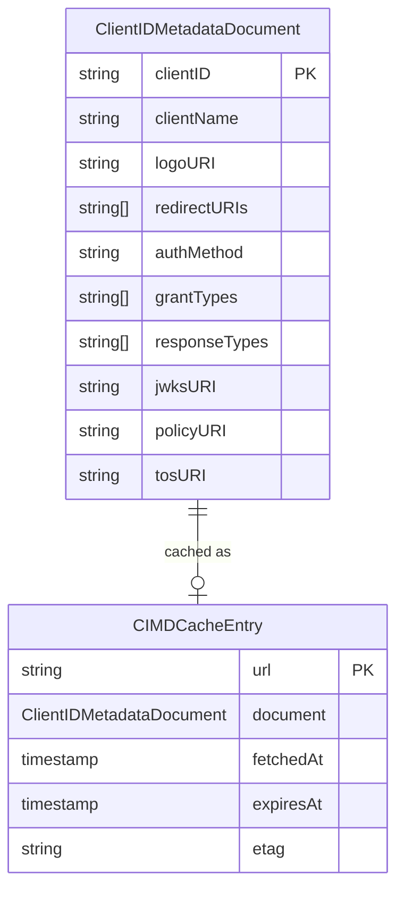
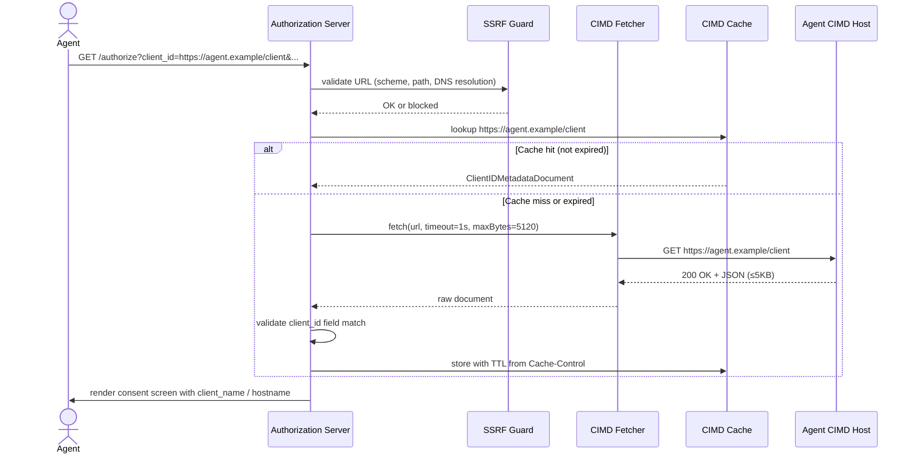
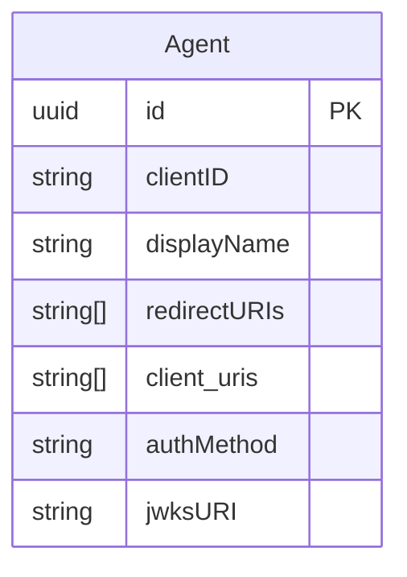

# Feature Specification: Client ID Metadata Document (CIMD) Support

**Feature Branch**: `026-cimd-support`
**Created**: 2026-04-21
**Status**: Draft
**Spec**: [draft-ietf-oauth-client-id-metadata-document-01](https://datatracker.ietf.org/doc/html/draft-ietf-oauth-client-id-metadata-document-01)

## User Scenarios & Testing *(mandatory)*

### User Story 1 - Agent Authenticates with URL-Based Client ID (Priority: P1)

An AI agent identifies itself to the authorization server by using its own HTTPS URL as the `client_id` value in an authorization request. The operator has pre-registered that URL on the corresponding Agent record. The authorization server resolves the Agent, fetches the metadata document at the `client_id` URL, validates it, and uses the contained metadata (name, redirect URIs, logo) to drive the consent screen.

**Why this priority**: This is the core capability of the feature. All other stories depend on the broker successfully fetching, validating, and presenting CIMD-sourced agent metadata.

**Independent Test**: Can be fully tested by sending a valid HTTPS URL `client_id` in an authorization request to a live broker instance backed by a mock CIMD endpoint, and verifying the consent screen renders metadata from the document.

**Acceptance Scenarios**:

1. **Given** a valid CIMD document is served at `https://agent.example.com/client`, **When** an authorization request arrives with `client_id=https://agent.example.com/client`, **Then** the broker fetches the document, validates the `client_id` field matches, and presents `client_name` and `redirect_uris` from the document on the consent screen.
2. **Given** the CIMD document's `client_id` field does not exactly match the request URL, **When** the broker fetches the document, **Then** the authorization request is rejected with an error indicating client metadata mismatch.
3. **Given** the CIMD document is absent or returns a non-200 HTTP status, **When** the broker attempts to fetch it, **Then** the authorization request is rejected and no redirect is issued.
4. **Given** the authorization request uses a `redirect_uri` not listed in the CIMD document, **When** the redirect URI is validated after authorization, **Then** the request is rejected.

---

### User Story 2 - SSRF-Hardened Fetcher Blocks Malicious URLs (Priority: P1)

An operator needs confidence that accepting untrusted HTTPS URLs as `client_id` values cannot be weaponized to make the broker perform Server-Side Request Forgery (SSRF) against internal infrastructure. The CIMD fetcher must proactively reject URLs targeting private networks, loopback addresses, and link-local IP ranges (including cloud metadata endpoints such as 169.254.169.254) before any network connection is established.

**Why this priority**: Without SSRF protection, any external party can craft a `client_id` URL that causes the broker to probe internal services. This is a critical pre-condition for enabling CIMD at all.

**Independent Test**: Can be fully tested by sending authorization requests whose `client_id` points to blocked IP ranges (loopback, RFC 1918 private, link-local) and verifying each is rejected before a DNS lookup or TCP connection is made.

**Acceptance Scenarios**:

1. **Given** a `client_id` URL whose hostname resolves to a private IP range (10.x, 172.16–31.x, 192.168.x), **When** the broker validates the URL, **Then** the request is rejected without issuing any outbound connection.
2. **Given** a `client_id` URL whose hostname resolves to a loopback address (127.x or ::1), **When** the broker validates the URL, **Then** the request is rejected.
3. **Given** a `client_id` URL whose hostname resolves to a link-local address (169.254.x.x or fe80::/10, including cloud metadata endpoints such as 169.254.169.254), **When** the broker validates the URL, **Then** the request is rejected.
4. **Given** a `client_id` URL using an HTTP (non-HTTPS) scheme, **When** the broker receives the request, **Then** the request is rejected immediately without a network call.
5. **Given** a `client_id` URL with a path containing single or double dot segments (`../`), **When** the URL is parsed, **Then** the request is rejected due to invalid client ID format.
6. **Given** a CIMD endpoint that streams a response larger than the configured size limit, **When** the broker fetches the document, **Then** the download is aborted and the request is rejected.
7. **Given** a CIMD endpoint that does not respond within the configured timeout, **When** the broker waits, **Then** the connection is terminated and the request is rejected.

---

### User Story 3 - CIMD Response Caching Reduces Latency (Priority: P2)

For repeated authorization requests from the same agent, the broker caches the previously fetched CIMD document according to HTTP cache semantics (ETag, Cache-Control, Expires), avoiding a network round-trip on every request while respecting operator-configured minimum and maximum TTL bounds.

**Why this priority**: Without caching, every authorization request triggers a network fetch to an external host, adding latency and creating a dependency on the CIMD host's availability. Caching makes the system resilient and performant.

**Independent Test**: Can be fully tested by issuing two sequential authorization requests for the same URL-based `client_id` and verifying the second request does not trigger an outbound HTTP fetch (observable via mock server request counts or cache metrics).

**Acceptance Scenarios**:

1. **Given** a CIMD document was successfully fetched and has a `Cache-Control: max-age=3600` header, **When** a second authorization request with the same `client_id` URL arrives within the TTL, **Then** the broker serves the cached document without a network call.
2. **Given** a cached CIMD document has expired (Cache-Control max-age elapsed), **When** an authorization request arrives, **Then** the broker re-fetches the document and refreshes the cache.
3. **Given** a CIMD fetch returns an error (non-200 status or network failure), **When** the broker evaluates caching, **Then** the error response is never cached and subsequent requests always retry the fetch.
4. **Given** operator configuration sets a maximum cache TTL shorter than the document's `max-age`, **When** the broker stores the document, **Then** the operator-configured TTL takes precedence.

---

### User Story 4 - Authorization Server Advertises CIMD Support (Priority: P3)

The authorization server's own metadata endpoint (`/.well-known/oauth-authorization-server` or `/.well-known/openid-configuration`) includes `"client_id_metadata_document_supported": true`, signaling to well-behaved clients that URL-based `client_id` values are accepted, preventing them from sending users to incompatible servers.

**Why this priority**: Provides standard interoperability signaling. Agents can check this field before initiating a flow. Lower priority because the feature works without it, but it is required for spec compliance.

**Independent Test**: Can be fully tested by fetching the broker's authorization server metadata document and asserting the field is present and `true` when CIMD support is enabled, and absent (or `false`) when disabled.

**Acceptance Scenarios**:

1. **Given** CIMD support is enabled in broker configuration, **When** a client fetches the authorization server metadata, **Then** the response includes `"client_id_metadata_document_supported": true`.
2. **Given** CIMD support is disabled in broker configuration, **When** a client fetches the authorization server metadata, **Then** the field is absent or `false`.

---

### User Story 5 - CIMD-Enhanced Consent Screen (Priority: P1)

When a user arrives at the consent screen for an Agent identified by a Client ID Metadata Document URL, the screen must communicate clearly who is requesting access, where credentials will be sent, and surface a prominent warning for localhost redirects — giving the user enough information to make an informed consent decision without needing to inspect raw OAuth parameters.

**Why this priority**: The consent screen is the primary user-facing trust boundary. Without explicit display of redirect destination and domain verification, users cannot detect phishing or misdirected consent flows. Elevated to P1 because it is the security-critical companion to the CIMD fetch and validation flow.

**Independent Test**: Can be fully tested by rendering the consent screen for a CIMD-based authorization request in isolation and asserting each required UI element is present with the correct content.

**Acceptance Scenarios**:

1. **Given** a CIMD-based authorization request with a non-localhost `redirect_uri`, **When** the consent screen is rendered, **Then** it displays: (a) summary "The application [client_name] wants to access [Access Target].", (b) "Verified domain: [hostname]", and (c) a collapsed "Advanced Details" section.
2. **Given** a CIMD-based authorization request whose `redirect_uri` resolves to `localhost` or `127.0.0.1`, **When** the consent screen is rendered, **Then** a prominent warning is displayed: "This app is requesting a redirect to your local machine. Ensure you started this request from [Agent.DisplayName]."
3. **Given** the "Advanced Details" section is collapsed, **When** the user expands it, **Then** it reveals: Client Name, Client ID, Redirect URI, and Requested Scopes.
4. **Given** a brand mismatch has been detected (CIMD `client_name` differs from `Agent.DisplayName`), **When** the consent screen is rendered, **Then** the displayed `client_name` is the CIMD value and the mismatch audit event has already been logged before the screen is shown.

---

### Edge Cases

- What happens when the CIMD URL contains query parameters? (Per spec: discouraged but permitted; query parameters must not alter the document identity check.)
- What happens when DNS resolution for the CIMD hostname succeeds but returns multiple A records — some safe, some blocked? (All resolved addresses must be checked; any blocked address causes rejection.)
- What happens when a CIMD document omits `redirect_uris`? (Authorization request is rejected; `redirect_uris` is mandatory for the flow to proceed.)
- What happens when a CIMD document's `token_endpoint_auth_method` specifies a client-secret-based method (`client_secret_post`, `client_secret_basic`, `client_secret_jwt`)? (Rejected; these methods are incompatible with URL-based client IDs per spec.)
- What happens when a brand mismatch is detected (current `client_name` differs from `Agent.DisplayName`)? (Authorization flow continues; mismatch is logged as a structured audit event per FR-023a — blocking is not automatic.)
- What happens when `redirect_uris` or `token_endpoint_auth_method` change between fetches? (A structured audit event is emitted per SR-011; the authorization flow continues. No blocking occurs.)
- What happens when `jwks_uri` changes between fetches? (Authorization flow continues; a structured audit event is emitted per SR-012. No blocking occurs for JWKS URI rotation alone.)
- What happens when a CIMD document's `client_name` matches a blacklisted keyword? (Document is rejected per FR-023b; the authorization request fails with an error, no redirect is issued.)
- What happens when the broker is configured with an empty SSRF blocklist override? (Default RFC 6890 blocklist is always enforced regardless of operator configuration; it cannot be disabled.)
- What happens during a CIMD cache eviction under memory pressure? (Document is treated as expired; next request triggers a re-fetch.)
- What happens when a `client_id` URL has a non-443 port? (Always rejected; port 443 is the only permitted port.)
- What happens when a Client ID Metadata Document URL matches pre-registered entries in more than one Agent? (Ambiguous match — request is rejected; operator must ensure pre-registered Client ID Metadata Document URLs are unique across all agents.)
- What happens when a Client ID Metadata Document URL is not pre-registered under any Agent? (Request is rejected per FR-027; clients presenting an unregistered Client ID Metadata Document URL are not permitted.)
- What happens when a CIMD document declares a `redirect_uri` on a different origin than the `client_id` URL (e.g. a CDN or a partner domain)? (Rejected per FR-004a; cross-origin redirect URIs are not permitted, with the sole exception of localhost/127.0.0.1.)
- What happens when a CIMD document declares a `redirect_uri` of `http://localhost:3000` but the `client_id` URL is `https://agent.example.com/client`? (Permitted; localhost is an unconditional exception regardless of the client_id origin.)

## Requirements *(mandatory)*

### Functional Requirements

- **FR-001**: System MUST accept HTTPS URLs as `client_id` values in authorization requests when CIMD support is enabled.
- **FR-002**: System MUST fetch the CIMD document at the `client_id` URL using a hardened HTTP client (SSRF-safe, timeout-bounded, size-limited).
- **FR-003**: System MUST reject any CIMD document where the `client_id` field does not exactly match the request URL (byte-for-byte string comparison).
- **FR-004**: System MUST reject authorization requests where the `redirect_uri` is not listed in the CIMD document's `redirect_uris` array.
- **FR-004a**: System MUST reject CIMD documents where any declared `redirect_uri` is not same-origin with the `client_id` URL (same scheme, host, and port), unless the `redirect_uri` host is `localhost` or `127.0.0.1` (any port), which are always permitted to support locally-running agents.
- **FR-005**: System MUST NOT follow HTTP redirects when fetching a CIMD document.
- **FR-006**: System MUST accept only HTTP 200 responses as valid CIMD documents; any other status code is treated as a fetch failure.
- **FR-007**: System MUST abort CIMD fetches that exceed the configured response size limit (default: 5,120 bytes).
- **FR-008**: System MUST abort CIMD fetches that exceed the configured total request timeout (default: 1 second).
- **FR-009**: System MUST resolve the CIMD URL's hostname to IP addresses and validate all resolved addresses against the SSRF blocklist before establishing a connection.
- **FR-010**: System MUST block CIMD fetch attempts targeting loopback addresses (IPv4 127.0.0.0/8 and IPv6 ::1/128).
- **FR-011**: System MUST block CIMD fetch attempts targeting private-use addresses (RFC 1918: 10.0.0.0/8, 172.16.0.0/12, 192.168.0.0/16).
- **FR-012**: System MUST block CIMD fetch attempts targeting link-local addresses (IPv4 169.254.0.0/16 and IPv6 fe80::/10).
- **FR-013**: System MUST block CIMD fetch attempts targeting any address in the RFC 6890 Special-Purpose Address Registry not already covered above.
- **FR-014**: System MUST reject `client_id` URLs using any scheme other than `https`.
- **FR-014a**: System MUST reject `client_id` URLs that have no path component (i.e. the URL ends immediately after the host or port with no `/` and path).
- **FR-015**: System MUST reject `client_id` URLs containing path segments composed solely of `.` or `..` (dot and double-dot).
- **FR-016**: System MUST reject `client_id` URLs containing fragment identifiers (`#`).
- **FR-017**: System MUST reject `client_id` URLs containing embedded credentials (userinfo in the authority component).
- **FR-018**: System MUST reject `client_id` URLs using ports other than 443.
- **FR-019**: System MUST cache successfully fetched CIMD documents according to HTTP cache semantics (ETag, Cache-Control, Expires), subject to operator-configured minimum and maximum TTL bounds.
- **FR-020**: System MUST NOT cache CIMD fetch errors or malformed documents.
- **FR-021**: System MUST include `"client_id_metadata_document_supported": true` in authorization server metadata when CIMD is enabled.
- **FR-022**: System MUST reject CIMD documents that specify a `token_endpoint_auth_method` of `client_secret_post`, `client_secret_basic`, or `client_secret_jwt`.
- **FR-023**: System MUST present `client_name` and `logo_uri` from the CIMD document on the consent screen; when `client_name` is absent, the pre-provisioned `Agent.DisplayName` MUST be displayed instead.
- **FR-023a**: System MUST enforce Brand Pinning on `client_name` only: when a CIMD document is fetched and matched to an Agent, the document's `client_name` MUST be compared to `Agent.DisplayName`. If the values differ, a structured mismatch event MUST be logged including the Agent ID, `Agent.DisplayName`, and the CIMD `client_name`. The authorization flow continues regardless of mismatch. `logo_uri` is displayed as-is without brand-pin validation.
- **FR-023b**: System MUST validate the CIMD document's `client_name` against a blacklist of reserved and system-level keywords (e.g. "admin", "system", "operator", names of identity providers) before accepting the document. A document whose `client_name` matches a blacklisted term MUST be rejected with an appropriate error.
- **FR-023c**: The keyword blacklist MUST be operator-configurable (additions); a non-empty default set of reserved terms MUST be enforced regardless of operator configuration.
- **FR-024**: SSRF protection MUST be enabled by default and MUST NOT be configurable to fully disable; operators may only extend (not replace) the default blocklist.
- **FR-025**: The `Agent` entity MUST be extended with: (a) a list of pre-registered Client ID Metadata Document URLs; and (b) `authMethod` and `jwksURI` fields storing the last observed values from the CIMD document (the existing `redirectURIs` field serves the same role). These fields act as the change-detection baseline for SR-011 and SR-012: each successful fetch compares incoming values against the stored fields, emits an audit event on any difference, then updates the fields. Both additions require a database migration.
- **FR-026**: When processing an authorization request whose `client_id` is a Client ID Metadata Document URL, the broker MUST attempt an exact-match lookup of that URL against each Agent's pre-registered Client ID Metadata Document URLs; if a match is found, that Agent record is the pre-registered client used for consent grouping.
- **FR-027**: If a Client ID Metadata Document URL matches no Agent's pre-registered Client ID Metadata Document URLs, the authorization request MUST be rejected; clients presenting an unregistered Client ID Metadata Document URL are not permitted.

### Consent Screen Requirements

- **CS-001**: The consent screen for CIMD-based clients MUST display a summary statement: *"The application [client_name] wants to access [Access Target]."* where `[Access Target]` is the name of the requested third-party service and/or the human-readable scope list.
- **CS-002**: The consent screen MUST display a domain verification badge: *"Verified domain: [hostname]"* derived from the Client ID Metadata Document URL's hostname, confirming the domain is pre-registered.
- **CS-003**: When the `redirect_uri` host is `localhost` or `127.0.0.1`, the consent screen MUST display a prominent warning: *"This app is requesting a redirect to your local machine. Ensure you started this request from [Agent.DisplayName]."* where `[Agent.DisplayName]` is the pre-registered Agent name.
- **CS-004**: The consent screen MUST include an unfoldable "Advanced Details" section, collapsed by default, that reveals the following fields: Client Name (`client_name` from CIMD document), Client ID (the `client_id` URL), Redirect URI (the requested `redirect_uri`), Requested Scopes.

### Domain Model

**Domain Entity Diagram**:



**CIMD Authorization Flow**:



**Agent Entity Extension** (from `025-oauth2-server`, extended for CIMD):

The existing `Agent` entity is extended with a list of pre-registered Client ID Metadata Document URLs `client_uris` — set by the operator during Client ID Metadata Document URL pre-registration. When an incoming `client_id` URL exactly matches an entry in this list, the broker resolves the Agent record as the pre-registered client for consent grouping.



**Entities** (things with unique identity):
- **ClientIDMetadataDocument**: The JSON document served at the agent's `client_id` URL. Identity is the `client_id` field value (the URL itself). Contains display metadata and OAuth2 parameters for a dynamically-registered-style client. Lifecycle: fetched on demand, cached, re-fetched on cache expiry. Key invariant: `client_id` field must match the URL it was fetched from.
- **CIMDCacheEntry**: A stored fetch result binding a URL to its document and caching metadata (ETag, expiry). Evicted on TTL expiry or memory pressure.

**Value Objects** (things without identity):
- **ClientIDMetadataDocumentURL**: An `https://` URL used as a `client_id`. Validated at parse time: must be HTTPS, no fragment, no credentials, no dot-segments, and hostname must resolve to a non-blocked address.
- **SSRFBlocklist**: The ordered set of CIDR ranges and address categories that are always rejected. Immutable at runtime; operator-provided additions are merged at startup.

**Domain Events** (state changes of business significance):
- **CIMDDocumentFetched**: Emitted when a document is successfully fetched and cached. Includes URL, cache TTL, and `client_name`.
- **CIMDFetchBlocked**: Emitted when a fetch attempt is rejected by the SSRF guard. Includes URL and the reason (blocked IP range, invalid scheme, etc.).
- **CIMDFetchFailed**: Emitted when the remote host returns a non-200 response, times out, or returns an oversized body.
- **BrandPinMismatchDetected**: Emitted when the CIMD document's `client_name` differs from `Agent.DisplayName`. Includes Agent ID, `Agent.DisplayName`, and the CIMD `client_name`. The authorization flow continues.
- **CIMDSecurityFieldChanged**: Emitted when `redirect_uris`, `token_endpoint_auth_method`, or `jwks_uri` changes between fetches (per SR-011/SR-012). Includes Agent ID, field name, previous value, new value, and timestamp. The authorization flow continues.

### Configuration Requirements

**Configuration Parameters** (nested under `oauth2_authorization_server`):
- **`oauth2_authorization_server.cimd.enabled`**: bool, enables CIMD support globally, default `false`
- **`oauth2_authorization_server.cimd.fetch_timeout`**: duration, total HTTP round-trip timeout, default `1s`
- **`oauth2_authorization_server.cimd.max_response_bytes`**: int, maximum CIMD document size in bytes, default `5120`
- **`oauth2_authorization_server.cimd.cache.max_ttl`**: duration, upper bound on document cache TTL, default `1h`
- **`oauth2_authorization_server.cimd.cache.min_ttl`**: duration, lower bound on document cache TTL (prevents hammering), default `60s`
- **`oauth2_authorization_server.cimd.ssrf.extra_blocked_cidrs`**: []string, operator-added CIDR ranges to block in addition to defaults

**Example YAML Configuration**:
```yaml
oauth2_authorization_server:
  # ... existing fields ...
  cimd:
    enabled: true
    fetch_timeout: 1s
    max_response_bytes: 5120
    cache:
      max_ttl: 1h
      min_ttl: 60s
    ssrf:
      extra_blocked_cidrs: []
```

**Configuration Location**: Added to `internal/ports/config.go` as `CIMDConfig` struct embedded in `OAuth2AuthServerConfig`, and documented in `examples/config/`.

### API Requirements

- **API-001**: The authorization server metadata endpoint (`GET /.well-known/oauth-authorization-server`) MUST include `"client_id_metadata_document_supported": true` when `cimd.enabled` is `true`.
- **API-002**: The existing `GET /authorize` and `POST /token` end-user endpoints accept URL-based `client_id` values without schema change; CIMD lookup is transparent.
- **API-003**: A structured error response using OAuth2 `error` / `error_description` fields MUST be returned for all CIMD validation failures (invalid URL format, SSRF block, fetch failure, document mismatch, blocked auth method). No redirect is issued on these errors.

### Security Requirements

- **SR-001**: SSRF protection MUST be enabled by default; it MUST NOT be possible to fully disable it via configuration.
- **SR-002**: All resolved IP addresses for a CIMD hostname MUST be checked against the blocklist before any TCP connection is opened (DNS TOCTOU protection: resolve once, validate, connect only to the validated address).
- **SR-003**: The CIMD fetcher MUST enforce a hard maximum on response body size (default 5,120 bytes) and abort mid-stream if the limit is reached; the response MUST NOT be buffered past this limit.
- **SR-004**: The CIMD fetcher MUST enforce a total request timeout (connect + read); default 1 second. Each phase (DNS, TCP connect, TLS handshake, response read) contributes to this single budget.
- **SR-005**: HTTP redirects MUST NOT be followed during CIMD fetch. A redirect response MUST be treated the same as a non-200 error.
- **SR-006**: TLS certificate validation MUST be enforced for all CIMD fetches; there MUST be no configuration option to skip certificate verification.
- **SR-007**: CIMD fetch failures (SSRF block, timeout, oversized body, TLS error, non-200 response) MUST emit structured audit log events including the URL, failure reason, and timestamp.
- **SR-008**: The `client_id` field in the CIMD document MUST be compared to the fetch URL using exact byte-for-byte string comparison; normalization or case folding MUST NOT be applied.
- **SR-009**: CIMD documents that specify client-secret-based `token_endpoint_auth_method` values MUST be rejected at validation time, not silently ignored.
- **SR-010**: Any URL field within a fetched CIMD document (`logo_uri`, `jwks_uri`, `policy_uri`, `tos_uri`) that the broker resolves or fetches MUST be validated against the same SSRF blocklist as the `client_id` URL itself before any outbound connection is made. A document containing a blocked URL in any such field MUST be logged but need not be rejected outright; the offending field is silently ignored.
- **SR-011**: On each successful CIMD document fetch, the broker MUST compare the current values of `redirect_uris` and `token_endpoint_auth_method` against the snapshot persisted on the Agent record from the previous fetch. If either field has changed, the broker MUST emit a structured audit event recording the previous and new values, Agent ID, and timestamp. The authorization flow continues regardless. The first successful fetch for a given Agent populates the snapshot without triggering an audit event.
- **SR-012**: On each successful CIMD document fetch, the broker MUST compare the current `jwks_uri` value against the snapshot persisted on the Agent record. If it has changed, a structured audit event MUST be emitted (previous URI, new URI, timestamp, Agent ID); the authorization flow is NOT blocked for `jwks_uri` changes alone. The Agent record snapshot is updated on every fetch.

### Key Entities

- **ClientIDMetadataDocument**: Represents an agent's self-described OAuth2 metadata, fetched from the agent's own HTTPS endpoint. Key attributes: `client_id` (URL), `client_name`, `redirect_uris`, `token_endpoint_auth_method`, `logo_uri`. Immutable after fetch; a new fetch produces a new value.
- **CIMDCacheEntry**: Stores a fetched document alongside its HTTP caching metadata (ETag, expiry timestamp). Scoped to the broker process; not persisted to the database.

## Success Criteria *(mandatory)*

### Measurable Outcomes

- **SC-001**: An AI agent using a URL-based `client_id` completes an authorization flow (fetch → consent → token) in under 2 seconds total when the CIMD host responds within 500ms, as measured end-to-end in E2E tests.
- **SC-002**: All 14 SSRF attack categories (loopback, RFC 1918, link-local, cloud metadata IP, non-HTTPS scheme, no path component, dot-segment path, fragment, credentials in URL, non-standard port, oversized response, slow-response timeout, redirect following, non-200 status) are each individually rejected before any TCP connection is established, verified by E2E tests.
- **SC-003**: A repeated authorization request for the same URL-based `client_id` within the cache TTL window completes without issuing a second outbound HTTP fetch, as verified by mock server request counts in E2E tests.
- **SC-004**: Zero regression in existing authorization flows using opaque (pre-registered) `client_id` values, verified by the full existing E2E test suite passing without modification.
- **SC-005**: The authorization server metadata endpoint correctly reflects `client_id_metadata_document_supported` status in all configuration states, verified by E2E tests.

## Clarifications

### Session 2026-04-22

- Q: How does a Client ID Metadata Document URL identify which Agent record it belongs to? → A: The operator pre-registers Client ID Metadata Document URLs on the Agent entity during Agent provisioning; the broker maps an incoming `client_id` URL to an Agent by exact lookup against that Agent's pre-registered Client ID Metadata Document URLs.
- Q: What constitutes a match between a `client_id` URL and a pre-registered Client ID Metadata Document URL? → A: Exact match only — the `client_id` URL must equal the pre-registered URL character-for-character.
- Terminology: Per the CIMD draft RFC, domain language is used throughout this spec. The act of adding URLs to an Agent is called "pre-registering Client ID Metadata Document URLs". The field on Agent is "pre-registered Client ID Metadata Document URLs". "Unregistered" describes a `client_id` URL that has not been pre-registered.
- Consent screen UX: Five explicit requirements added (CS-001 through CS-005): summary statement with access target, redirect URI destination statement, verified domain badge, localhost redirect warning (referencing Agent.DisplayName), and a collapsed Advanced Details section showing Client Name, Client ID, Redirect URI, and Requested Scopes.
- Q: Which authority governs the acceptable `redirect_uri` values for a client identified by a Client ID Metadata Document URL? → A: Same-origin as the `client_id` URL (scheme + host + port); `localhost` and `127.0.0.1` are always permitted regardless of origin to support locally-running tooling and coding agents.
- Q: Which metadata drives the consent screen when a CIMD document resolves to an Agent? → A: CIMD document metadata (`client_name`, `logo_uri`) is displayed to show current app branding. Brand Pinning is enforced: the CIMD `client_name` is compared against `Agent.DisplayName` (set by the operator at provisioning); a mismatch is logged as an audit event but does not block the flow. The `client_name` is also validated against a blacklist of reserved/system-level keywords to prevent spoofing.
- Q: Where is the Brand Pin baseline stored, and what is it anchored to? → A: The pin IS `Agent.DisplayName` — already persisted on the Agent record. No new baseline storage is required. Only `client_name` is subject to brand pinning (not `logo_uri`).
- RFC security gap review applied: (1) Added FR-014a requiring path component in `client_id` URL. (2) Added SR-010 requiring SSRF validation for all URLs embedded within the CIMD document. (3) Documented `logo_uri` prefetching as a known deferred security tradeoff. (4) Q: Scope of metadata change monitoring beyond `client_name` → A: Log-only for all three security-critical fields (`redirect_uris`, `token_endpoint_auth_method`, `jwks_uri`); no blocking on any field change. Authorization flow continues regardless.
- Q: Where is the previously-observed CIMD snapshot stored for SR-011/SR-012 change detection? → A: The Agent entity's own `redirectURIs`, `authMethod`, and `jwksURI` fields serve as the snapshot — updated on every successful CIMD fetch. No separate snapshot columns are required; the stored Agent state IS the baseline. Persisted in the database; survives restarts and is consistent across replicas.

## Assumptions

- CIMD support will be implemented as an opt-in capability (`cimd.enabled: false` by default), consistent with the constitution's security-first principle.
- The cache layer is in-process memory only (no Redis or DB persistence required); cache is lost on broker restart.
- Existing Agents with opaque (non-URL) `client_id` values are unaffected; the broker distinguishes a Client ID Metadata Document URL from an opaque `client_id` by the `https://` prefix.
- The consent screen renders `client_name` and `logo_uri` from the CIMD document; `logo_uri` is displayed as a URL reference (no server-side pre-fetching or proxying in this implementation). **Known security tradeoff**: the RFC recommends server-side prefetching and caching of `logo_uri` to (a) prevent dynamic logo substitution attacks that could confuse users, and (b) prevent cross-domain tracking via logo requests from users' browsers. This is deferred to a follow-on spec. The consent screen also includes all five CIMD-specific UX elements defined in CS-001 through CS-005.
- Port 443 is the only default allowed port; this is not expected to need operator customization in practice.
- `Agent.DisplayName` serves as the Brand Pin baseline; no new storage or first-fetch recording logic is required.
- The operator-configurable keyword blacklist augments a non-empty built-in default set; the exact default terms are defined during implementation.
