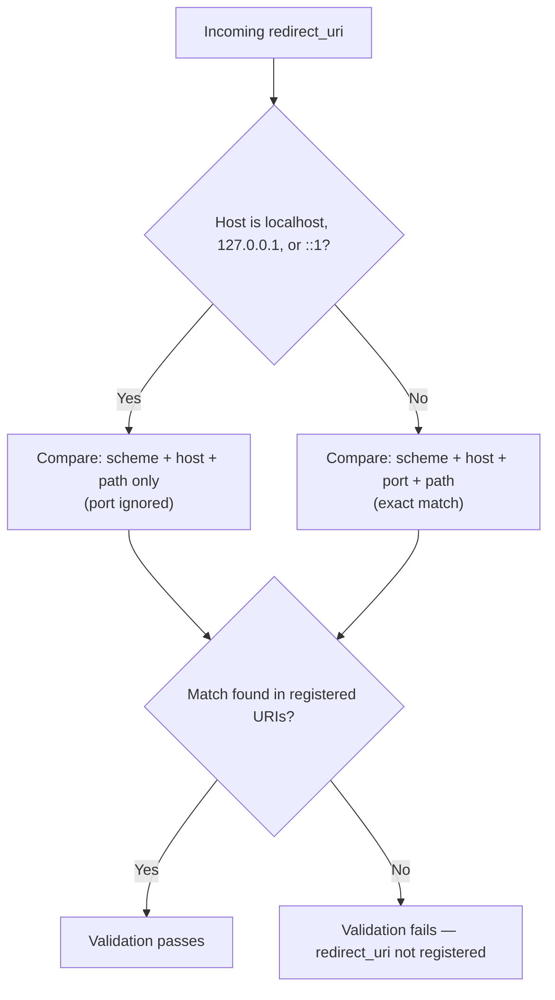

# Feature Specification: Portless Redirect URI Registration for Native App Clients

**Feature Branch**: `feat/ephemeral-runtime-port`
**Created**: 2026-06-02
**Status**: Draft
**Extends**: [028-cimd-support/spec.md](../028-cimd-support/spec.md)

## Overview

Spec 028 enforces exact port matching when validating redirect URIs for CIMD-based clients, ignoring the RFC 8252 §7.3 loopback redirect exception. RFC 8252 §7.3 and OAuth 2.1 §2.3.1 both specify that the port component of a loopback redirect URI MUST be ignored during validation, because native apps bind to an ephemeral OS-assigned port at runtime. Enforcing a static port breaks every CIMD client that uses a standard OS-assigned port.

This spec amends the redirect URI validation rules established in 028 to correctly implement the RFC 8252 §7.3 / OAuth 2.1 §2.3.1 exception: when the redirect URI host is `localhost`, `127.0.0.1`, or `::1`, any port value (or no port) is valid; scheme, host, and path are compared — only the port is ignored.

---

## User Scenarios & Testing *(mandatory)*

### User Story 1 — Native App Registers Without a Port (Priority: P1)

A developer of a native AI agent registers their app's redirect URI as `http://localhost/callback` — without specifying a port — because the app binds to an OS-assigned ephemeral port at launch. Under the current (028) implementation this registration would be rejected or fail to match at runtime. After this change, the authorization server accepts `http://localhost/callback` and, at authorization time, matches it against any incoming `redirect_uri` of the form `http://localhost:<any-port>/callback`.

**Why this priority**: This is the core capability. Without it, any native app that follows RFC 8252 §7.3 (port-free loopback URIs) is incompatible with the broker. All other stories are sub-cases or edge validations of this fundamental change.

**Independent Test**: Can be fully tested by registering an agent with `redirect_uri: http://localhost/callback` (no port) in CIMD document, then issuing an authorization request whose `redirect_uri` is `http://localhost:52341/callback`, and asserting the request proceeds to the consent screen rather than being rejected.

**Acceptance Scenarios**:

1. **Given** a CIMD document lists `redirect_uris: ["http://localhost/callback"]` (no port), **When** an authorization request arrives with `redirect_uri=http://localhost:52341/callback`, **Then** the redirect URI validation succeeds and the authorization flow proceeds normally.
2. **Given** a CIMD document lists `redirect_uris: ["http://localhost/callback"]` (no port), **When** an authorization request arrives with `redirect_uri=http://localhost:8080/callback`, **Then** the redirect URI validation succeeds and the authorization flow proceeds normally.
3. **Given** a CIMD document lists `redirect_uris: ["http://localhost/callback"]` (no port), **When** an authorization request arrives with `redirect_uri=http://localhost/callback` (no port), **Then** the redirect URI validation succeeds.
4. **Given** a CIMD document lists `redirect_uris: ["http://localhost/callback"]` (no port), **When** an authorization request arrives with `redirect_uri=http://localhost:3000/other-path`, **Then** the redirect URI validation fails (path mismatch), not a port mismatch.

---

### User Story 2 — Native App Registers With a Port (Backward Compatibility) (Priority: P1)

A developer registers their CIMD redirect URI as `http://localhost:3000/callback` — with an explicit port. After this change, the port is still accepted at registration time, but at authorization time, any port is considered a match (ephemeral port exception applies regardless of whether a port was originally specified or omitted).

**Why this priority**: RFC 8252 §7.3 uses **MUST**: "The authorization server MUST allow any port to be specified at the time of the request for loopback IP redirect URIs." This is unconditional — the RFC gives no mechanism for a server to honour an intent to pin based on the registered URI. The registered port is not a reliable signal of intent: native app frameworks often register metadata statically (before the app has run and claimed a port), and even when a client selects a preferred port, the OS may not have it available when the flow executes. Treating an explicit registered port as a server-side pin would cause non-deterministic authorization failures when that port is already in use. If voluntary port pinning is ever required, it must be expressed via an explicit opt-in field on the Agent record (a separate spec).

**Independent Test**: Can be fully tested by registering an agent with `redirect_uri: http://localhost:3000/callback` (explicit port) and sending an authorization request with `redirect_uri=http://localhost:9999/callback`, asserting the flow proceeds.

**Acceptance Scenarios**:

1. **Given** a CIMD document lists `redirect_uris: ["http://localhost:3000/callback"]` (explicit port), **When** an authorization request arrives with `redirect_uri=http://localhost:9999/callback`, **Then** the redirect URI validation succeeds.
2. **Given** a CIMD document lists `redirect_uris: ["http://localhost:3000/callback"]` (explicit port), **When** an authorization request arrives with `redirect_uri=http://localhost/callback` (no port in request), **Then** the redirect URI validation succeeds.
3. **Given** a CIMD document lists `redirect_uris: ["http://127.0.0.1:8080/callback"]`, **When** an authorization request arrives with `redirect_uri=http://127.0.0.1:51234/callback`, **Then** the redirect URI validation succeeds.

---

### User Story 3 — Non-Localhost Redirect URIs Are Unaffected (Priority: P1)

The ephemeral port exception applies exclusively to loopback hosts (`localhost`, `127.0.0.1`, and `::1`). Non-loopback redirect URIs continue to require exact scheme, host, port, and path matching. This spec does not loosen validation for any non-loopback redirect URI.

**Why this priority**: The port-ignore behavior must not silently expand to non-loopback hosts. Expanding it would allow attackers to redirect to arbitrary ports on legitimate domains, bypassing the redirect URI pinning that prevents token theft.

**Independent Test**: Can be fully tested by registering `https://app.example.com/callback` and sending an authorization request with a different port (`https://app.example.com:9999/callback`), asserting it is rejected.

**Acceptance Scenarios**:

1. **Given** a CIMD document lists `redirect_uris: ["https://app.example.com/callback"]`, **When** an authorization request arrives with `redirect_uri=https://app.example.com:9999/callback`, **Then** the redirect URI validation fails with an appropriate error.
2. **Given** a CIMD document lists `redirect_uris: ["https://app.example.com:8443/callback"]`, **When** an authorization request arrives with `redirect_uri=https://app.example.com:9000/callback`, **Then** the redirect URI validation fails.
3. **Given** a CIMD document lists `redirect_uris: ["https://app.example.com:8443/callback"]`, **When** an authorization request arrives with `redirect_uri=https://app.example.com:8443/callback` (exact match), **Then** the redirect URI validation succeeds.

---

### Edge Cases

- What happens when a loopback redirect URI registered in a CIMD document uses a non-HTTP scheme (e.g. `https://localhost/callback`)? `https` on localhost is unusual but syntactically valid. The scheme must still match exactly — only the port is ignored.
- What happens when the authorization request `redirect_uri` omits a port and the registered URI includes one (or vice versa) for a non-loopback host? Exact match is required; port differences are not ignored for non-loopback hosts.
- What happens when the CIMD document contains both `http://localhost/callback` (no port) and `http://localhost:3000/callback` (explicit port)? Both entries individually match any loopback request with the same scheme and path, so both entries should independently be treated as wildcarded on port. Duplicate semantic coverage is harmless.
- What happens when the authorization request `redirect_uri` uses `127.0.0.1` but the registered URI uses `localhost` (or vice versa)? `localhost` and `127.0.0.1` are distinct hostnames from a string-matching perspective. They are not interchangeable — only the port component is ignored, not the host.
- What happens when the path differs between the registered and requested loopback URI (e.g. registered `/callback` vs requested `/other`)? Rejection — only the port is ignored; scheme, host, and path must still match.

---

## Requirements *(mandatory)*

### Functional Requirements

- **FR-001**: For redirect URIs whose host is `localhost`, `127.0.0.1`, or `::1`, the system MUST ignore the port component during authorization request redirect URI validation, applying only scheme, host, and path comparison. (CIMD document fetch-time validation already satisfies this via its existing same-origin skip for loopback hosts — no code change required there.)
- **FR-002**: For all other redirect URI hosts (non-loopback), the system MUST perform exact match validation across scheme, host, port, and path — unchanged from existing behavior.
- **FR-003**: A CIMD document that registers a loopback redirect URI without a port (e.g. `http://localhost/callback`) MUST be accepted; the absence of a port is not a validation error.
- **FR-004**: A CIMD document that registers a loopback redirect URI with an explicit port (e.g. `http://localhost:3000/callback`) MUST be accepted; the explicit port is ignored during authorization-time validation.
- **FR-005**: The same-origin enforcement from 028 FR-004a remains in force for the non-loopback case; only the loopback exception logic changes.
- **FR-006**: The localhost redirect warning on the consent screen (028 CS-003) applies to all loopback redirect URIs regardless of whether the registered entry specified a port.
- **FR-007**: The loopback port-ignore rule applies to ALL client redirect URI validation, including opaque (UUID) `client_id` Agents with directly-registered `redirect_uris`. RFC 8252 §7.3 MUST is not CIMD-specific; a native app's port-free loopback redirect URI must work regardless of how the Agent was registered.

### Domain Model

**Redirect URI Matching Rules**:

**Value Objects** (changed):

- **RedirectURIMatch**: A comparison result between a registered redirect URI and an incoming redirect URI. For loopback hosts, the match is port-agnostic; for all other hosts, it is exact across all four components (scheme, host, port, path).

### Security Requirements

- **SR-001**: The port-ignore exception applies exclusively to loopback addresses (`localhost`, `127.0.0.1`, `::1`). Any extension of this exception to other host categories requires a superseding ADR.
- **SR-002**: Scheme, path, and query string must still match exactly for loopback redirect URIs; only the port is excluded from comparison.

### Key Entities

- **RedirectURIValidator**: The component responsible for comparing a requested redirect URI against the set of registered URIs for a client. Extended to apply port-agnostic matching for loopback hosts.

---

## Success Criteria *(mandatory)*

### Measurable Outcomes

- **SC-001**: A native app that registers `http://localhost/callback` (no port) in its CIMD document can complete a full authorization flow when using any OS-assigned port in the runtime redirect URI, as verified by E2E tests covering at minimum two distinct ephemeral port values and one portless request.
- **SC-002**: A native app that registers `http://localhost:3000/callback` (explicit port) in its CIMD document can complete a full authorization flow when using a different ephemeral port in the runtime redirect URI, as verified by E2E tests.
- **SC-003**: Authorization requests using non-loopback redirect URIs with mismatched ports continue to be rejected, as verified by the existing E2E test suite passing without relaxation.
- **SC-004**: Zero regression in all existing 028 acceptance scenarios, as verified by the full 028 E2E test suite passing without modification.
- **SC-005**: The consent screen localhost warning (CS-003 from 028) is displayed for loopback redirect URIs regardless of whether a port was present in the registered or runtime URI, as verified by E2E tests.
- **SC-006**: An opaque (UUID) `client_id` Agent with `http://localhost:3000/callback` in its directly-registered `redirect_uris` can complete a full authorization flow when the runtime `redirect_uri` uses a different ephemeral port, as verified by a dedicated E2E test for the non-CIMD flow path.

---

## Assumptions

- IPv6 loopback (`::1`) follows the same authorize-time port-ignore rule as `localhost` and `127.0.0.1` per RFC 8252 §7.3. Redirect URIs such as `http://[::1]:3000/callback` and `http://[::1]:51234/callback` match when scheme, host, and path are equal.
- The port-ignore rule applies at authorization-request-time redirect URI matching — this is the code change location. CIMD document fetch-time validation (`validateRedirectOrigin`) already skips same-origin enforcement entirely for loopback hosts and requires no code change.
- The port-ignore rule applies to all Agent redirect URI validation, not only to CIMD-based flows. An opaque (UUID) `client_id` Agent with `http://localhost:3000/callback` in its directly-registered `redirect_uris` benefits from the same exception as a CIMD-sourced client. (`client_uris` on the Agent entity is the CIMD document URL field; `redirect_uris` is the separately-registered redirect URI list.)

---

## Clarifications

### Session 2026-06-02

- Q: Should the loopback port-ignore exception apply only to CIMD-sourced redirect URIs, or also to opaque (UUID) `client_id` Agent flows? → A: Both. RFC 8252 §7.3 MUST is not CIMD-specific; FR-007 covers all Agent redirect URI validation regardless of registration method.
- Q: Should audit logging be added on every loopback redirect match, recording both the registered URI and the full incoming URI (including ephemeral port)? → A: Descoped. OAuth2 authorization events (grant creation, session creation, authorization code issuance) are already captured at higher granularity by existing structured logging. Adding per-match logging at the comparator level would duplicate information without security value, since PKCE already ensures an intercepted code is unusable. No SR-003 requirement.
- Q: Should SC-006 be added to require E2E test coverage for the loopback port-ignore rule on opaque (UUID) Agent flows (FR-007)? → A: Yes. Added SC-006 requiring a dedicated E2E test for the non-CIMD flow path.

---

## References

- [RFC 8252 §7.3 — Loopback Interface Redirects](https://www.rfc-editor.org/rfc/rfc8252#section-7.3)
- [OAuth 2.1 §2.3.1 — Loopback Redirect URIs in Native Apps](https://datatracker.ietf.org/doc/html/draft-ietf-oauth-v2-1#section-2.3.1)
- [028-cimd-support/spec.md](../028-cimd-support/spec.md) — baseline spec being amended
