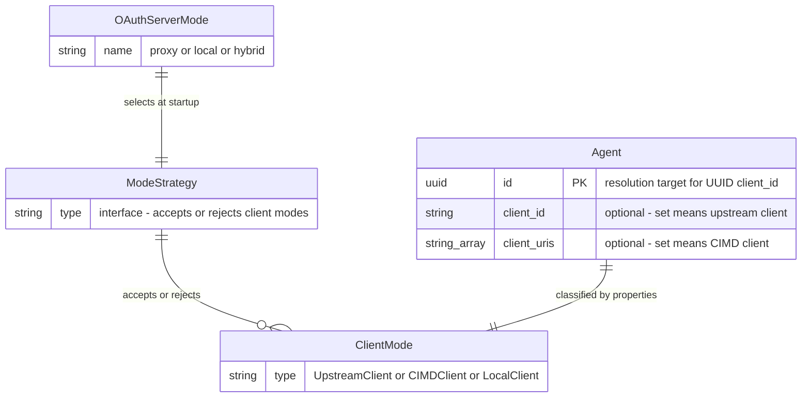

# Data Model: Hybrid OAuth Server Modes

**Feature**: 030-hybrid-oauth-modes | **Date**: 2026-05-12

## Entity Changes

**No new entities. No schema changes. No migrations.**

The existing `Agent` entity is unchanged (FR-017). Agent classification is derived from existing properties at runtime.

## New Value Objects

### OAuthServerMode

Enumeration replacing the current string-based mode field.

| Value | Description |
|-------|-------------|
| `proxy` | Forward all requests to upstream OAuth2 server |
| `local` | Issue tokens locally (replaces `issue_token`) |
| `hybrid` | Accept both proxy-class and local-class agents |

**Location**: `internal/ports/config.go` (or `internal/domain/oauth2/mode.go` if separated from config)

**Validation**: Must be one of the three values. `issue_token` produces a deprecation error.

### ClientMode

Derived classification of a resolved agent based on its properties.

| Value | Condition | Behavior |
|-------|-----------|----------|
| `UpstreamClient` | `Agent.ClientID != nil` | Forward to upstream using `Agent.ClientID` |
| `CIMDClient` | `Agent.ClientID == nil && len(Agent.ClientURIs) > 0` | Issue tokens locally |
| `LocalClient` | `Agent.ClientID == nil && len(Agent.ClientURIs) == 0` | Issue tokens locally |

**Location**: `internal/domain/storage/agent.go` (alongside the Agent entity)

**Method**: `func (a Agent) ClientMode() ClientMode` — derived from the agent's own fields, no side effects.

## New Interfaces

### ModeStrategy

Domain logic that determines whether a classified agent is permitted in the active mode. Not a port — all implementations are internal domain logic.

```go
type ModeStrategy interface {
    AcceptsClientMode(mode ClientMode) bool
    Name() OAuthServerMode
}
```

**Implementations** (all in `internal/domain/oauth2/`):
- `proxyModeStrategy` — accepts `UpstreamClient` only
- `localModeStrategy` — accepts `CIMDClient` and `LocalClient`
- `hybridModeStrategy` — accepts all client modes

**Location**: `internal/domain/oauth2/mode_strategy.go`

### Dispatching Strategies (adapter layer)

For hybrid mode, the builder wires dispatching proceed/grant strategies that wrap both proxy and local strategies and delegate based on `agent.ClientMode()`.

**Location**: `internal/adapters/http/enduser/` (alongside existing proceed/grant strategies)

## Config Structure Changes

### Current (flat)

```go
type OAuth2AuthServerConfig struct {
    Mode                      string
    UpstreamIssuerURI         string
    UpstreamAuthorizeEndpoint string
    UpstreamTokenEndpoint     string
    TokenTTL                  time.Duration
    TokenClaimsExpression     string
    // ...
}
```

### New (nested)

```go
type OAuth2AuthServerConfig struct {
    Mode  OAuthServerMode
    Proxy ProxyModeConfig
    Local LocalModeConfig
    CIMD  CIMDConfig
    // shared fields remain at top level
}

type ProxyModeConfig struct {
    UpstreamIssuerURI         string
    UpstreamAuthorizeEndpoint string
    UpstreamTokenEndpoint     string
    UpstreamTimeoutSeconds    int
}

type LocalModeConfig struct {
    TokenTTL             time.Duration
    TokenClaimsExpression string
    SupportedGrantTypes  []string
}
```

**Validation rules**:
- `proxy` mode: `Proxy` section required, `Local` section must be empty
- `local` mode: `Local` section required, `Proxy` section must be empty
- `hybrid` mode: both `Proxy` and `Local` sections required (FR-016)
- `issue_token`: rejected with deprecation error (FR-002)
- CIMD: rejected in `proxy` mode, allowed in `local` and `hybrid` (US3)

## Existing Entity Reference

### Agent (unchanged)

| Field | Type | Classification Role |
|-------|------|---------------------|
| `ID` | `id.AgentID` (UUID) | Resolution: UUID-format `client_id` → `Agent.ID` lookup |
| `ClientID` | `*id.ClientID` | Classification: set → proxy-class |
| `ClientURIs` | `[]string` | Classification: set (without ClientID) → local CIMD-class; Resolution: URL-format `client_id` → `GetByClientURI` |

## Relationship Diagram


