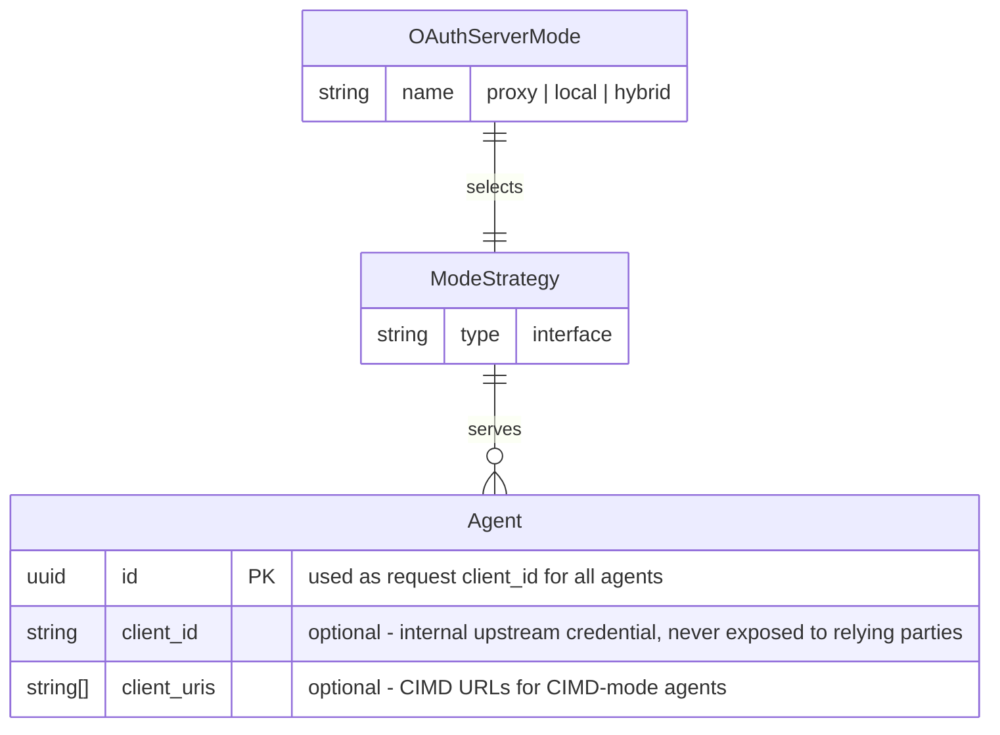
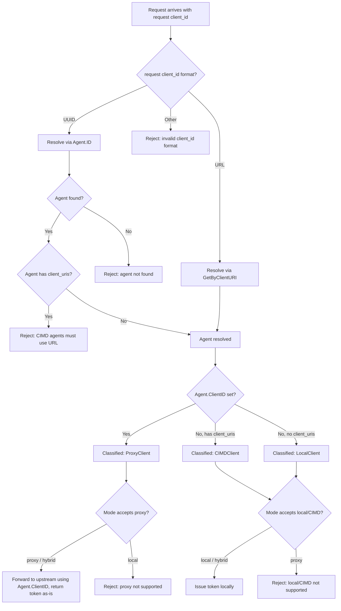

# Feature Specification: Hybrid OAuth Server Modes

**Feature Branch**: `030-hybrid-oauth-modes`  
**Created**: 2026-05-11  
**Status**: Draft  
**Input**: Overhaul OAuth server mode management: rename modes symmetrically (proxy, local, hybrid), introduce hybrid mode allowing proxy and local clients to coexist. All agents are addressed by `Agent.ID` (UUID) or CIMD URL on `/authorize` — the upstream `Agent.ClientID` is never exposed to relying parties. Client mode is derived from agent properties after resolution: `Agent.ClientID` set → proxy, `client_uris` set → CIMD, neither → local. Classification is universal across all modes; each mode strategy accepts or rejects client modes. No explicit routing field. Proxy agent tokens follow the established proxy token approach (no re-signing). In hybrid mode proxy agents coexist with local agents (with and without CIMD support).

## User Scenarios & Testing *(mandatory)*

### User Story 1 - Symmetric Mode Naming and Configuration (Priority: P1)

An operator configures the broker's OAuth server mode using one of three clearly named, symmetric options: `proxy`, `local`, or `hybrid`. The configuration structure for each mode is self-documenting — each mode section contains only the parameters relevant to that mode, with no ambiguity about which fields apply. The old mode name `issue_token` is replaced by `local`.

**Why this priority**: Without clear, symmetric mode naming and configuration, all other mode-related work is ambiguous. This is the foundational change that everything else builds on.

**Independent Test**: Can be fully tested by configuring each mode in isolation and verifying the system starts successfully with valid config and rejects invalid config with clear error messages.

**Acceptance Scenarios**:

1. **Given** a configuration file with `mode: proxy`, **When** the broker starts, **Then** it accepts the configuration and operates in proxy mode (forwarding to upstream OAuth2 server).
2. **Given** a configuration file with `mode: local`, **When** the broker starts, **Then** it accepts the configuration and operates in local mode (issuing tokens directly), behaving identically to the former `issue_token` mode.
3. **Given** a configuration file with `mode: hybrid`, **When** the broker starts, **Then** it accepts the configuration and operates in hybrid mode.
4. **Given** a configuration file with `mode: issue_token`, **When** the broker starts, **Then** it rejects the configuration with a clear error message suggesting the new mode name `local`.
5. **Given** a configuration file with `mode: proxy` that includes `local`-only fields (e.g., `token_ttl`), **When** the broker starts, **Then** it rejects the configuration with a clear error explaining which fields are invalid for the selected mode.
6. **Given** a configuration file with `mode: local` that includes `proxy`-only fields (e.g., `upstream_issuer_uri`), **When** the broker starts, **Then** it rejects the configuration with a clear error.

---

### User Story 2 - Universal Agent Resolution, Classification, and Mode Enforcement (Priority: P1)

**Terminology**: This spec distinguishes between two uses of "client_id":
- **Request `client_id`**: The `client_id` parameter sent by the caller in an OAuth2 `/authorize` or `/token` request. It is always either a UUID (`Agent.ID`) or a URL (CIMD). The upstream `Agent.ClientID` is never exposed to relying parties.
- **`Agent.ClientID`**: The optional stored field on the Agent entity representing the agent's registered upstream/external OAuth2 client identifier (e.g., `github-app-abc123`). Only set for proxy agents. Used internally by the broker when forwarding requests to the upstream OAuth2 server — never used for agent resolution from incoming requests.

These are distinct concepts. The request `client_id` identifies the agent; `Agent.ClientID` is an internal detail used by the broker's proxy path to communicate with the upstream server.

Every incoming OAuth2 request goes through a **resolution step** followed by **agent-property-based classification**. This is universal — it runs in every mode. The active mode strategy then determines whether the classified agent is permitted or rejected.

**Resolution** (based on request `client_id` format):
- If the request `client_id` is a URL → resolve via `GetByClientURI` (CIMD path)
- If the request `client_id` is a valid UUID → resolve via `Agent.ID` (primary key lookup)
- Otherwise → reject (invalid `client_id` format)

All non-CIMD agents — including proxy agents — are addressed by their `Agent.ID` (UUID) on `/authorize`. The upstream `Agent.ClientID` is never used for resolution and is never exposed to relying parties. This provides a unified experience regardless of client mode.

**Agent classification** (based on resolved agent's properties):
- **Proxy** (`ProxyClient`): Agent has `Agent.ClientID` set (has upstream OAuth2 registration). The broker uses `Agent.ClientID` internally when forwarding the request to the upstream OAuth2 server. Tokens are returned as-is (no re-signing).
- **CIMD** (`CIMDClient`): Agent has `client_uris` but no `Agent.ClientID`. The broker issues tokens locally. Must be resolved via URL; resolution via UUID for a CIMD agent MUST be rejected — CIMD agents must be discovered via their URL, not by internal ID.
- **Local** (`LocalClient`): Agent has neither `Agent.ClientID` nor `client_uris`. The broker issues tokens locally. Resolved via UUID.

**Mode enforcement**:
- **`proxy` mode**: Only proxy agents are permitted. Local and CIMD agents are rejected with an error explaining that local clients are not supported in proxy mode.
- **`local` mode**: Only local and CIMD agents are permitted. Proxy agents are rejected with an error explaining that proxy clients are not supported in local mode.
- **`hybrid` mode**: All client modes are permitted. Both upstream and local paths coexist.

This design makes mode a true strategy boundary — the resolution and classification logic is shared, and each mode strategy acts as a filter that accepts or rejects client modes. Classification is derived from existing agent properties (`Agent.ClientID` and `client_uris`), not from the format of the request `client_id`. No new entity field is introduced.

**Why this priority**: This is the core new capability. Universal resolution and classification with mode-based enforcement makes modes first-class architectural strategies rather than ad-hoc config switches, and naturally enables hybrid mode as the union of upstream and local.

**Independent Test**: Can be tested per mode by registering agents of each client mode (upstream with `ClientID`, CIMD with `client_uris`, local with neither) and sending requests — verifying each mode accepts the correct client modes and rejects the others with clear errors.

**Acceptance Scenarios**:

1. **Given** the broker runs in `hybrid` mode and a proxy agent (has `Agent.ClientID`) is registered, **When** an authorization request arrives with the agent's UUID (`Agent.ID`) as request `client_id`, **Then** the broker resolves the agent by primary key, classifies it as `ProxyClient` (has `ClientID`), forwards the request to the upstream OAuth2 server using `Agent.ClientID`, and returns the upstream token as-is (no re-signing).
2. **Given** the broker runs in `hybrid` mode and a local agent (no `Agent.ClientID`, no `client_uris`) is registered, **When** an authorization request arrives with the agent's UUID as request `client_id`, **Then** the broker resolves the agent by primary key, classifies it as local, and issues tokens locally.
3. **Given** the broker runs in `hybrid` mode with CIMD enabled and a CIMD agent (has `client_uris`, no `Agent.ClientID`) is registered, **When** an authorization request arrives with a URL-format request `client_id` matching one of the agent's `client_uris`, **Then** the broker resolves the agent via `GetByClientURI` and issues tokens locally.
4. **Given** a CIMD agent (has `client_uris`) is registered, **When** an authorization request arrives with the agent's UUID as request `client_id`, **Then** the broker rejects the request — CIMD agents must be addressed via their URL, not by internal ID.
5. **Given** the broker runs in any mode, **When** a request arrives with a request `client_id` that is neither a valid UUID nor a valid URL, **Then** the broker rejects the request with an invalid format error.
6. **Given** the broker runs in any mode, **When** a request arrives with a valid UUID that does not match any `Agent.ID`, **Then** the broker rejects the request with an agent-not-found error.
7. **Given** the broker runs in `proxy` mode, **When** an authorization request resolves to a local or CIMD agent, **Then** the broker rejects the request with an error explaining that local clients are not supported in proxy mode.
8. **Given** the broker runs in `local` mode, **When** an authorization request resolves to a proxy agent, **Then** the broker rejects the request with an error explaining that proxy clients are not supported in local mode.
9. **Given** the broker runs in `hybrid` mode, **When** a local plain agent requests client credentials (UUID-format request `client_id`), **Then** the broker issues tokens via the client credentials grant (local behavior).
10. **Given** the broker runs in `hybrid` mode, **When** the JWKS endpoint is requested, **Then** the broker serves its local signing keys (needed for local and CIMD clients).
11. **Given** the broker runs in `hybrid` mode, **When** the OAuth2 metadata endpoint is requested, **Then** the response reflects the capabilities of the hybrid mode (JWKS URI present, supported grant types from both paths).

---

### User Story 3 - Mode-Specific Feature Gating (Priority: P2)

Certain features are only available in specific modes. CIMD (Client Identity Metadata Discovery) is only available for CIMD-mode agents — meaning it works in `local` mode and in `hybrid` mode (for CIMD agents), but never in `proxy` mode. The configuration validates and enforces these constraints.

**Why this priority**: Feature gating ensures operators cannot enable incompatible combinations, preventing runtime errors and security misconfigurations.

**Independent Test**: Can be tested by attempting to enable CIMD in proxy mode (should fail) and in local/hybrid mode (should succeed).

**Acceptance Scenarios**:

1. **Given** a configuration with `mode: proxy` and CIMD enabled, **When** the broker starts, **Then** it rejects the configuration with a clear error explaining CIMD is not available in proxy mode.
2. **Given** a configuration with `mode: local` and CIMD enabled, **When** the broker starts, **Then** it accepts the configuration and CIMD is operational.
3. **Given** a configuration with `mode: hybrid` and CIMD enabled, **When** the broker starts, **Then** it accepts the configuration and CIMD is operational for CIMD-mode agents only.
4. **Given** a configuration with `mode: hybrid` and CIMD enabled, **When** a proxy agent is resolved (agent has `Agent.ClientID` set), **Then** the broker does not apply CIMD behavior and forwards to upstream using the internal `Agent.ClientID`.

---

### User Story 4 - Mode as First-Class Architectural Strategy (Priority: P2)

The mode selection drives the entire wiring of the system at startup. The universal resolution and agent-property-based classification runs for every request, and the mode strategy acts as an accept/reject filter on the classified agent. Rather than sprinkling mode checks throughout handlers and services, the builder selects the appropriate components based on mode: domain-level class acceptance (ModeStrategy) and adapter-level HTTP dispatch strategies (proceed/grant). Code branching on mode happens once at the top level (builder/wiring), not scattered across handlers.

**Why this priority**: Architectural cleanliness prevents subtle bugs from inconsistent mode branching and makes adding future modes straightforward.

**Independent Test**: Can be verified by inspecting the builder — each mode should produce a fully self-contained set of strategies, handlers, and services without runtime mode checks in handler code.

**Acceptance Scenarios**:

1. **Given** the broker is configured in any mode, **When** the builder wires the system, **Then** mode-specific behavior is fully determined by the injected strategies — no runtime `if mode ==` checks exist in handler or service code.
2. **Given** a developer adds a new mode-specific feature, **When** they implement it, **Then** they extend the domain ModeStrategy (for class acceptance rules) or add adapter-level dispatch strategies (for HTTP-path behavior), rather than adding conditional branches in handlers.

---

### Edge Cases

- What happens when hybrid mode is configured but no upstream endpoints are provided? The system rejects the configuration — hybrid mode requires both proxy config (upstream endpoints) and local config (signing keys, etc.).
- What happens when an operator migrates from `issue_token` to `local`? The system provides a clear deprecation error pointing to the new name. No silent fallback.
- How does the OAuth2 metadata endpoint behave in hybrid mode? It exposes the union of capabilities (JWKS URI, all supported grant types) so agents on both routing paths can discover the server's features.
- What happens when a plain local agent (no `ClientID`, no `client_uris`) is resolved in hybrid mode? The agent works — clients use the agent's UUID as the request `client_id`, resolution finds it by `Agent.ID`, classification sees no `ClientID` → `LocalClient`.
- What happens when a UUID-format request `client_id` resolves to a CIMD agent (agent has `client_uris`)? The request is rejected. CIMD agents must be discovered and addressed via their URL-format `client_id`, not by internal UUID. This prevents bypassing CIMD validation.
- What happens when a request `client_id` is neither a UUID nor a URL? The request is rejected with an invalid format error. The upstream `Agent.ClientID` is never exposed to relying parties and cannot be used for resolution.
- What happens in `proxy` mode if a local or CIMD agent is resolved? The proxy mode strategy rejects it with a clear error. This prevents accidental local agent usage in a proxy-only deployment.
- What happens in `local` mode if a proxy agent is resolved? The local mode strategy rejects it with a clear error. This prevents accidental proxy usage in a local-only deployment.
- What happens if an agent has both `Agent.ClientID` and `client_uris` set? The storage layer rejects this on create/update (invariant violation). If encountered at classification time (e.g., direct DB manipulation), the classifier fails closed with an internal error — no request is served.
- How does the broker use `Agent.ClientID` for proxy agents? After resolving the agent by `Agent.ID` and classifying it as `ProxyClient`, the broker uses the stored `Agent.ClientID` internally when communicating with the upstream OAuth2 server. The relying party never sees or uses this value.

## Requirements *(mandatory)*

### Functional Requirements

- **FR-001**: System MUST support exactly three mutually exclusive OAuth server modes: `proxy`, `local`, and `hybrid`.
- **FR-002**: The mode name `issue_token` MUST be rejected at configuration time with a deprecation message directing the operator to use `local`.
- **FR-003**: The system MUST resolve every incoming OAuth2 request's `client_id` using the following strategy: URL-format → `GetByClientURI`, UUID-format → `Agent.ID` primary key lookup, otherwise → reject as invalid format. The upstream `Agent.ClientID` MUST NOT be used for agent resolution and MUST NOT be exposed to relying parties. This resolution MUST be universal across all modes.
- **FR-004**: After resolution, agent classification MUST be derived from the resolved agent's properties: agent has `Agent.ClientID` set → `ProxyClient`; agent has `client_uris` (no `Agent.ClientID`) → `CIMDClient`; agent has neither → `LocalClient`. An agent MUST NOT have both `Agent.ClientID` and `client_uris` set simultaneously. This invariant MUST be enforced at both the storage layer (reject on create/update) and the classification layer (fail closed with an error if encountered at request time, as defense-in-depth).
- **FR-005**: When a UUID-format request `client_id` resolves to an agent that has `client_uris` (CIMD agent), the request MUST be rejected with an error. CIMD agents MUST only be addressed via their URL-format `client_id`.
- **FR-006**: In `proxy` mode, the mode strategy MUST accept proxy agents (`ProxyClient`) and MUST reject local and CIMD agents with an actionable error.
- **FR-007**: In `local` mode, the mode strategy MUST accept local and CIMD agents and MUST reject proxy agents (`ProxyClient`) with an actionable error. This fully replaces the former `issue_token` behavior.
- **FR-008**: In `hybrid` mode, the mode strategy MUST accept all client modes (upstream, local, and CIMD) within the same instance.
- **FR-008b**: Tokens obtained from the upstream OAuth2 server for proxy agents MUST be passed through as-is without re-signing or transformation.
- **FR-009**: Local and CIMD agents MUST receive locally issued tokens from the broker, whether resolved by UUID (local agent) or by CIMD URL (CIMD agent).
- **FR-010**: Configuration validation MUST reject mode-incompatible parameter combinations (e.g., upstream endpoints in `local` mode, CIMD in `proxy` mode) with clear, actionable error messages.
- **FR-011**: Mode-specific features (e.g., CIMD, client credentials grant) MUST be gated by mode — available only in modes where they are meaningful.
- **FR-012**: The JWKS endpoint MUST be served in `local` and `hybrid` modes, and MUST NOT be served in `proxy` mode.
- **FR-013**: The OAuth2 metadata endpoint MUST reflect the actual capabilities of the active mode.
- **FR-014**: Mode selection MUST drive strategy wiring at startup (builder) — runtime mode branching in handlers and services is not permitted.
- **FR-015**: Each mode MUST have a dedicated configuration section that contains only parameters relevant to that mode, eliminating cross-mode field ambiguity.
- **FR-016**: `hybrid` mode configuration MUST require both proxy-related parameters (upstream endpoints) and local-related parameters (signing key config, token TTL).
- **FR-017**: No new field MUST be introduced on the Agent entity. Agent classification is derived from existing properties (`Agent.ClientID` presence and `client_uris` presence).

### Domain Model

**Domain Entity Diagram**:



**Activity / Flow Diagram (Universal Resolution, Classification + Mode Enforcement)**:



**Value Objects**:
- **OAuthServerMode**: Enumeration of `proxy`, `local`, `hybrid`. Immutable once validated. Determines the entire wiring strategy.

### Configuration Requirements

**Configuration Parameters**:
- **mode**: String, one of `proxy`, `local`, `hybrid`. Required. No default — operator must explicitly choose.
- **proxy section**: Upstream issuer URI, authorize endpoint, token endpoint. Required in `proxy` and `hybrid` modes.
- **local section**: Token TTL, token claims expression, supported grant types. Required in `local` and `hybrid` modes.
- **cimd section**: CIMD configuration. Available in `local` and `hybrid` modes only.

**Example YAML Configuration**:
```yaml
# Proxy mode — forward everything to upstream
oauth2_authorization_server:
  mode: proxy
  proxy:
    upstream_issuer_uri: "https://auth.example.com"
    upstream_authorize_endpoint: "https://auth.example.com/authorize"
    upstream_token_endpoint: "https://auth.example.com/token"

# Local mode — broker issues tokens directly
oauth2_authorization_server:
  mode: local
  local:
    token_ttl: "1h"
    token_claims_expression: "claims.sub"
    supported_grant_types:
      - authorization_code
      - client_credentials
  cimd:
    enabled: true

# Hybrid mode — both proxy and local clients
# Agent class derived from agent properties: Agent.ClientID set → proxy, client_uris → local CIMD, neither → local plain
oauth2_authorization_server:
  mode: hybrid
  proxy:
    upstream_issuer_uri: "https://auth.example.com"
    upstream_authorize_endpoint: "https://auth.example.com/authorize"
    upstream_token_endpoint: "https://auth.example.com/token"
  local:
    token_ttl: "1h"
    token_claims_expression: "claims.sub"
    supported_grant_types:
      - authorization_code
      - client_credentials
  cimd:
    enabled: true
```

**Configuration Location**: Will be added to `examples/config/oauth2_modes.yaml` and referenced in `examples/config/README.md`

### Security Requirements

- **SR-001**: Mode configuration MUST be validated before any server component starts — invalid mode config MUST prevent startup entirely (fail closed).
- **SR-002**: Each mode strategy MUST enforce strict client mode boundaries — ProxyClient agent requests MUST NOT reach local token issuance, and LocalClient/CIMDClient agent requests MUST NOT reach the upstream proxy path. Violations MUST result in an explicit error, not silent routing.
- **SR-003**: The deprecated `issue_token` mode name MUST NOT silently fall back to `local` — it MUST produce an explicit error requiring operator action.
- **SR-004**: ProxyClient agent tokens MUST NOT be re-signed or transformed — they are returned from the upstream server as-is, preserving the upstream token's integrity and signature.

## Assumptions

- The existing strategy pattern (AuthorizationProceedStrategy, TokenGrantStrategy) is the correct architectural foundation and will be extended, not replaced.
- Agent classification is based on agent properties after resolution, not on the format of the request `client_id`. Resolution uses two paths (URL → `GetByClientURI`, UUID → `Agent.ID`); non-UUID/non-URL values are rejected. Each mode strategy then accepts or rejects the classified agent.
- `Agent.ClientID` is already optional (nullable pointer, migration 016). Only proxy agents have a value set. It is used internally by the broker when forwarding to the upstream OAuth2 server, never for agent resolution or exposure to relying parties.
- The OAuth2 metadata endpoint in hybrid mode will advertise the union of capabilities from both proxy and local paths.
- Migration from `issue_token` to `local` is a configuration-only change — no data migration is needed.
- The `supported_grant_types` field in the config may differ between the proxy and local sections in hybrid mode.
- ProxyClient agent tokens use the same pass-through mechanism as current proxy mode — no re-signing, no local token wrapping.
- All agents — including proxy agents — are addressed by `Agent.ID` (UUID) on `/authorize`. This is the existing behavior after the recent change to hide upstream client_ids from relying parties.
- CIMD agents are addressed via their URL (`client_uris`) — UUID-based access is explicitly rejected.
- `Agent.ClientID` is an internal credential used by the broker's proxy path to communicate with the upstream OAuth2 server. It is never used for agent resolution from incoming requests.
- No new fields on the Agent entity are required. Classification relies on the existing `Agent.ClientID` (optional) and `client_uris` properties.

## Success Criteria *(mandatory)*

### Measurable Outcomes

- **SC-001**: Operators can configure any of the three modes (proxy, local, hybrid) and the system starts successfully with valid configuration within the same startup time as current single-mode operation.
- **SC-002**: Agents are classified correctly based on their properties — agents with `Agent.ClientID` take the proxy path (`ProxyClient`), agents with `client_uris` take the CIMD path (`CIMDClient`), agents with neither take the local path (`LocalClient`). Unsupported client modes in limited modes are rejected with actionable errors.
- **SC-003**: Invalid mode configurations are rejected at startup with actionable error messages — operators can resolve configuration errors on first attempt in 100% of cases.
- **SC-004**: Adding a future mode-specific feature requires extending a strategy interface, not modifying existing handler code — verified by the absence of runtime mode checks in handler and service layers.
- **SC-005**: All existing proxy-mode and local-mode (formerly issue_token) deployments continue to work with only a mode name change in configuration — zero behavioral regression.
- **SC-006**: Hybrid mode requires no new fields on the Agent entity — classification is derived from existing `Agent.ClientID` and `client_uris` properties.

## Clarifications

### Session 2026-05-14

- Q: Where is the mutual exclusivity constraint (agent cannot have both client_id and client_uris) enforced? → A: Storage layer + classification — reject on write AND error if both found at classification time (defense-in-depth).
