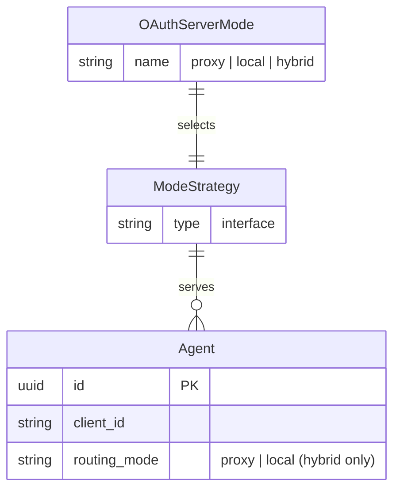
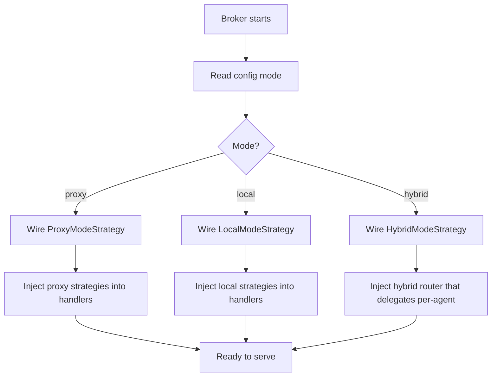

# Feature Specification: Hybrid OAuth Server Modes

**Feature Branch**: `030-hybrid-oauth-modes`  
**Created**: 2026-05-11  
**Status**: Draft  
**Input**: Overhaul OAuth server mode management: rename modes symmetrically (proxy, local, hybrid), introduce hybrid mode allowing proxy and local clients to coexist, make modes first-class architectural citizens with dedicated configuration and strategy-based wiring.

## User Scenarios & Testing *(mandatory)*

### User Story 1 - Symmetric Mode Naming and Configuration (Priority: P1)

An operator configures the broker's OAuth server mode using one of three clearly named, symmetric options: `proxy`, `local`, or `hybrid`. The configuration structure for each mode is self-documenting — each mode section contains only the parameters relevant to that mode, with no ambiguity about which fields apply. The old mode name `issue_token` is replaced by `local`.

**Why this priority**: Without clear, symmetric mode naming and configuration, all other mode-related work is ambiguous. This is the foundational change that everything else builds on.

**Independent Test**: Can be fully tested by configuring each mode in isolation and verifying the system starts successfully with valid config and rejects invalid config with clear error messages.

**Acceptance Scenarios**:

1. **Given** a configuration file with `mode: proxy`, **When** the broker starts, **Then** it accepts the configuration and operates in proxy mode (forwarding to upstream OAuth2 server).
2. **Given** a configuration file with `mode: local`, **When** the broker starts, **Then** it accepts the configuration and operates in local mode (issuing tokens directly), behaving identically to the former `issue_token` mode.
3. **Given** a configuration file with `mode: hybrid`, **When** the broker starts, **Then** it accepts the configuration and operates in hybrid mode.
4. **Given** a configuration file with `mode: issue_token`, **When** the broker starts, **Then** it rejects the configuration with a clear error message suggesting the new mode name `local`.
5. **Given** a configuration file with `mode: proxy` that includes `local`-only fields (e.g., `token_ttl`), **When** the broker starts, **Then** it rejects the configuration with a clear error explaining which fields are invalid for the selected mode.
6. **Given** a configuration file with `mode: local` that includes `proxy`-only fields (e.g., `upstream_issuer_uri`), **When** the broker starts, **Then** it rejects the configuration with a clear error.

---

### User Story 2 - Hybrid Mode: Proxy and Local Clients Coexist (Priority: P1)

An operator runs the broker in `hybrid` mode, where some agents are served by proxying to an upstream OAuth2 server and others are served by the broker's local token issuance. The routing decision is per-agent via an explicit `routing_mode` field: each registered agent declares whether it uses the proxy path or the local path (defaulting to `proxy` for backward compatibility). All clients belonging to a given agent inherit its routing.

**Why this priority**: This is the core new capability. It enables deployments where some clients need upstream integration while others use locally issued tokens — both within a single broker instance.

**Independent Test**: Can be tested by registering two agents — one proxy-routed and one locally-routed — and verifying each follows its correct authorization flow.

**Acceptance Scenarios**:

1. **Given** the broker runs in `hybrid` mode with a proxy-routed agent and a local-routed agent, **When** the proxy-routed agent initiates an authorization flow, **Then** the request is forwarded to the upstream OAuth2 server.
2. **Given** the broker runs in `hybrid` mode, **When** the local-routed agent initiates an authorization flow, **Then** the broker issues tokens locally (authorization code, access token).
3. **Given** the broker runs in `hybrid` mode, **When** a request arrives for an unknown client, **Then** the broker rejects the request with an appropriate error.
4. **Given** the broker runs in `hybrid` mode with a local-routed agent, **When** the agent requests client credentials, **Then** the broker issues tokens via the client credentials grant (local behavior).
5. **Given** the broker runs in `hybrid` mode, **When** the JWKS endpoint is requested, **Then** the broker serves its local signing keys (needed for local-routed clients).
6. **Given** the broker runs in `hybrid` mode, **When** the OAuth2 metadata endpoint is requested, **Then** the response reflects the capabilities of the hybrid mode (JWKS URI present, supported grant types from both paths).

---

### User Story 3 - Mode-Specific Feature Gating (Priority: P2)

Certain features are only available in specific modes. For example, CIMD (Client Identity Metadata Discovery) is only available for local-routed clients — meaning it works in `local` mode and in `hybrid` mode (for non-proxy agents), but never in `proxy` mode. The configuration validates and enforces these constraints.

**Why this priority**: Feature gating ensures operators cannot enable incompatible combinations, preventing runtime errors and security misconfigurations.

**Independent Test**: Can be tested by attempting to enable CIMD in proxy mode (should fail) and in local/hybrid mode (should succeed).

**Acceptance Scenarios**:

1. **Given** a configuration with `mode: proxy` and CIMD enabled, **When** the broker starts, **Then** it rejects the configuration with a clear error explaining CIMD is not available in proxy mode.
2. **Given** a configuration with `mode: local` and CIMD enabled, **When** the broker starts, **Then** it accepts the configuration and CIMD is operational.
3. **Given** a configuration with `mode: hybrid` and CIMD enabled, **When** the broker starts, **Then** it accepts the configuration and CIMD is operational for local-routed clients only.
4. **Given** a configuration with `mode: hybrid` and CIMD enabled, **When** a proxy-routed client attempts a CIMD flow, **Then** the broker does not apply CIMD behavior for that client.

---

### User Story 4 - Mode as First-Class Architectural Strategy (Priority: P2)

The mode selection drives the entire wiring of the system at startup. Rather than sprinkling mode checks throughout handlers and services, the builder selects a mode strategy that assembles the correct set of components. Code branching on mode happens once at the top level (builder/wiring), not scattered across handlers.

**Why this priority**: Architectural cleanliness prevents subtle bugs from inconsistent mode branching and makes adding future modes straightforward.

**Independent Test**: Can be verified by inspecting the builder — each mode should produce a fully self-contained set of strategies, handlers, and services without runtime mode checks in handler code.

**Acceptance Scenarios**:

1. **Given** the broker is configured in any mode, **When** the builder wires the system, **Then** mode-specific behavior is fully determined by the injected strategies — no runtime `if mode ==` checks exist in handler or service code.
2. **Given** a developer adds a new mode-specific feature, **When** they implement it, **Then** they extend the mode strategy interface rather than adding conditional branches.

---

### Edge Cases

- What happens when hybrid mode is configured but no upstream endpoints are provided? The system rejects the configuration — hybrid mode requires both proxy config (upstream endpoints) and local config (signing keys, etc.).
- What happens when an agent registered in hybrid mode has no explicit routing designation? The agent defaults to `proxy` routing (backward-compatible default for pre-existing agent configurations). This default is applied at validation time and persisted explicitly.
- What happens when an operator migrates from `issue_token` to `local`? The system provides a clear deprecation error pointing to the new name. No silent fallback.
- How does the OAuth2 metadata endpoint behave in hybrid mode? It exposes the union of capabilities (JWKS URI, all supported grant types) so agents on both routing paths can discover the server's features.

## Requirements *(mandatory)*

### Functional Requirements

- **FR-001**: System MUST support exactly three mutually exclusive OAuth server modes: `proxy`, `local`, and `hybrid`.
- **FR-002**: The mode name `issue_token` MUST be rejected at configuration time with a deprecation message directing the operator to use `local`.
- **FR-003**: In `proxy` mode, all OAuth2 authorization and token requests MUST be forwarded to the configured upstream OAuth2 server.
- **FR-004**: In `local` mode, the broker MUST issue authorization codes and tokens directly, fully replacing the former `issue_token` behavior.
- **FR-005**: In `hybrid` mode, the broker MUST support both proxy-routed and locally-routed agents within the same instance.
- **FR-006**: In `hybrid` mode, the routing decision (proxy vs. local) MUST be determined per-agent via an explicit `routing_mode` field on the Agent entity. This field MUST be a strongly typed value (`proxy` or `local`). For agents without an explicit value, the system MUST default to `proxy` (backward-compatible with pre-existing configurations).
- **FR-007**: Configuration validation MUST reject mode-incompatible parameter combinations (e.g., upstream endpoints in `local` mode, CIMD in `proxy` mode) with clear, actionable error messages.
- **FR-008**: Mode-specific features (e.g., CIMD, client credentials grant) MUST be gated by mode — available only in modes where they are meaningful.
- **FR-009**: The JWKS endpoint MUST be served in `local` and `hybrid` modes, and MUST NOT be served in `proxy` mode.
- **FR-010**: The OAuth2 metadata endpoint MUST reflect the actual capabilities of the active mode.
- **FR-011**: Mode selection MUST drive strategy wiring at startup (builder) — runtime mode branching in handlers and services is not permitted.
- **FR-012**: Each mode MUST have a dedicated configuration section that contains only parameters relevant to that mode, eliminating cross-mode field ambiguity.
- **FR-013**: `hybrid` mode configuration MUST require both proxy-related parameters (upstream endpoints) and local-related parameters (signing key config, token TTL).

### Domain Model

**Domain Entity Diagram**:



**Activity / Flow Diagram**:



**Value Objects**:
- **OAuthServerMode**: Enumeration of `proxy`, `local`, `hybrid`. Immutable once validated. Determines the entire wiring strategy.
- **AgentRoutingMode**: Explicit field on Agent entity with values `proxy` or `local`. Defaults to `proxy` when not set (backward-compatible). The field is always accepted and persisted regardless of server mode, enabling operators to pre-configure agents before switching to hybrid mode. In `proxy`-only or `local`-only server modes, the field has no runtime effect (all agents follow the server mode). In `hybrid` mode, it drives per-agent routing decisions. Strongly typed in code to enable compile-time safety and mode-specific validation.

### Configuration Requirements

**Configuration Parameters**:
- **mode**: String, one of `proxy`, `local`, `hybrid`. Required. No default — operator must explicitly choose.
- **proxy section**: Upstream issuer URI, authorize endpoint, token endpoint. Required in `proxy` and `hybrid` modes.
- **local section**: Token TTL, token claims expression, supported grant types. Required in `local` and `hybrid` modes.
- **cimd section**: CIMD configuration. Available in `local` and `hybrid` modes only.

**Example YAML Configuration**:
```yaml
# Proxy mode — forward everything to upstream
oauth2_authorization_server:
  mode: proxy
  proxy:
    upstream_issuer_uri: "https://auth.example.com"
    upstream_authorize_endpoint: "https://auth.example.com/authorize"
    upstream_token_endpoint: "https://auth.example.com/token"

# Local mode — broker issues tokens directly
oauth2_authorization_server:
  mode: local
  local:
    token_ttl: "1h"
    token_claims_expression: "claims.sub"
    supported_grant_types:
      - authorization_code
      - client_credentials
  cimd:
    enabled: true

# Hybrid mode — both proxy and local clients
oauth2_authorization_server:
  mode: hybrid
  proxy:
    upstream_issuer_uri: "https://auth.example.com"
    upstream_authorize_endpoint: "https://auth.example.com/authorize"
    upstream_token_endpoint: "https://auth.example.com/token"
  local:
    token_ttl: "1h"
    token_claims_expression: "claims.sub"
    supported_grant_types:
      - authorization_code
      - client_credentials
  cimd:
    enabled: true
```

**Configuration Location**: Will be added to `examples/config/oauth2_modes.yaml` and referenced in `examples/config/README.md`

### Security Requirements

- **SR-001**: Mode configuration MUST be validated before any server component starts — invalid mode config MUST prevent startup entirely (fail closed).
- **SR-002**: In hybrid mode, a proxy-routed client MUST NOT be able to obtain locally-issued tokens, and a locally-routed client MUST NOT trigger upstream proxy flows.
- **SR-003**: The deprecated `issue_token` mode name MUST NOT silently fall back to `local` — it MUST produce an explicit error requiring operator action.

## Assumptions

- The existing strategy pattern (AuthorizationProceedStrategy, TokenGrantStrategy) is the correct architectural foundation and will be extended, not replaced.
- In hybrid mode, per-agent routing designation will use an existing or new field on the Agent entity to indicate `proxy` or `local` routing.
- The OAuth2 metadata endpoint in hybrid mode will advertise the union of capabilities from both proxy and local paths.
- Migration from `issue_token` to `local` is a configuration-only change — no data migration is needed.
- The `supported_grant_types` field in the config may differ between the proxy and local sections in hybrid mode.

## Success Criteria *(mandatory)*

### Measurable Outcomes

- **SC-001**: Operators can configure any of the three modes (proxy, local, hybrid) and the system starts successfully with valid configuration within the same startup time as current single-mode operation.
- **SC-002**: In hybrid mode, proxy-routed and locally-routed clients complete their respective OAuth2 flows without cross-contamination — 100% of requests are routed to the correct path.
- **SC-003**: Invalid mode configurations are rejected at startup with actionable error messages — operators can resolve configuration errors on first attempt in 100% of cases.
- **SC-004**: Adding a future mode-specific feature requires extending a strategy interface, not modifying existing handler code — verified by the absence of runtime mode checks in handler and service layers.
- **SC-005**: All existing proxy-mode and local-mode (formerly issue_token) deployments continue to work with only a mode name change in configuration — zero behavioral regression.
