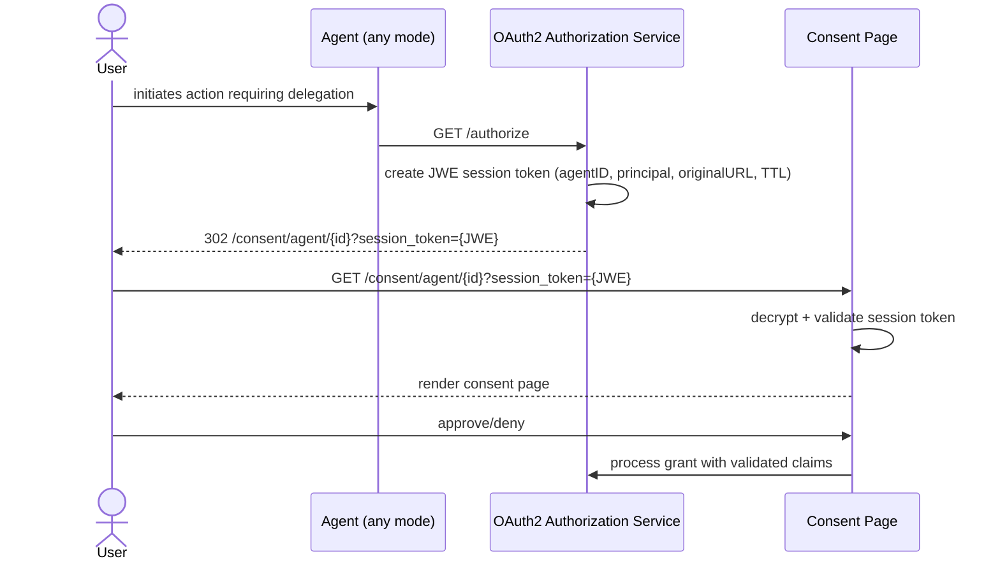

# Feature Specification: Unified Session Token State Transport

**Feature Branch**: `031-unified-session-token`  
**Created**: 2026-05-17  
**Status**: Draft  
**Predecessor**: `specs/028-cimd-support/` — introduced JWE session token transport and `AuthorizationSessionClaims` for CIMD agents (see also [ADR 016](../../adrs/016-authorization-session-anti-spoofing.md))  
**Input**: Align all agent modes (local, proxy, CIMD) to use the session_token JWE approach for consent URL state transport, eliminating the less secure redirect_uri query parameter fallback.

## User Scenarios & Testing

### User Story 1 - Local Agent Consent Flow Uses Session Token (Priority: P1)

A user interacts with a local (non-CIMD, non-proxy) agent that initiates an OAuth2 authorization request. The system creates a JWE session token containing the authorization context (agent ID, principal, original URL) and redirects the user to the consent page with a `session_token` parameter instead of a raw `redirect_uri`.

**Why this priority**: This is the core change — eliminating the insecure redirect_uri fallback for the most common non-CIMD agent type.

**Independent Test**: Can be tested by sending an authorize request for a local agent and verifying the consent redirect contains `session_token` instead of `redirect_uri`.

**Acceptance Scenarios**:

1. **Given** a registered local agent without CIMD metadata, **When** the user initiates an authorization request, **Then** the consent URL contains a `session_token` query parameter (JWE) and does NOT contain a `redirect_uri` parameter.
2. **Given** a session token issued for a local agent, **When** the token is decrypted, **Then** it contains the agent ID, principal, original URL, issued-at, and expires-at (10 min TTL).
3. **Given** a session token issued for a local agent, **When** a different principal attempts to use it on the consent page, **Then** the system rejects the token with a 403 error.

---

### User Story 2 - Proxy Agent Consent Flow Uses Session Token (Priority: P1)

A user interacts with a proxy agent. The system creates a JWE session token for the consent redirect, identical in structure to the CIMD flow (minus CIMD metadata fields).

**Why this priority**: Proxy agents are the other non-CIMD mode that currently uses the insecure redirect_uri fallback.

**Independent Test**: Can be tested by sending an authorize request for a proxy agent and verifying session_token usage.

**Acceptance Scenarios**:

1. **Given** a registered proxy agent without CIMD metadata, **When** the user initiates an authorization request, **Then** the consent URL contains a `session_token` query parameter.
2. **Given** an expired session token for a proxy agent (older than 10 minutes), **When** the user submits consent, **Then** the system rejects the token with an appropriate error indicating the session has expired.

---

### User Story 3 - Consent Handlers Accept Session Token for All Agent Modes (Priority: P2)

The consent page (agent detail and grant submission handlers) resolves authorization context exclusively from the `session_token` when resuming an OAuth2 authorization flow, removing the `redirect_uri` resolution path. Standalone consent-management requests (browsing agent details, managing grants) without a `session_token` continue to work unchanged — `session_token` is only required for authorization-resumption continuations.

**Why this priority**: Depends on stories 1 and 2; ensures the receiving side of the consent flow is unified.

**Independent Test**: Can be tested by submitting consent with a valid session token for any agent type and verifying successful grant creation.

**Acceptance Scenarios**:

1. **Given** a consent page request with a valid session token (any agent mode), **When** the handler processes it, **Then** it extracts agent ID, principal, and original URL from the decrypted token claims.
2. **Given** a consent page request with a `redirect_uri` parameter but no `session_token`, **When** the handler processes it, **Then** the system rejects the request (no fallback to redirect_uri).
3. **Given** a standalone consent-management request (GET agent detail or list grants) with no `session_token` and no `redirect_uri`, **When** the handler processes it, **Then** the system returns the resource normally — no authorization session required for browsing.

---

### User Story 4 - Grant Submission Returns Original Authorization Context (Priority: P2)

After a user approves consent, the grant submission response includes the original authorization URL (`redirect_url`) so the frontend can resume the OAuth2 flow where it left off. The original request context — `state`, `redirect_uri`, PKCE challenge, and `client_id` — must be intact in the returned URL.

**Why this priority**: The `redirect_url` is the mechanism for resuming the authorization flow after consent; losing the original request context would require the agent to restart from scratch.

**Independent Test**: Can be tested by executing a full authorize → consent → grant flow and asserting the `redirect_url` in the grant response matches the original authorize URL with all parameters intact.

**Acceptance Scenarios**:

1. **Given** a user submits consent with a valid `session_token`, **When** the grant is created, **Then** the response body includes a `redirect_url` field containing the original authorization URL with the original `state`, `redirect_uri`, and `client_id` parameters intact.
2. **Given** a user submits consent without a `session_token`, **When** the grant is created, **Then** the response body does NOT include a `redirect_url` field (no authorization flow to resume).

---

### Edge Cases

- What happens when the session token is malformed (not valid JWE)?
- What happens when the session token's agent ID does not match the agent in the URL path?
- What happens when the JWE decryption key has been rotated since token issuance?

## Requirements

### Functional Requirements

- **FR-001**: System MUST generate a JWE session token for ALL agent modes (local, proxy, CIMD) when building the consent URL.
- **FR-002**: The session token MUST contain: agent ID, principal, original authorize URL, issued-at timestamp, and expiry (10 minute TTL).
- **FR-003**: For CIMD agents, the session token MUST additionally contain CIMD metadata (unchanged from current behavior).
- **FR-004**: The `buildConsentURL` function MUST NOT include a raw `redirect_uri` query parameter for any agent mode.
- **FR-005**: When an authorization-resumption `session_token` is present, consent handlers MUST resolve authorization context exclusively from it — no fallback to raw query parameters. Requests without a `session_token` (standalone consent-management) continue to work normally.
- **FR-006**: Consent handlers MUST validate: token expiry, principal match (authenticated user matches token principal), and agent ID match (URL path matches token).
- **FR-007**: System MUST return appropriate error responses when session token validation fails (expired, tampered, mismatched principal, mismatched agent).

### Domain Model

### Security Requirements

- **SR-001**: All consent URL state MUST be sealed in a JWE token providing confidentiality, integrity, and expiry enforcement.
- **SR-002**: Session tokens MUST be bound to the authenticated principal — a token issued to one user MUST NOT be usable by another.
- **SR-003**: Session tokens MUST expire after 10 minutes to limit replay window.
- **SR-004**: The system MUST NOT fall back to insecure state transport (raw query parameters) under any condition.

## Success Criteria

### Measurable Outcomes

- **SC-001**: All agent modes (local, proxy, CIMD) use session_token in consent URLs — zero consent redirects contain a raw `redirect_uri` parameter.
- **SC-002**: Consent session tokens expire after 10 minutes across all agent modes.
- **SC-003**: Tampered or expired tokens are rejected 100% of the time with clear user-facing error messages.
- **SC-004**: No regressions in existing CIMD consent flows — all existing E2E tests continue to pass.

## Assumptions

- The existing `AuthorizationSessionClaims` structure and JWE `TokenService` (introduced in `specs/028-cimd-support/`, governed by [ADR 016](../../adrs/016-authorization-session-anti-spoofing.md)) can be reused for non-CIMD agents with `CIMDMetadata` set to nil.
- The 10-minute TTL is appropriate for all agent modes (same as current CIMD behavior).
- No database changes are required — session tokens remain stateless (sealed in JWE).
- The transition can be atomic (deploy once, old redirect_uri format immediately unsupported) because consent sessions are short-lived (10 min max).
