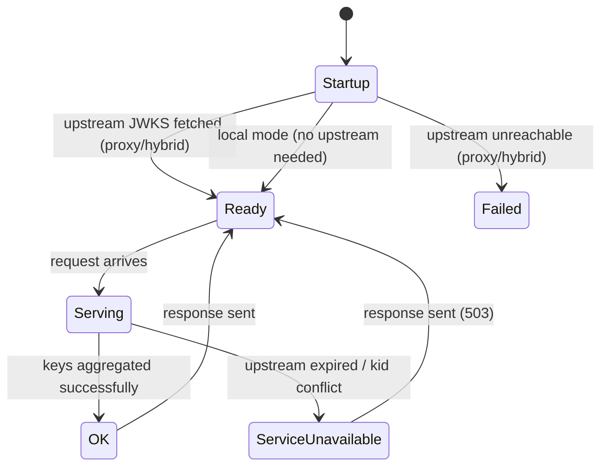
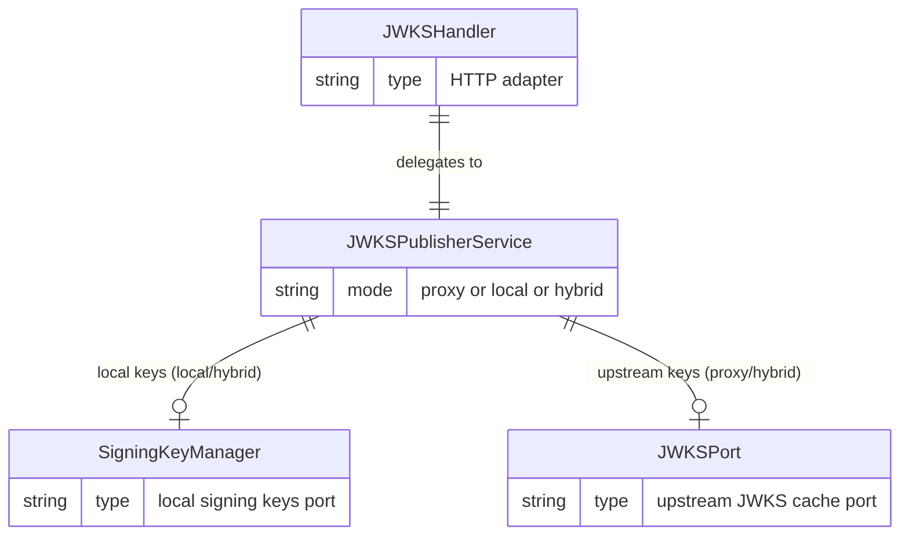

# Data Model: Broker-Hosted Aggregated JWKS

**Branch**: `032-aggregated-jwks` | **Date**: 2026-06-04

## Domain Entities

No new persisted entities. This feature operates on in-memory key sets.

## Value Objects

### AggregatedKeySet

Immutable snapshot of public keys from one or more sources, validated for `kid` uniqueness. Represents the complete verification surface at a point in time.

```go
// Package jwkspublisher implements the aggregated JWKS publishing domain logic.
package jwkspublisher

// AggregatedKeySet is not a separate struct — it is represented as jwk.Set from lestrrat-go/jwx/v3.
// The domain service produces it by aggregating keys from configured sources.
// Invariant: all keys in the set have unique kid values.
```

### KeySource (conceptual)

Abstraction representing a source of public keys. Materialized through port interfaces rather than a concrete type:
- **Local source**: `ports.SigningKeyManager.BuildJWKS(ctx)` → returns local public signing keys
- **Upstream source**: `ports.JWKSPort.GetKeySet(ctx)` → returns cached upstream JWKS

## New Port Interface

### `JWKSPublisherPort`

**File**: `internal/ports/jwks_publisher.go`

```go
package ports

import (
    "context"
    "github.com/lestrrat-go/jwx/v3/jwk"
)

// JWKSPublisherPort produces the aggregated JWKS for the broker's /oauth2/jwks.json endpoint.
// The implementation aggregates keys from mode-appropriate sources (local signing keys,
// upstream JWKS, or both) and enforces kid uniqueness invariants.
type JWKSPublisherPort interface {
    PublishJWKS(ctx context.Context) (jwk.Set, error)
}
```

## Domain Service

### `JWKSPublisherService`

**File**: `internal/domain/jwkspublisher/service.go`

**Responsibilities**:
1. Mode-dependent key source selection (local, proxy, hybrid)
2. Key aggregation in hybrid mode (union of local + upstream)
3. Duplicate `kid` detection (fail-closed with specific error)
4. Upstream availability gate (fail-closed if expired/unavailable)
5. Private key exclusion guarantee (only public material exposed)

**Dependencies** (constructor injection):
- `mode servermode.Mode` — determines which sources to use
- `localKeys ports.SigningKeyManager` — local signing key source (nil in proxy mode)
- `upstreamKeys ports.JWKSPort` — upstream JWKS source (nil in local mode)
- `logger *slog.Logger`

**Error Types**:

```go
// ErrUpstreamUnavailable indicates the upstream JWKS source is not available.
// The handler maps this to HTTP 503.
var ErrUpstreamUnavailable = errors.New("upstream JWKS unavailable")

// ErrKidConflict indicates a duplicate kid was found across key sources.
// The handler maps this to HTTP 503.
var ErrKidConflict = errors.New("duplicate kid across key sources")
```

**Behavior by mode**:

| Mode | Local Keys | Upstream Keys | Kid Check | Error on Upstream Fail |
|------|-----------|---------------|-----------|----------------------|
| `local` | ✓ | — | — | — |
| `proxy` | — | ✓ | — | 503 |
| `hybrid` | ✓ | ✓ | ✓ | 503 |

## Modified Types

### `MetadataResponse` (ports/oauth2.go)

No structural change. Behavioral change: `JWKSURI` field populated in all modes (was only local/hybrid).

### `JWKSHandler` (adapters/http/handlers/enduser/jwks_handler.go)

**Before**: Depends on `ports.SigningKeyManager`
**After**: Depends on `ports.JWKSPublisherPort`

```go
type JWKSHandler struct {
    publisher ports.JWKSPublisherPort
    logger    *slog.Logger
}

func (h *JWKSHandler) ServeJWKS(w http.ResponseWriter, r *http.Request) {
    jwks, err := h.publisher.PublishJWKS(r.Context())
    if err != nil {
        if errors.Is(err, jwkspublisher.ErrUpstreamUnavailable) || errors.Is(err, jwkspublisher.ErrKidConflict) {
            h.logger.Error("JWKS unavailable", "error", err)
            http.Error(w, "upstream key material temporarily unavailable", http.StatusServiceUnavailable)
            return
        }
        h.logger.Error("failed to build JWKS", "error", err)
        http.Error(w, "internal server error", http.StatusInternalServerError)
        return
    }
    // ... set headers, encode response (unchanged)
}
```

## State Diagram



## Relationships


