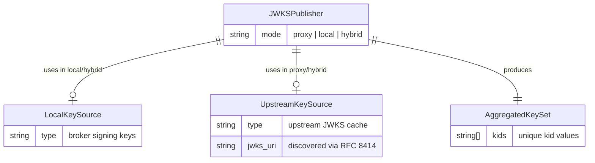
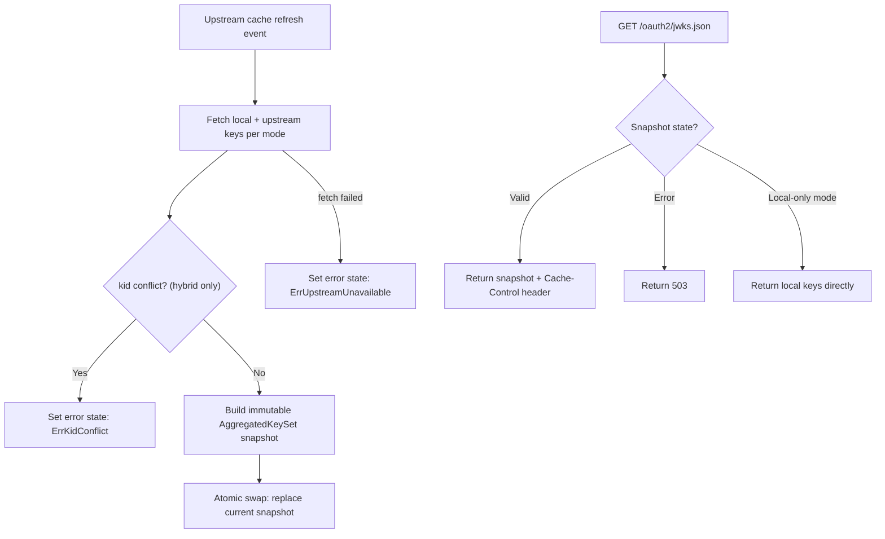

# Feature Specification: Broker-Hosted Aggregated JWKS

**Feature Branch**: `032-aggregated-jwks`  
**Created**: 2026-06-04  
**Status**: Draft  
**Input**: Change the broker's published JWKS contract from "local signing keys only" to a broker-hosted verification surface for all tokens the broker asks clients to trust, with mode-dependent aggregation behavior.

## Clarifications

### Session 2026-06-04

- Q: Should the broker honor the upstream server's Cache-Control headers to drive JWKS refresh, or use a fixed broker-configured interval? → A: Honor upstream Cache-Control headers (jwx jwk.Cache default behavior) with a configurable minimum refresh floor.
- Q: Should the aggregated key set be pre-computed on cache refresh or computed lazily per-request? → A: Pre-computed on each cache refresh event; requests serve the pre-built snapshot.
- Q: Should the broker support only RFC 8414 discovery for upstream JWKS URI, or also accept an explicit override? → A: RFC 8414 discovery only (derive JWKS URI from upstream issuer metadata). No direct JWKS URI config parameter.
- Q: What level of observability should the JWKS feature provide? → A: Structured log events plus health state exposed via existing health endpoint (upstream JWKS status: healthy/degraded).
- Q: What capabilities are explicitly out of scope for this feature? → A: All of: signed JWKS responses (RFC draft), key filtering by alg/use, multiple upstream sources, JWKS endpoint authentication, key pinning/allowlisting.

## Supersedes

This specification supersedes the following requirements from prior specs:

- **Spec 030 (Hybrid OAuth Modes), FR-012**: "The JWKS endpoint MUST be served in `local` and `hybrid` modes, and MUST NOT be served in `proxy` mode." → Replaced by this spec: JWKS endpoint is served in all three modes with mode-specific content.
- **Spec 030, Acceptance Scenario 10**: "hybrid mode serves its local signing keys" → Replaced: hybrid mode serves the union of local and upstream keys.
- **Spec 025 (OAuth2 Server), User Story 6, Scenario 3**: "proxy mode discovery returns 404" → Replaced: proxy mode exposes discovery with `jwks_uri` pointing at the broker-hosted endpoint.

## Out of Scope

The following capabilities are explicitly excluded from this feature and would each require a separate specification:

- **Signed JWKS responses** (RFC draft for JWK Set signed metadata) — not supported; responses are plain JSON.
- **Key filtering by `alg` or `use`** — the broker publishes all keys from each source without filtering.
- **Multiple upstream sources** — only a single upstream authorization server is supported per broker instance.
- **JWKS endpoint authentication** — the `/oauth2/jwks.json` endpoint is public (unauthenticated), per OAuth2 convention.
- **Key pinning or allowlisting** — the broker does not restrict which `kid` values are acceptable from upstream.

## User Scenarios & Testing *(mandatory)*

### User Story 1 - Unified Token Verification Surface for Clients (Priority: P1)

An OAuth2 client (API gateway, service mesh sidecar, or application) needs to verify tokens that the broker asks it to trust. Regardless of whether the token was minted locally by the broker or issued by an upstream authorization server, the client discovers and fetches a single broker-hosted JWKS endpoint to obtain all relevant verification keys. The client never needs to know whether the broker operates in proxy, local, or hybrid mode — the broker publishes exactly the keys required for the tokens it distributes.

**Why this priority**: This is the core value proposition. Without a unified verification surface, clients in proxy or hybrid deployments must independently discover and fetch upstream JWKS, breaking the broker's role as a trust mediator. This user story delivers the single most impactful change.

**Independent Test**: Can be fully tested by configuring the broker in each mode, fetching the JWKS endpoint, and verifying that tokens from the expected signing domains validate using only the broker-hosted JWKS response.

**Acceptance Scenarios**:

1. **Given** the broker is configured in `local` mode with active signing keys, **When** a client fetches `GET /oauth2/jwks.json`, **Then** the response contains only the broker's local public signing keys and no upstream keys.
2. **Given** the broker is configured in `proxy` mode with a reachable upstream authorization server, **When** a client fetches `GET /oauth2/jwks.json`, **Then** the response contains only the upstream authorization server's public keys, republished by the broker.
3. **Given** the broker is configured in `hybrid` mode with active local signing keys and a reachable upstream authorization server, **When** a client fetches `GET /oauth2/jwks.json`, **Then** the response contains both the broker's local public signing keys and the upstream authorization server's public keys in a single JWKS document.
4. **Given** the broker is in `hybrid` mode, **When** a client validates a locally-minted token using the broker JWKS endpoint, **Then** the token signature validates successfully (the local `kid` is present in the published key set).
5. **Given** the broker is in `hybrid` mode, **When** a client validates an upstream-issued token using the broker JWKS endpoint, **Then** the token signature validates successfully (the upstream `kid` is present in the published key set).
6. **Given** the broker is in `proxy` mode, **When** a client validates an upstream-issued token using the broker JWKS endpoint, **Then** the token signature validates successfully.
7. **Given** any mode, **When** a client fetches `GET /oauth2/jwks.json`, **Then** the response contains only public key material — no private keys are ever exposed.
8. **Given** any mode, **When** a client fetches `GET /oauth2/jwks.json`, **Then** the response includes `Cache-Control: public, max-age=300`.

---

### User Story 2 - Discovery Advertises Broker-Hosted JWKS in All Modes (Priority: P1)

An OAuth2 client library auto-configures itself by fetching the broker's RFC 8414 discovery document at `/.well-known/oauth-authorization-server`. In all three modes (proxy, local, hybrid), the discovery document includes a `jwks_uri` field pointing to the broker's own `/oauth2/jwks.json` endpoint. Clients have a single, predictable discovery path regardless of the broker's operating mode.

**Why this priority**: Discovery is the entry point for automated client configuration. If `jwks_uri` is absent or the discovery endpoint returns 404 in proxy mode, clients cannot auto-configure, negating the benefit of the unified JWKS surface.

**Independent Test**: Can be fully tested by fetching `/.well-known/oauth-authorization-server` in each mode and verifying `jwks_uri` is present and resolves to the broker endpoint.

**Acceptance Scenarios**:

1. **Given** the broker is configured in `local` mode, **When** a client fetches `/.well-known/oauth-authorization-server`, **Then** the response includes `jwks_uri` pointing to the broker's `/oauth2/jwks.json` endpoint.
2. **Given** the broker is configured in `proxy` mode, **When** a client fetches `/.well-known/oauth-authorization-server`, **Then** the response includes `jwks_uri` pointing to the broker's `/oauth2/jwks.json` endpoint (not the upstream server's JWKS URI).
3. **Given** the broker is configured in `hybrid` mode, **When** a client fetches `/.well-known/oauth-authorization-server`, **Then** the response includes `jwks_uri` pointing to the broker's `/oauth2/jwks.json` endpoint.
4. **Given** the broker is in `proxy` mode, **When** a client follows the `jwks_uri` from the discovery document, **Then** it receives a valid JWKS containing the upstream server's public keys (republished by the broker).

---

### User Story 3 - Fail-Closed Upstream JWKS Bootstrap and Availability (Priority: P2)

An operator deploys the broker in proxy or hybrid mode. Because the broker advertises a broker-hosted verification surface, it must resolve the upstream authorization server metadata at startup before serving traffic. If metadata discovery fails, startup fails with a clear error rather than starting with an unknown upstream verifier configuration. After startup, if upstream key retrieval later fails, the JWKS endpoint returns a service-unavailable response rather than publishing an incomplete verification surface.

**Why this priority**: Publishing an incomplete JWKS (missing upstream keys) would cause token validation failures for clients that trust the broker's endpoint. Failing closed prevents silent security degradation and gives operators one predictable startup policy.

**Independent Test**: Can be tested by starting the broker with an unreachable upstream issuer and verifying startup fails with a discovery error, and by simulating upstream JWKS fetch failure after successful startup and verifying the JWKS endpoint returns HTTP 503.

**Acceptance Scenarios**:

1. **Given** the broker is configured in `proxy` mode with unreachable upstream metadata discovery, **When** the broker starts, **Then** startup fails with a clear discovery error and the server does not begin serving the broker-hosted JWKS surface.
2. **Given** the broker is configured in `hybrid` mode with unreachable upstream metadata discovery, **When** the broker starts, **Then** startup fails with a clear discovery error and the server does not begin serving the broker-hosted JWKS surface.
3. **Given** the broker is running in `proxy` mode and upstream key retrieval fails after startup, **When** a client fetches `GET /oauth2/jwks.json`, **Then** the response is HTTP 503 Service Unavailable with a message indicating the upstream key material is temporarily unavailable.
4. **Given** the broker is running in `hybrid` mode and upstream key retrieval fails after startup, **When** a client fetches `GET /oauth2/jwks.json`, **Then** the response is HTTP 503 Service Unavailable (the broker does not publish a partial key set with only local keys).
5. **Given** the broker is configured in `local` mode (no upstream configured), **When** the broker starts, **Then** startup succeeds without requiring any upstream JWKS source.

---

### User Story 4 - Duplicate Key ID Detection (Priority: P2)

An operator configures the broker in hybrid mode where both local and upstream key sets are aggregated. If the broker detects that a local signing key and an upstream key share the same `kid` value, it treats this as a conflict and fails closed — the ambiguity of which key to use for verification would be a security risk. The operator is alerted with a specific error message identifying the conflicting `kid`.

**Why this priority**: Duplicate `kid` across trust domains creates ambiguity during token validation. Failing closed prevents a class of key confusion attacks.

**Independent Test**: Can be tested by configuring a local key with a `kid` that matches an upstream key `kid` and verifying the broker rejects the aggregation.

**Acceptance Scenarios**:

1. **Given** the broker is in `hybrid` mode and a local signing key has `kid: "abc123"` and the upstream JWKS also contains a key with `kid: "abc123"`, **When** the broker attempts to aggregate the key sets, **Then** it fails closed with an error identifying the duplicate `kid`.
2. **Given** the broker is in `hybrid` mode with no `kid` conflicts, **When** the broker aggregates the key sets, **Then** all keys from both sources appear in the published JWKS without modification to `kid`, `alg`, or other JWK fields.
3. **Given** a `kid` conflict is detected at startup (initial upstream JWKS fetch), **When** the broker starts, **Then** startup succeeds in a degraded state and `GET /oauth2/jwks.json` returns HTTP 503 while logs identify the conflicting key ID.
4. **Given** a `kid` conflict is detected at runtime (upstream JWKS refresh introduces a conflicting key), **When** the next JWKS request arrives, **Then** the broker returns HTTP 503 and logs the conflict — it does not silently drop or rename the conflicting key.

---

### Edge Cases

- What happens when the upstream JWKS contains zero keys (empty set)? The broker publishes the empty upstream set as-is in proxy mode. In hybrid mode, only local keys appear (empty upstream contributes nothing). This is not an error — the upstream server may be between key rotations.
- What happens when the upstream JWKS response is malformed (invalid JSON or non-conformant JWK)? The broker treats it as an unavailable source — same fail-closed behavior as unreachable upstream.
- What happens when local signing keys are rotated while the JWKS endpoint is being served? The next request after rotation picks up the new key set. No locking is required beyond normal read consistency.
- What happens when the broker is in `local` mode and an upstream config block is present? The upstream JWKS source is ignored — the broker does not fetch or cache upstream keys. Only local keys are published. A configuration warning may be logged.
- How does the broker handle upstream key rotation (keys added or removed)? The broker refreshes upstream keys on its cache schedule. New keys appear in the next JWKS response after cache refresh. Removed keys disappear after cache expiry.
- What happens if the upstream JWKS endpoint requires authentication? This is not supported. The upstream JWKS endpoint must be publicly accessible (standard for OAuth2 authorization servers per RFC 7517).

## Requirements *(mandatory)*

### Functional Requirements

- **FR-001**: The `/oauth2/jwks.json` endpoint MUST be served in all three modes (`proxy`, `local`, `hybrid`).
- **FR-002**: In `local` mode, the JWKS endpoint MUST return only the broker's local public signing keys.
- **FR-003**: In `proxy` mode, the JWKS endpoint MUST return the upstream authorization server's public keys, republished through the broker endpoint.
- **FR-004**: In `hybrid` mode, the JWKS endpoint MUST return the union of the broker's local public signing keys and the upstream authorization server's public keys in a single JWKS document.
- **FR-005**: The JWKS response MUST never contain private key material under any circumstances.
- **FR-006**: Keys from upstream MUST be republished without modification — `kid`, `alg`, `kty`, `use`, and all other JWK fields MUST be preserved as received from the upstream source.
- **FR-007**: When aggregating keys from multiple sources (hybrid mode), if any `kid` value appears in both the local and upstream key sets, the broker MUST fail closed and refuse to publish the aggregated JWKS.
- **FR-008**: The `/.well-known/oauth-authorization-server` discovery endpoint MUST include a `jwks_uri` field in all three modes, pointing to the broker's own `/oauth2/jwks.json` endpoint.
- **FR-009**: In `proxy` and `hybrid` modes, the broker MUST resolve upstream OAuth2 metadata at startup before serving broker-hosted upstream verification surfaces. If metadata discovery fails at startup, the broker MUST fail startup with a clear error. After successful startup, if upstream JWKS key material later becomes unavailable, the JWKS endpoint MUST return HTTP 503 until the upstream recovers.
- **FR-010**: At runtime, if the broker cannot retrieve upstream JWKS key material, the JWKS endpoint MUST return HTTP 503 rather than serving incomplete key material.
- **FR-011**: The JWKS response MUST include `Cache-Control: public, max-age=300` in all modes.
- **FR-012**: The broker MUST NOT rewrite, rename, or synthesize `kid` values — keys are published exactly as sourced.

### Domain Model

**Domain Entity Diagram**:



**Activity / Flow Diagram**:



**Value Objects**:
- **AggregatedKeySet**: Immutable snapshot of public keys from one or more sources, validated for `kid` uniqueness. Represents the complete verification surface at a point in time. Pre-computed eagerly on each upstream cache refresh event; JWKS requests serve the current snapshot without per-request merging. Conflict detection (duplicate `kid`) occurs at computation time, not request time.
- **KeySource**: Abstraction representing a source of public keys — either local (broker signing keys) or upstream (cached remote JWKS).

### Configuration Requirements

**Configuration Parameters**:
- No new configuration parameters are introduced. The existing `oauth2_authorization_server.upstream_issuer_uri` (or equivalent upstream config) is used to discover the upstream JWKS URI via RFC 8414 metadata. The mode selection (`proxy`, `local`, `hybrid`) determines which key sources are active.
- The upstream JWKS cache refresh interval is governed by the upstream server's `Cache-Control`/`Expires` headers (via `jwx jwk.Cache` default behavior), with a configurable minimum refresh floor to prevent excessive polling.

**Example YAML Configuration** (existing parameters, no change):
```yaml
oauth2_authorization_server:
  mode: hybrid
  upstream_issuer_uri: "https://auth.example.com"
  token_ttl: 3600
```

**Configuration Location**: No new configuration files. Behavior is derived from existing mode and upstream settings.

### API Requirements

- **API-001**: The `/oauth2/jwks.json` endpoint (end-user server) MUST be documented in `/api/enduser/openapi.yaml` with updated semantics reflecting mode-dependent content.
- **API-002**: The `/.well-known/oauth-authorization-server` endpoint MUST be documented with `jwks_uri` present in all modes.
- **API-003**: The `/oauth2/jwks.json` endpoint description MUST state: in `local` mode it returns broker keys; in `proxy` mode it returns upstream keys republished by the broker; in `hybrid` mode it returns the combined set.
- **API-004**: The `/oauth2/jwks.json` endpoint MUST document the HTTP 503 response for upstream unavailability scenarios.
- **API-005**: All API changes MUST follow Zalando RESTful API and Event Guidelines.

### Security Requirements

- **SR-001**: The JWKS endpoint MUST never expose private key material — only public components of signing keys are published.
- **SR-002**: Duplicate `kid` across trust domains (local vs. upstream) MUST be treated as a security-relevant error and trigger fail-closed behavior.
- **SR-003**: The broker MUST NOT silently degrade from "full verification surface" to "partial verification surface" — if any required key source is unavailable, the endpoint fails rather than serving incomplete data.
- **SR-004**: Upstream JWKS MUST be fetched over HTTPS. Insecure (HTTP) upstream JWKS URIs MUST be rejected at configuration time.
- **SR-005**: The broker MUST NOT trust or republish upstream keys that fail JWK format validation.

### Observability Requirements

- **OB-001**: The broker MUST emit structured log events for: upstream JWKS fetch success, upstream JWKS fetch failure, cache refresh with key count, and `kid` conflict detection (including the conflicting `kid` value).
- **OB-002**: The broker MUST expose upstream JWKS health state (healthy/degraded) via the existing health endpoint. Degraded state indicates the cached upstream JWKS has expired without successful refresh.
- **OB-003**: Structured log events MUST follow the project's OpenTelemetry provider pattern (ADR 011) using `slog` structured attributes.

## Assumptions

- The existing JWKS caching adapter (used for upstream key fetch/refresh in the ExtProc and token exchange paths) is reusable for this feature's upstream key source. The cache honors the upstream server's `Cache-Control`/`Expires` response headers to determine refresh intervals (jwx `jwk.Cache` default), with a configurable minimum refresh floor.
- The upstream JWKS URI is discovered exclusively via RFC 8414 metadata from the configured `upstream_issuer_uri`. No direct JWKS URI configuration parameter is supported — the broker fetches `{upstream_issuer_uri}/.well-known/oauth-authorization-server` and extracts `jwks_uri` from the metadata response.
- `Cache-Control: public, max-age=300` remains the downstream cache policy for all modes. This matches current local key rotation assumptions and can be tuned by a future spec if needed.
- The `/oauth2/jwks.json` path is unchanged. Only its behavior (what keys it serves) changes per mode.
- The discovery endpoint path `/.well-known/oauth-authorization-server` is unchanged. Only the presence of `jwks_uri` in proxy mode is new.
- No database schema changes are required — this feature operates on in-memory key sets (local signing keys from existing key management, upstream keys from cache).

## Success Criteria *(mandatory)*

### Measurable Outcomes

- **SC-001**: Clients can verify tokens from any signing domain the broker distributes using a single JWKS endpoint, without needing to know the broker's operating mode.
- **SC-002**: In proxy and hybrid modes, the broker-hosted JWKS endpoint contains the upstream authorization server's public keys within 5 minutes of key rotation upstream (bounded by cache refresh).
- **SC-003**: 100% of token validation attempts succeed when using only the broker-hosted JWKS endpoint for tokens the broker distributes, across all three modes.
- **SC-004**: The broker never starts successfully if it cannot resolve upstream metadata for an advertised upstream-backed verification surface — operators see a clear startup failure rather than later discovery-time errors.
- **SC-005**: Duplicate `kid` conflicts are detected and surfaced within one cache refresh cycle — operators are never silently exposed to key confusion.
