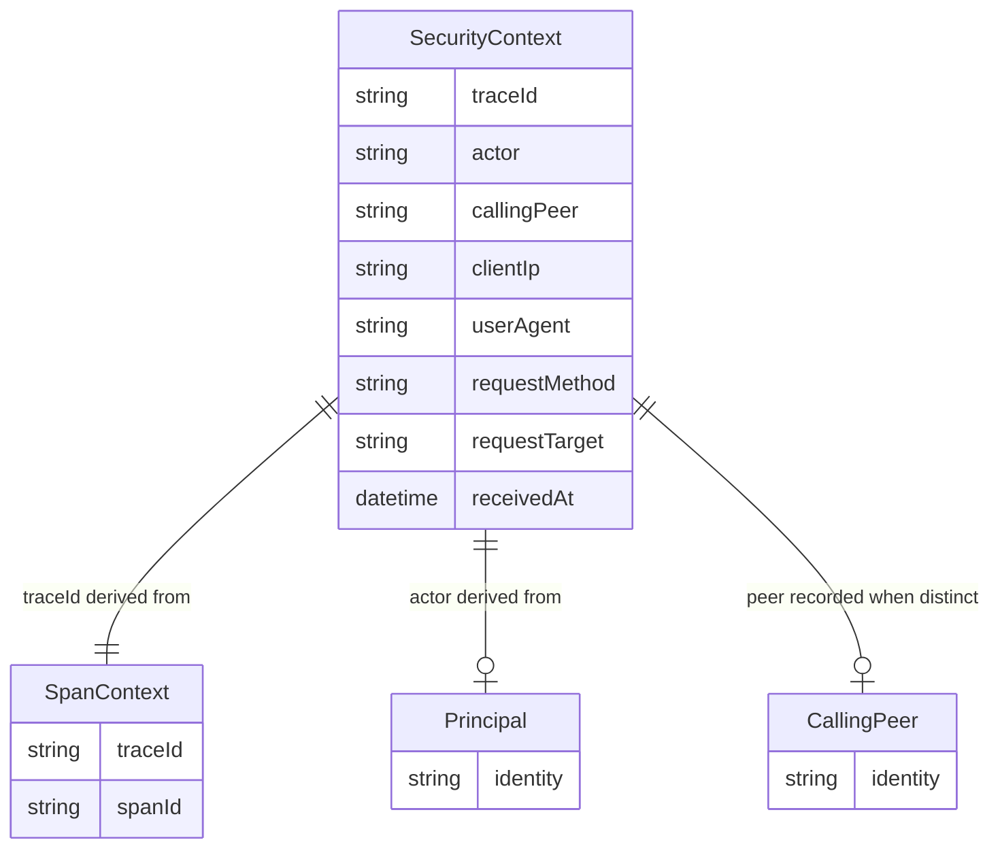
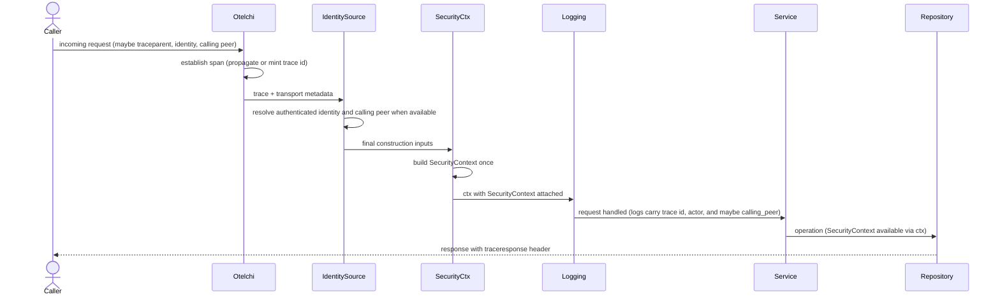

# Phase 1 Data Model: Request Security Context Propagation

**Feature**: 033-request-security-context | **Date**: 2026-06-29 | **Spec**: [spec.md](./spec.md) | **Research**: [research.md](./research.md)

This feature introduces **no persisted entities and no database schema changes**. The data model is an
in-process, request-scoped **value object** carried on Go's `context.Context`. All types live in the domain
layer (`internal/domain/security`) and import no infrastructure (Constitution Principle VI).

---

## Value Object: `SecurityContext`

The immutable bundle captured for a request and read (never mutated) by downstream layers. Transport metadata and trace inputs are collected at the outer perimeter; the final `SecurityContext` value is instantiated exactly once at the earliest request-authentication seam that can supply the request's actor and calling peer.

| Field | Type | Description | Invariant / Default |
|---|---|---|---|
| `TraceID` | `string` | Correlation identifier — the **authoritative** value read by the log handler and carried in the `traceresponse` header's `<trace-id>` field. | Always non-empty, 32-char lower-case hex. Span trace ID when a valid span exists, else `crypto/rand` fallback. |
| `Actor` | `string` | Identity on whose behalf the request is acting (forensic label, distinct from access-control `principal`). | Always non-empty; `"anonymous"` when no authenticated identity is available or the value is malformed/oversized. |
| `CallingPeer` | `string` | Authenticated peer that directly wielded the request when distinct from the actor. | `""` when unavailable, malformed, or equal to `Actor`. |
| `ClientIP` | `string` | Source network address of the caller (authoritative caller IP for logs — see contract C4). | `""` (unknown) when unresolvable; never panics. |
| `UserAgent` | `string` | Client user-agent string. | `""` when absent; truncated to 1024 bytes. |
| `RequestMethod` | `string` | HTTP method (or gRPC equivalent). | Non-empty for HTTP. |
| `RequestTarget` | `string` | Request path/target (query string excluded to avoid leaking secrets). | Non-empty for HTTP. |
| `ReceivedAt` | `time.Time` | Timestamp the context was captured for the request. | Set to capture instant (UTC). |

**Invariants**:
- **Immutable**: the final `SecurityContext` is constructed exactly once; no setters; downstream code reads only (**FR-013**).
- **Always complete**: every field has a safe default; construction never fails and never rejects a request (**FR-008**).
- **Distinct peer semantics**: `CallingPeer` is present only when the request carries a separately authenticated peer that differs from `Actor` (**FR-001 / FR-015**).
- **No secrets**: credential material (tokens, secrets, authorization codes, cookies) is never copied into any field; `RequestTarget` excludes the query string (**FR-012 / SR-005**).

**Context accessors** (mirroring `internal/domain/principal/context.go`):
- `WithSecurityContext(ctx context.Context, sc SecurityContext) context.Context` — returns a derived context with the value object attached under an unexported key.
- `FromContext(ctx context.Context) (SecurityContext, bool)` — safe retrieval; `false` when absent (background / non-perimeter code), in which case callers treat the actor as `anonymous`/system and `calling_peer` as empty.
## Value Object: `Actor`

Represented as the `Actor` field (a `string`) on `SecurityContext`; modeled conceptually as a value object.

| Concept | Representation | Notes |
|---|---|---|
| Authenticated actor | the validated authenticated identity | Sourced from the first validated request identity available for the request (pre-auth principal for ordinary HTTP requests, subject-token principal for token exchange — research D5). |
| Anonymous actor | sentinel `"anonymous"` | Used when no validated identity is present or when the identity is malformed/oversized. |

**Derivation rule**: `actor = validated request identity` when one is already available for the request; otherwise `principal.FromContext(ctx)` if present and non-empty; otherwise `"anonymous"`.

**`Actor` vs `Principal`**: `principal` is the *access-control* identity resolved by the existing HTTP auth mechanism. `Actor` is the *forensic* label always present on the security context — the validated request identity when authenticated, else the `anonymous` sentinel. They are intentionally separate fields for one fact viewed through two different responsibilities.

---

## Value Object: `CallingPeer`

Represented as the `CallingPeer` field (a `string`) on `SecurityContext`; modeled conceptually as a value object.

| Concept | Representation | Notes |
|---|---|---|
| Distinct calling peer | the validated peer identity | For delegated requests, sourced from the validated peer credential (for example `client_assertion.sub`) when it differs from `Actor` (research D5). |
| Omitted peer | empty string | Used when no separate peer is authenticated or when it resolves to the same identity as `Actor`. |

**Derivation rule**: `callingPeer = validated peer identity` when present and distinct from `Actor`; otherwise empty.

## Value Object: `TraceID`

Represented as the `TraceID` field (a `string`) on `SecurityContext`.

| Source | When | Format |
|---|---|---|
| OTel span trace ID | tracing enabled (`otelchi` span present) | 32-char lower-case hex (W3C). |
| Propagated inbound | inbound `traceparent`/b3 present → span inherits it | same as span. |
| Generated fallback | tracing disabled (no span) | 32-char lower-case hex via `crypto/rand`. |

**Rule**: `SecurityContext.TraceID` is the single authority (**research D2**). It is set from the span trace ID
(`trace.SpanContextFromContext`) when a valid span exists, and from a `crypto/rand` fallback only when no valid
span exists. The context slog handler reads it as `trace_id`, and the `traceresponse` response header embeds it
as its `<trace-id>` field (envelope `00-<trace-id>-<child-id>-<flags>`, contract C1 / research D10), so they
agree in tracing-on and tracing-off modes alike (**FR-003 / FR-006 / SC-002 / SC-007**).

---

## Relationships

---

## Lifecycle / Flow

---

## State transitions

The final `SecurityContext` is immutable and has no state machine. Its only "transition" is creation before business logic runs; it is never updated thereafter. Outer middleware may capture preliminary trace and transport inputs, but downstream code only ever sees the fully constructed value object.

---

## Persistence

**None.** No tables, no migrations, no repositories. The context is exposed to the persistence layer only as an in-process `context.Context` value for logging/correlation. Actor-stamping columns or provenance storage are explicitly **out of scope** (spec Assumptions). Constitution Principle IX (persistence patterns) therefore does not apply to this feature.
