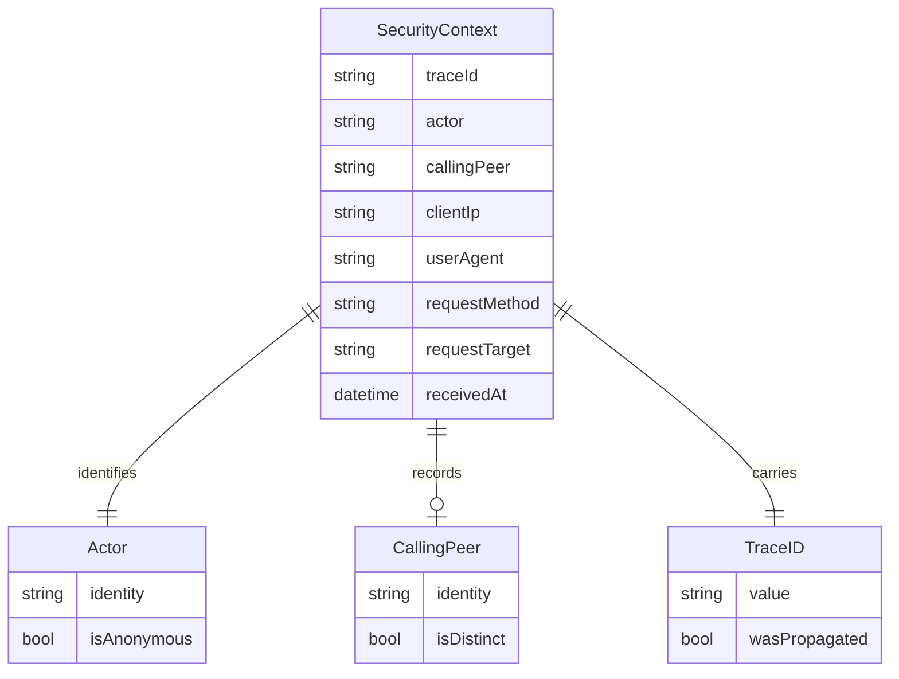
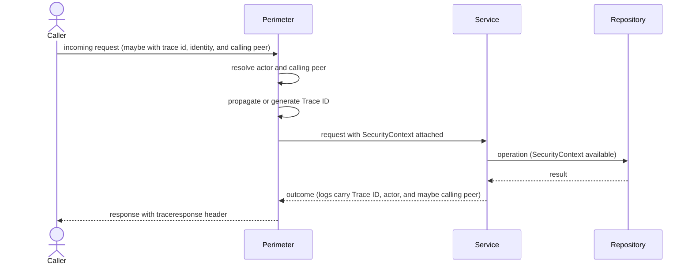

# Feature Specification: Request Security Context Propagation

**Feature Branch**: `033-request-security-context`

**Created**: 2026-06-29

**Status**: Draft

**Input**: User description: "Establish a system-wide mechanism to capture and propagate security context for every incoming request to the identity broker. To maintain a forensic audit trail, every business event must be bound to the actor who initiated it. Developers should not have to manually pass network metadata (IP, User-Agent) through the business logic layers; it must happen seamlessly and implicitly. Capture core security metadata at the HTTP/gRPC perimeter (who is the actor, what is the context of the request). Generate or propagate a unique Trace ID for every request to enable end-to-end log correlation. Inject this metadata safely into the request context so it is accessible by downstream business logic and database layers. If metadata is missing (e.g., an unauthenticated request), the system must degrade gracefully and record the actor as 'anonymous' rather than failing the request."

## Clarifications

### Session 2026-07-03

- Q: When both a subject and a distinct calling peer are present, which identity should the security context treat as the actor? → A: Record the subject as the actor and record the calling peer separately when distinct.

## User Scenarios & Testing *(mandatory)*

### User Story 1 - Implicit security-context capture and propagation (Priority: P1)

Every request that reaches the identity broker is, at the moment it crosses the network boundary, tagged with a single bundle of security metadata — who the actor is, which calling peer wielded the action when distinct, where the request came from (client IP), what software made it (user agent), and a unique Trace ID. That bundle travels with the request through every internal layer (business services and the persistence/database layer) without any handler, service, or repository having to read raw network details or thread them through function arguments.

**Why this priority**: This is the foundational MVP. Without an automatically-captured, automatically-propagated security context, there is no forensic audit trail and developers are forced to manually plumb network metadata through business code — which is exactly the error-prone, inconsistent situation this feature eliminates. Every other story builds on this capture-and-propagate spine.

**Independent Test**: Issue an authenticated request to any broker endpoint and assert (via the structured logs and the response correlation header) that the actor, any distinct calling peer, client IP, user agent, and Trace ID were captured at the perimeter and were readable by a downstream service and the persistence layer — without that endpoint containing any code that reads network metadata directly.

**Acceptance Scenarios**:

1. **Given** an authenticated request arrives at any broker endpoint, **When** the request crosses the perimeter, **Then** a security context containing the actor identity, any distinct calling peer identity, client IP, user agent, and a Trace ID is established and attached to the request before any business logic runs.
2. **Given** a request is being handled by a downstream business service, **When** that service needs the initiating actor, calling peer, or request metadata, **Then** it can read the complete security context from the request context without accessing the raw transport/connection.
3. **Given** a request reaches the persistence/database layer, **When** a repository operation executes, **Then** the same security context captured at the perimeter is available to that operation for correlation and audit purposes.
4. **Given** a new endpoint is added by a developer, **When** that endpoint handles a request, **Then** the security context is present automatically with no per-endpoint capture code written by the developer.
5. **Given** a request presents both an authenticated identity and a distinct calling peer, **When** the security context is captured, **Then** the authenticated identity is recorded as the actor and the calling peer is recorded separately rather than collapsed into the actor field.

---

### User Story 2 - End-to-end trace correlation (Priority: P1)

Every request carries one Trace ID for its entire lifetime. If the inbound request already supplies a trace identifier (e.g., from an upstream gateway or caller) and distributed tracing is enabled, the broker reuses it; otherwise (no identifier supplied, or tracing disabled) the broker generates a fresh one. That single Trace ID appears on every log line emitted while handling the request and is returned to the caller, so an operator handed one Trace ID can reconstruct the complete, gap-free story of that request across all components.

**Why this priority**: Correlation is what turns scattered log lines into an investigable audit trail and is essential for incident response and support. A captured context (Story 1) is far less useful if the records it produces cannot be tied together end to end.

**Independent Test**: With distributed tracing enabled, send a request that includes an upstream trace identifier and a second request without one; assert that the first reuses the supplied identifier and the second is assigned a freshly generated one, that every log entry for each request shares that one identifier, and that the identifier is returned to the caller in the response.

**Acceptance Scenarios**:

1. **Given** an inbound request that carries a valid upstream trace identifier while distributed tracing is enabled, **When** the request is processed, **Then** the broker reuses that identifier as the request's Trace ID rather than generating a new one.
2. **Given** an inbound request with no trace identifier, **When** the request is processed, **Then** the broker generates a unique Trace ID for it.
3. **Given** a request is handled, **When** any structured log entry is emitted during its handling, **Then** that entry includes the request's Trace ID.
4. **Given** a request completes, **When** the response is returned, **Then** the Trace ID is included in the response so the caller can reference it.
5. **Given** two requests are processed concurrently, **When** their logs are inspected, **Then** each log entry carries only its own request's Trace ID with no cross-request leakage.

---

### User Story 3 - Graceful degradation to anonymous actor (Priority: P2)

When a request has no authenticated identity (for example, a public, pre-authentication, or health-check request) or arrives with missing/unusable network metadata, the system does not fail the request. Instead it records the actor as `anonymous`, fills absent metadata with safe defaults, and continues processing — while still preserving a Trace ID and whatever context is available.

**Why this priority**: The capture mechanism must never become a new failure mode. Failing requests because metadata is absent would be a severe availability regression and would undermine trust in the perimeter. This guardrail makes the capture mechanism safe to apply universally.

**Independent Test**: Send an unauthenticated request and a request with absent network metadata; assert that both are processed successfully (not rejected by the capture mechanism), that the actor is recorded as `anonymous`, that absent fields use defined safe defaults, and that a Trace ID is still present.

**Acceptance Scenarios**:

1. **Given** an unauthenticated request to an endpoint that does not require authentication, **When** the security context is captured, **Then** the actor is recorded as `anonymous` and the request proceeds normally.
2. **Given** a request whose network metadata is missing or malformed, **When** the context is captured, **Then** absent fields receive safe defaults (unknown/empty) and the request is not rejected by the capture mechanism.
3. **Given** an endpoint that requires an authenticated principal, **When** an unauthenticated request arrives, **Then** the request is still rejected by the existing authentication control (the anonymous fallback applies only to the audit context, never to access decisions).
4. **Given** any degraded request, **When** it is processed, **Then** a Trace ID is still generated and present in logs and response.

---

### User Story 4 - gRPC perimeter parity (Priority: P3)

Requests arriving at the broker's gRPC perimeter (the ExtProc token-exchange service) receive the same trace treatment as HTTP requests: a Trace ID is generated or propagated and appears in that service's structured logs alongside an `actor` and an optional `calling_peer` field — so end-to-end correlation holds across the full surface, not just HTTP. Today the direct token-exchange path sees only an opaque bearer token, so it logs `actor=anonymous` and omits `calling_peer`; the field contract is in place so a future authenticated-peer source (e.g. tool-authz requests) can populate both without changing the log shape.

**Why this priority**: The gRPC perimeter handles security-sensitive token exchange and must participate in the same audit trail for completeness. It is lower priority than the HTTP perimeter because it is a narrower, standalone surface, but parity is required for the audit trail to be truly system-wide.

**Independent Test**: With distributed tracing enabled, send a request through the gRPC (ExtProc) perimeter with and without an upstream trace identifier; assert that a Trace ID is propagated or generated accordingly and that the actor/context appears in the service's structured logs (`actor=anonymous` with `calling_peer` omitted on today's direct token-exchange path).

**Acceptance Scenarios**:

1. **Given** a request arrives at the gRPC (ExtProc) perimeter carrying an upstream trace identifier while distributed tracing is enabled, **When** it is processed, **Then** the identifier is propagated and included in the service's logs.
2. **Given** a request arrives at the gRPC perimeter without a trace identifier, **When** it is processed, **Then** a unique Trace ID is generated and included in the service's logs.
3. **Given** any gRPC perimeter request, **When** its logs are inspected, **Then** the actor/context captured at the perimeter — and any distinct calling peer when present — is present and consistent in meaning with the HTTP perimeter's context.

---

### Edge Cases

- **Spoofed forwarding headers**: When the broker is not configured to trust an upstream proxy, client-supplied forwarding headers (e.g., a forged forwarded-for value) MUST be ignored and the direct connection address used as the client IP.
- **Multiple or duplicate inbound trace identifiers**: When more than one trace identifier is supplied, the system selects a single deterministic value (the first valid one) and, if none is valid, generates a new Trace ID.
- **Oversized or malformed actor identity**: An actor identity that exceeds the fixed maximum length (256 characters — see [data-model.md](./data-model.md)) or is malformed is treated as not-present for context purposes (actor recorded as `anonymous`); endpoints requiring authentication still reject such requests via the existing authentication control.
- **Actor and calling peer resolve to the same identity**: When the authenticated calling peer and the actor resolve to the same identity, the system records the actor once and leaves the calling-peer value empty rather than duplicating the same identity twice.
- **Concurrent requests**: Each in-flight request maintains an isolated security context; no field of one request's context is ever visible to another.
- **Oversized user agent**: A user-agent value beyond the fixed maximum length (1024 bytes — see [data-model.md](./data-model.md)) is truncated so it cannot bloat logs or storage.
- **No inbound perimeter (internal/background work)**: Work that is not initiated by an inbound request has no perimeter-captured context; downstream code that reads the security context MUST tolerate its absence (treated as `anonymous`/system) without panicking.
- **Sensitive material**: Credentials present on the request (tokens, secrets, authorization codes, cookies) MUST never be copied into the security context or its logs.

## Requirements *(mandatory)*

### Functional Requirements

- **FR-001**: The system MUST capture, at the request perimeter (before any business logic executes), a security context for every incoming request containing at minimum: actor identity, calling peer identity when distinct from the actor and present, source network address (client IP), user agent, request descriptor (method and target/path), receipt timestamp, and a Trace ID.
- **FR-002**: The system MUST determine the actor from the authenticated identity when one is present, and MUST record the actor as `anonymous` when no authenticated identity is available.
- **FR-003**: When distributed tracing is enabled, the system MUST reuse an existing trace identifier supplied by the inbound request when one is present and valid; it MUST generate a new unique Trace ID otherwise — including whenever tracing is disabled, in which case no inbound span exists to carry an upstream identifier (see Assumptions: trace correlation reuses the distributed-tracing identifier). Regardless of mode, exactly one Trace ID is present and identical across the context, logs, and response header.
- **FR-004**: The system MUST make the captured security context available implicitly to all downstream layers — business services and the persistence/database layer — via the request context, so that no handler, service, or repository needs to read raw transport metadata or pass network metadata through its function signatures.
- **FR-005**: Security context capture MUST be applied uniformly to all incoming requests on every served HTTP interface (both the administrative and the end-user perimeters), not as a per-endpoint opt-in.
- **FR-006**: Every perimeter access/audit log entry and every context-aware structured log entry emitted while handling a request MUST include that request's Trace ID; security-relevant log entries — defined as the OAuth2 audit sites (authorization, token issuance, and consent decisions) — MUST additionally include the actor and, when present, the calling peer, so that all records for a single request can be correlated end to end. Legacy log call sites that do not yet thread the request context are converted where they are security-relevant; a blanket migration of every historical call site is out of scope (see research D3).
- **FR-007**: The system MUST return the request's Trace ID to the caller via the W3C `traceresponse` response header (Trace Context Level 2) so external callers and operators can reference it in support and incident workflows. Emission MAY be disabled by explicit configuration.
- **FR-008**: Missing, malformed, or partially available metadata MUST NOT cause a request to be rejected by the capture mechanism; the system MUST degrade gracefully by populating absent fields with defined safe defaults (actor = `anonymous`, calling peer empty/omitted, unknown/empty network metadata) and continue processing.
- **FR-009**: Capturing and propagating the security context MUST NOT change existing authentication or authorization outcomes; endpoints that require an authenticated principal MUST continue to reject unauthenticated requests. The `anonymous` fallback applies only to the forensic/audit context, never to access decisions.
- **FR-010**: When the broker is deployed behind a trusted proxy, the system MUST derive the client IP from the configured forwarded-for header(s); when proxy trust is not configured, the system MUST use the direct connection address and MUST NOT trust client-supplied forwarding headers.
- **FR-011**: Security context capture MUST be enabled by default; only the trusted-proxy / forwarded-header behavior MAY be altered via explicit configuration.
- **FR-012**: The security context and any logs derived from it MUST NOT contain sensitive credential material (access/refresh tokens, client secrets, authorization codes, session cookies, or other secrets).
- **FR-013**: The security context MUST be effectively immutable for the lifetime of the request once established at the perimeter; downstream layers read it but do not mutate it.
- **FR-014**: The gRPC perimeter (the ExtProc token-exchange service) MUST capture an actor/context, any distinct calling peer, and a Trace ID for each incoming request — reusing an upstream trace identifier when present and distributed tracing is enabled, generating one otherwise — and include them in that service's structured logs, behaving consistently with the HTTP perimeter. This MUST apply to every inbound-request entry point of the ExtProc service, covering both the direct token-exchange path and the OPA-authorization path (ADR 028).
- **FR-015**: The actor identity recorded in the security context MUST be sourced from the broker's existing authenticated-identity mechanism; when a distinct authenticated calling peer is already available for the same request, it MUST be recorded separately rather than collapsed into the actor field. This feature MUST NOT introduce a new authentication method or change how identities are authenticated.

### Domain Model *(document before API or database design)*

**Domain Entity Diagram** (the security context is a value object captured per request):



**Request lifecycle flow** (capture at perimeter, implicit propagation, correlation on response):



**Value Objects** (things without identity):
- **SecurityContext**: Immutable bundle captured once per request at the perimeter. Holds the actor, any distinct calling peer, client IP, user agent, request descriptor (method, target), receipt timestamp, and Trace ID. Read by downstream layers; never mutated after creation.
- **Actor**: The initiating authenticated identity for the request, or the sentinel `anonymous` when no authenticated identity is available. Invariant: always populated (never empty).
- **CallingPeer**: The authenticated calling peer that directly wielded the request when distinct from the actor. Invariant: omitted/empty when unavailable or when it resolves to the same identity as the actor.
- **TraceID**: The correlation identifier for the request — either propagated from the inbound request or newly generated. Invariant: always present and unique-per-request when generated.

**Domain Events** (state changes of business significance):
- **SecurityContextCaptured**: Occurs at the perimeter the instant a request's security context is established; it is the anchor to which all subsequent log records and business events for that request are bound.

*All domain terms (SecurityContext, Actor, CallingPeer, anonymous actor, Trace ID) should be added to the ARCHITECTURE.md Glossary section per Constitution Principle V.*

### Configuration Requirements *(document before implementation)*

**Configuration Parameters**:
- **trusted_proxy.enabled**: Boolean. Whether the broker trusts an upstream proxy to supply the real client IP via forwarded headers. Default: `false` (do not trust client-supplied forwarding headers).
- **trusted_proxy.forwarded_header**: String. The header name from which to read the client IP when proxy trust is enabled. Default: standard forwarded-for header.
- **trace.response_enabled**: Boolean. Whether the broker emits the W3C `traceresponse` response header (Trace Context Level 2) returning the request's Trace ID to callers. Default: `true`.

**Example YAML Configuration**:
```yaml
# Request security context configuration
request_context:
  trusted_proxy:
    enabled: false
    forwarded_header: "X-Forwarded-For"
  trace:
    response_enabled: true
```

**Configuration Location**: Will be added to `examples/config/request-context.yaml` and referenced in `examples/config/README.md`.

### Security Requirements *(mandatory for security-critical features)*

- **SR-001**: Security context capture MUST be enabled by default; disabling or weakening it (e.g., trusting forwarding headers) MUST require explicit configuration.
- **SR-002**: Trace ID generation MUST use a collision-resistant identifier from a vetted library (no custom identifier scheme).
- **SR-003**: The capture mechanism MUST fail safe for availability (never reject a request for missing context) while NOT weakening any existing access-control decision — authentication/authorization controls remain fail-closed and unchanged.
- **SR-004**: The actor and Trace ID MUST be recorded in structured audit logs for security-relevant operations to support forensic reconstruction.
- **SR-005**: The security context MUST NOT capture or log credential material; forwarding/identity headers used to derive context MUST be handled so that secrets are never copied into the context.
- **SR-006**: When proxy trust is disabled, client-supplied forwarding headers MUST NOT be able to spoof the recorded client IP.

## Success Criteria *(mandatory)*

### Measurable Outcomes

- **SC-001**: 100% of incoming requests across every served interface are processed with a security context that includes a Trace ID — no request is handled without one.
- **SC-002**: Given any single Trace ID taken from one log line or one response, an operator can retrieve every log entry produced for that request with no gaps and no entries from other requests.
- **SC-003**: 100% of requests that lack an authenticated identity are recorded with actor `anonymous`, and 0% of requests are rejected solely because perimeter metadata was missing or malformed.
- **SC-004**: New endpoints and handlers can be added with zero lines of code that read or pass client IP, user agent, or Trace ID — verified by new handlers relying solely on the request context for that metadata.
- **SC-005**: 0 production log entries or stored audit records contain raw credential material originating from the security context.
- **SC-006**: Authentication and authorization pass/fail outcomes are identical to before the feature (no access-control regression), verified by the existing authentication/authorization test suites remaining green.
- **SC-007**: For every request that arrives with a valid upstream trace context while tracing is enabled, the same trace identifier — never a newly minted one — appears in the broker's logs and response header, verified deterministically per request rather than as a statistical sample.
- **SC-008**: Perimeter capture adds under 1 ms of median per-request overhead and no additional heap allocations beyond one context value and one response header, verified by a Go benchmark of the capture middleware (tasks.md T072).

## Assumptions

- **Perimeter scope**: Both HTTP perimeters (the administrative server and the end-user server) and the standalone gRPC ExtProc token-exchange service are in scope. Because ExtProc is an independent binary that must not import the broker's core packages, its perimeter capture is implemented as parallel behavior that matches the HTTP perimeter's semantics rather than shared code.
- **Actor source**: The actor is derived from the broker's existing authenticated-identity mechanism. When a distinct authenticated calling peer is already available for the same request (for example via a client assertion), it is recorded separately as the calling peer. No new authentication method is introduced and identity validation rules are unchanged.
- **Trace correlation**: Trace correlation reuses the established distributed-tracing identifier supplied on inbound requests when present (e.g., the standard W3C trace-context header already used by the broker's telemetry), and generates a request-scoped identifier otherwise.
- **Persistence reach**: The security context is exposed to the persistence layer through the in-process request context for logging and correlation. Adding actor-stamping database columns, schema changes, or per-row provenance storage is out of scope for this feature unless separately specified.
- **Response surface**: The Trace ID is returned to callers via the W3C `traceresponse` response header only; no request/response body contracts change, and no new business API endpoints are introduced.
- **Frontend**: This is backend perimeter infrastructure; no frontend/design-system changes are in scope.
- **Proxy trust default**: Trusted-proxy / forwarded-header handling defaults to NOT trusting client-supplied forwarding headers; operators must explicitly enable proxy trust for forwarded-for resolution.
- **Background work**: Code paths not initiated by an inbound request (scheduled/background tasks) have no perimeter context; consumers of the security context treat its absence as `anonymous`/system.
