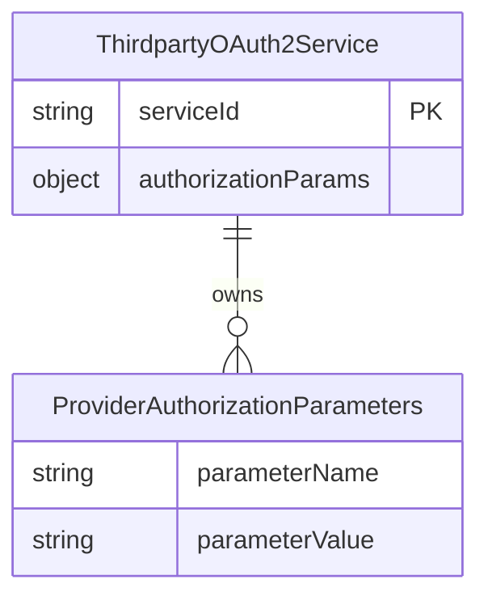
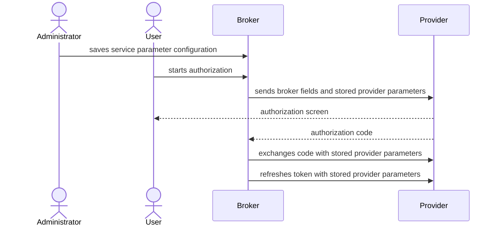

# Feature Specification: Provider Authorization Parameters

**Feature Branch**: `034-provider-auth-params`  
**Created**: 2026-07-20  
**Status**: Draft  
**Input**: User description: "Add support for provider-specific static authorization request parameters on third-party OAuth2 services."

## Clarifications

### Session 2026-07-20

- Q: Should configured provider parameters be sent in both upstream authorization and token/code-exchange requests? → A: Send all configured `authorization_params` in the upstream authorization request and every broker-issued token request for that service, including authorization-code exchange and refresh-token grants.
- Q: Which token/code-exchange fields must remain broker-owned? → A: Add `code` and `grant_type` to the reserved-name list.
- Q: Should the PKCE code-exchange field `code_verifier` be broker-owned? → A: Add `code_verifier` to the reserved-name list.
- Q: Does the target Zalando Platform IdP require `business_partner_id` on refresh-token grants? → A: Yes. Its `/oauth2/token` refresh route requires `grant_type=refresh_token`, `refresh_token`, and `business_partner_id`; the broker must send stored parameters on refresh requests.

## User Scenarios & Testing *(mandatory)*

### User Story 1 - Configure Provider Authorization Parameters (Priority: P1)

An administrator can configure a third-party OAuth2 service with named, static provider protocol parameters required by that provider, so users can complete authorization and the broker can complete code exchange without supplying provider-specific values themselves.

**Why this priority**: Provider-required parameters block authorization entirely when they cannot be configured.

**Independent Test**: Create a service with `authorization_params` containing `business_partner_id: "12345"`, then retrieve the service and confirm the same configuration is returned.

**Acceptance Scenarios**:

1. **Given** an administrator creates a third-party service with `authorization_params` set to `business_partner_id: "12345"`, **When** the service is retrieved directly or in the service list, **Then** the configured parameter name and value are returned.
2. **Given** an existing third-party service has `authorization_params`, **When** an administrator updates other optional service settings without supplying `authorization_params`, **Then** the existing parameter map remains unchanged.
3. **Given** a service is created or updated without `authorization_params` or with an empty map, **When** it is retrieved, **Then** it has no additional authorization parameters.

---

### User Story 2 - Authorize With Provider Configuration (Priority: P1)

An authenticated user starting an OAuth2 connection to a configured service is redirected with that service's static provider parameters alongside the broker-owned authorization parameters. The broker sends the same configuration with the resulting authorization-code exchange and any later refresh-token request for that service.

**Why this priority**: Provider-required parameters block authorization entirely when they cannot be configured, and the target IdP requires `business_partner_id` to refresh a session.

**Independent Test**: Start authorization for a service configured with `business_partner_id: "12345"`; verify the redirect and the subsequent code-exchange request each contain that value plus their applicable broker-generated protocol fields; refresh the resulting session and verify the refresh request contains that value.

**Acceptance Scenarios**:

1. **Given** a third-party service is configured with `authorization_params.business_partner_id` equal to `"12345"`, **When** an authenticated user starts its authorization flow, exchanges the resulting authorization code, and later refreshes its session, **Then** the upstream authorization request, code-exchange request, and refresh-token request each contain `business_partner_id=12345` and their applicable broker-generated protocol parameters.
2. **Given** a third-party service has no configured authorization parameters, **When** an authenticated user starts its authorization flow, exchanges the resulting authorization code, and later refreshes its session, **Then** none of those upstream requests contains provider-specific additional parameters and all otherwise behave as before.
3. **Given** a service stores `business_partner_id: "12345"`, **When** a user adds `business_partner_id=untrusted` to the broker authorization-start request, **Then** the upstream authorization request, subsequent code-exchange request, and any refresh-token request use `business_partner_id=12345` and do not forward `untrusted`.

---

### User Story 3 - Prevent Unsafe Parameter Configuration (Priority: P1)

An administrator receives a clear rejection when attempting to configure invalid or broker-owned authorization parameters, preserving the integrity of the authorization flow.

**Why this priority**: Allowing configured parameters to replace broker-owned authorization fields could weaken OAuth2 protections or direct flows incorrectly.

**Independent Test**: Attempt to create or update a service with each reserved key and with blank keys or values; verify each request is rejected without changing the stored service configuration.

**Acceptance Scenarios**:

1. **Given** an administrator supplies a blank parameter name or blank parameter value, **When** they create or update a service, **Then** the request is rejected and no invalid configuration is saved.
2. **Given** an administrator supplies one of the broker-owned names `client_id`, `client_secret`, `redirect_uri`, `response_type`, `scope`, `state`, `code_challenge`, `code_challenge_method`, `code_verifier`, `nonce`, `request`, `request_uri`, `code`, or `grant_type`, **When** they create or update a service, **Then** the request is rejected and no invalid configuration is saved.

---

### Edge Cases

- A duplicate parameter name in an administrative request follows standard JSON-object behavior: the resulting object cannot represent multiple conflicting values for one name.
- Parameter names and values that are whitespace-only are rejected as blank.
- The configured map is only applied to the stored service selected by the authorization flow; query parameters received from the end user are not treated as provider configuration.
- Administrative and operational logs must not include configured parameter values.

## Requirements *(mandatory)*

### Functional Requirements

- **FR-001**: The administrative service representation MUST support an optional `authorization_params` object whose names and values are strings.
- **FR-002**: The administrative service representation MUST return `authorization_params` on create, get, list, and update responses when configured.
- **FR-003**: The system MUST store each third-party service's `authorization_params` independently from other services.
- **FR-004**: When updating a service, omission of `authorization_params` MUST preserve its existing value, consistent with existing optional-field update behavior.
- **FR-005**: The system MUST treat omitted or empty `authorization_params` as no additional provider authorization parameters.
- **FR-006**: The system MUST reject blank or whitespace-only authorization-parameter names and values.
- **FR-007**: The system MUST reject configuration using these broker-owned names: `client_id`, `client_secret`, `redirect_uri`, `response_type`, `scope`, `state`, `code_challenge`, `code_challenge_method`, `code_verifier`, `nonce`, `request`, `request_uri`, `code`, and `grant_type`.
- **FR-008**: When starting an upstream authorization flow, exchanging its resulting authorization code, or refreshing its session, the system MUST add only the selected service's stored `authorization_params` to the applicable upstream provider request.
- **FR-009**: Broker-generated OAuth2 authorization and code-exchange fields MUST remain authoritative and cannot be replaced by provider configuration or end-user query parameters.
- **FR-010**: The system MUST ignore provider-specific query parameters supplied to the broker's authorization-start endpoint unless separately defined as a supported broker input.
- **FR-011**: The system MUST not expose configured authorization-parameter values in logs.
- **FR-012**: Service-management documentation MUST describe `authorization_params`, show the Zalando Platform `business_partner_id` example, and state that values are administrator configuration rather than end-user request input.
- **FR-013**: The domain glossary MUST define the provider authorization parameter configuration concept and its relationship to a third-party OAuth2 service.

### Domain Model

**Provider Authorization Parameters**: A static map of provider-defined protocol parameter names and values owned by one third-party OAuth2 service. It is configuration, not a user-provided request, is sent with upstream authorization, authorization-code exchange, and refresh-token requests, and may not contain broker-owned OAuth2 protocol fields such as `code`, `code_verifier`, or `grant_type`.

**Third-Party OAuth2 Service**: A configured external provider connection. It owns an optional set of Provider Authorization Parameters used only when the broker creates its upstream authorization, authorization-code exchange, and refresh-token requests.

### API Requirements

- **API-001**: The existing administrative third-party-service operations MUST accept and return the optional `authorization_params` object consistently for create, get, list, and update.
- **API-002**: Invalid blank or broker-owned parameter names MUST receive the existing validation-error response format.
- **API-003**: The user has explicitly requested and approved this administrative API addition in this feature specification.

### Data Requirements

- **DR-001**: Provider Authorization Parameters MUST persist across service reads, service listing, updates that omit the field, and application restarts.
- **DR-002**: Both supported storage modes MUST return equivalent parameter configuration behavior for upstream authorization, code exchange, and refresh.

### Security Requirements

- **SR-001**: Provider Authorization Parameters MUST be added only from persisted administrator configuration.
- **SR-002**: End-user-supplied authorization-start query parameters MUST NOT be forwarded as provider parameters or override stored values.
- **SR-003**: Broker-owned authorization and token fields remain exclusively generated and controlled by the broker.
- **SR-004**: Configured parameter values MUST be excluded from logs to account for future provider parameters that could be sensitive.

### Key Entities

- **ThirdpartyOAuth2ProviderEntity**: The persisted third-party OAuth2 service configuration, extended with optional Provider Authorization Parameters.
- **Provider Authorization Parameters**: String-to-string configuration entries associated with one third-party OAuth2 service and used only in that service's upstream authorization, authorization-code exchange, and refresh-token requests.

## Success Criteria *(mandatory)*

### Measurable Outcomes

- **SC-001**: 100% of authorization flows for a service configured with `business_partner_id: "12345"` include `business_partner_id=12345` in the upstream authorization request, resulting code-exchange request, and subsequent refresh-token request.
- **SC-002**: 100% of authorization flows for services without configured parameters produce the same provider-specific parameter set as before this feature: none, including on refresh.
- **SC-003**: 100% of attempted blank or broker-owned parameter configurations are rejected before they can affect an upstream authorization, code-exchange, or refresh-token request.
- **SC-004**: 100% of authorization starts containing a user-supplied conflicting provider parameter retain the stored administrator-configured value rather than the user-supplied value on authorization, code exchange, and refresh.
- **SC-005**: Administrators can create, review, list, and update valid provider parameter configuration without needing an end user to repeat that data during authorization.

## Assumptions

- The current administrative authorization model remains responsible for controlling who can create and update third-party services.
- `authorization_params` is static per service; dynamic, user-specific, or request-specific provider values are out of scope.
- Existing service update semantics distinguish an omitted optional field from an explicitly supplied empty map.
- The initial documented provider is Zalando Platform, using `business_partner_id`, which requires the parameter on authorization, authorization-code, and refresh-token grants; valid non-reserved provider-defined names are supported without provider-specific code.
- No new end-user API input is introduced by this feature.
