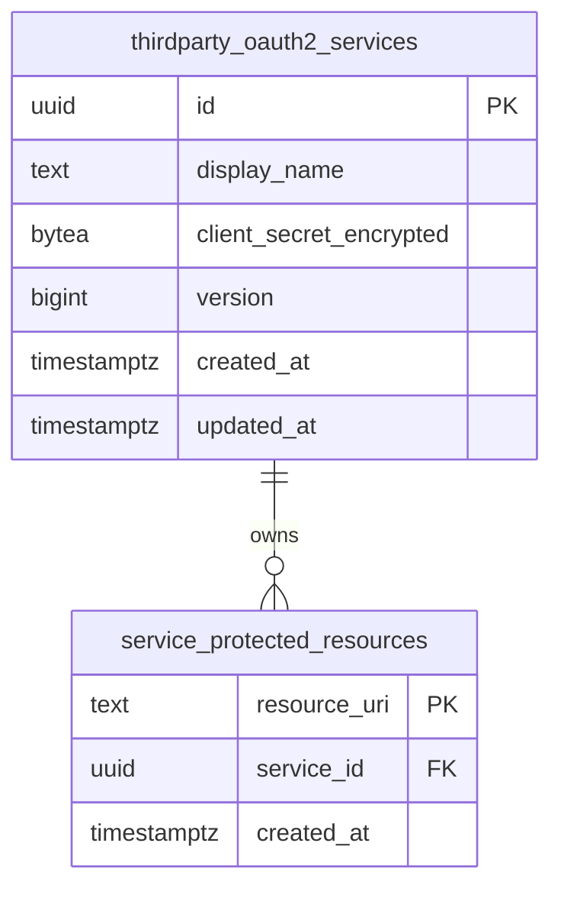

# Phase 1 Data Model: Protected Resource Subresources

**Feature**: 035-protected-resource-subresources
**Inputs**: [spec.md](./spec.md), [research.md](./research.md)

## Entities

### ThirdpartyOAuth2ProviderEntity (existing — modified)

`internal/domain/model/thirdparty_oauth2_provider.go`. The external OAuth2 provider aggregate root. It
**owns** an unordered set of unique protected resources. Unchanged fields (`ID`, `DisplayName`,
`ClientID`, `Secret`, `Flavor`, `IssuerURI`, `Discovery`, `Endpoints`, `Scopes`, `AuthorizationParams`,
`ServiceRequirements`, `CreatedAt`, `UpdatedAt`) keep their current semantics.

| Field | Type | Change | Notes |
|---|---|---|---|
| `ProtectedResources` | `[]string` | retained | In-memory representation of the owned set. Adapters now materialize it from / persist it to the `service_protected_resources` child table instead of a `TEXT[]` column. Always normalized. |
| `Version` | `int64` | **new** | Optimistic-concurrency counter. Starts at `1`; incremented on every mutation of the service or its resource set. Exposed to clients as the strong `ETag`. Read-only to clients. |

`ProtectedResources` remains the value used by full-service `Create`/`Update` (whole-set write) and by
`Get`/`List` (whole-set read). Single-resource operations do **not** round-trip the whole slice.

### ProtectedResource (new — persistence entity, child of the provider aggregate)

A protected resource has **no attributes other than its URI** (spec Assumption §Modify semantics). Its
identity **is** its normalized URI; there is no synthetic identifier.

| Column | Type | Constraints |
|---|---|---|
| `resource_uri` | `TEXT` | `PRIMARY KEY` — globally unique across all services |
| `service_id` | `UUID` | `NOT NULL`, `REFERENCES thirdparty_oauth2_services(id) ON DELETE CASCADE` |
| `created_at` | `TIMESTAMPTZ` | `NOT NULL DEFAULT now()` |

Secondary index: `INDEX (service_id)` for list-by-service and cascade deletion.



## Validation Rules

Applied per URI, identical to the current full-service path (spec FR-005/FR-006; parity with
`model.ValidateProtectedResources` at `internal/domain/model/thirdparty_oauth2_provider.go:359-374`):

- **Normalize first**: `urivalidation.NormalizeResourceURI` (trailing-slash trim on the path; query and
  fragment preserved — `internal/domain/urivalidation/resource.go:10`). Storage and matching always use
  the normalized form.
- **Absolute URI required**: `url.Parse` must succeed and yield a non-empty `Scheme` **and** `Host`.
  Empty, whitespace-only, relative, or malformed values are rejected with a validation error and **no
  state change** (FR-006, SC-006).
- **Rename target** (`to`) is validated and normalized identically before any write.

## State Transitions (single-resource operations)

Let `R` = the target service's resource set; `G` = the global set of `(resource_uri → owning service)`.

| Op | Precondition | Effect | Result |
|---|---|---|---|
| **Add** `u` | service exists; `u` valid | if `u ∈ R` → no-op; else if `u` owned by another service → reject; else insert `u`, bump `version` | `201` added / `200` idempotent / `409` conflict / `400` invalid / `404` no service |
| **Remove** `u` | service exists; `u ∈ R` | delete `u`, bump `version` | `200` / `404` not on service / `404` no service |
| **Rename** `a→b` | service exists; `a ∈ R`; `b` valid | if `a == b` → no-op success; else if `b` owned (any service, incl. same) → reject; else delete `a` + insert `b`, bump `version` | `200` / `409` conflict / `404` `a` absent / `400` invalid / `404` no service |
| **List** | service exists | read set | `200` `{protected_resources[]}` + `ETag` / `404` no service |

All mutating transitions run in **one storage transaction** and increment the service `version`.

## Concurrency Invariants (spec FR-007, FR-011, FR-015)

1. **Global uniqueness** — enforced by `PRIMARY KEY (resource_uri)`. Concurrent claims of the same new
   URI: one `INSERT` wins, the other gets `23505` → `StorageError{Kind: Conflict}` → `409`. Holds for
   both single-resource **and** full-service-replacement paths (both insert through the constraint).
2. **No lost updates among single-resource ops** — add/remove/rename are single-row writes keyed by
   `resource_uri`; concurrent ops on *different* resources of the same service commit independently.
3. **Full-set replacement safety** — `PUT` that includes `protected_resources` performs, in one
   transaction: `UPDATE … SET version = version + 1, updated_at = now() WHERE id = $id AND version = $ifMatch`
   (0 rows ⇒ `412`); `DELETE` the service's child rows; `INSERT` the payload set. A single-resource op
   committing in between bumps `version`, so the stale replacement's CAS fails (`412`) instead of
   silently erasing the delta.
4. **Adapter parity** — the in-memory adapter reproduces (1)–(3) with a `resourceOwners
   map[string]id.ServiceID` and an `int64` version per service, all mutated under the existing
   `sync.RWMutex`.

## Port / Repository Surface

Additions to `ports.ThirdpartyOAuth2ProviderRepository` (`internal/ports/thirdparty_provider.go`):

```go
// AddProtectedResource atomically claims resourceURI for serviceID.
// Returns added=false when the service already owns it (idempotent success).
// Errors: StorageError{Kind: Conflict} if another service owns it;
//         StorageError{Kind: NotFound} if the service does not exist.
AddProtectedResource(ctx context.Context, serviceID id.ServiceID, resourceURI string) (added bool, err error)

// RemoveProtectedResource atomically releases resourceURI from serviceID.
// Errors: StorageError{Kind: NotFound} if the service or the resource is absent.
RemoveProtectedResource(ctx context.Context, serviceID id.ServiceID, resourceURI string) error

// RenameProtectedResource atomically replaces fromURI with toURI on serviceID.
// Errors: Conflict if toURI is owned (incl. same service); NotFound if service or fromURI absent.
RenameProtectedResource(ctx context.Context, serviceID id.ServiceID, fromURI, toURI string) error

// ListProtectedResources returns the service's normalized resource URIs.
// Errors: StorageError{Kind: NotFound} if the service does not exist.
ListProtectedResources(ctx context.Context, serviceID id.ServiceID) ([]string, error)
```

Modified existing methods:
- `Create` / `Update` write the child set (and `version`) alongside the service row within a transaction.
- `Update` gains an optimistic precondition: `Update(ctx, entity, expectedVersion *int64) error` — `nil`
  means the resource set is **not** being replaced (no CAS); non-`nil` means replace-with-CAS. Domain
  service `ThirdpartyOAuth2ProviderService.Update` threads the same parameter.
- `Get` / `List` populate `entity.ProtectedResources` and `entity.Version` from storage.
- `FindByProtectedResource` resolves via `service_protected_resources` (unique lookup; the ambiguous /
  multi-match branch is removed).

## Domain Service

Single-resource orchestration (validation → normalization → repository call → response assembly) lives in
the domain layer — `ThirdpartyOAuth2ProviderService` (`internal/domain/thirdparty/service.go`) gains
`AddProtectedResource` / `RemoveProtectedResource` / `RenameProtectedResource` / `ListProtectedResources`
so handlers stay thin (Constitution VI). These reuse the per-URI validation/normalization already in the
model. They do **not** touch `Secret`, branch keys, or encryption (FR-012).

## Error → HTTP Mapping

| Domain condition | `StorageError.Kind` / error | HTTP |
|---|---|---|
| Invalid / relative / empty URI | validation | `400` |
| URI owned by another service | conflict | `409` |
| Rename target already present | conflict | `409` |
| Resource not on service (remove/rename) | not_found | `404` |
| Service does not exist | not_found | `404` |
| `If-Match` absent on replacing PUT | precondition required | `428` |
| `If-Match` stale on replacing PUT | precondition failed | `412` |
| Add of already-owned URI (same service) | — | `200` (idempotent) |

## Migration `028_normalize_service_protected_resources`

`/migrations/028_normalize_service_protected_resources.{up,down}.sql` (go-migrate; after main-line migration `027_add_profile_to_oauth2_codes`).

The migration is **fail-closed**: it aborts unless every legacy value is provably canonical and free of
collisions, before any destructive DDL. The Go normalizer's *only* transformation is trimming trailing
`/` from the escaped path (query/fragment preserved — `internal/domain/urivalidation/resource.go:10`), so
a value is canonical **iff its path segment does not end in `/`** — a condition SQL can check exactly for
well-formed URIs (all stored rows are validated absolute URIs, FR-006). Every write path already
normalizes before persisting (`internal/domain/thirdparty/service.go:87,200`;
`internal/adapters/http/handlers/admin/services_handler.go:203,361`), so in practice no row is flagged.

**up (every check precedes destructive work):**
1. `ADD COLUMN version BIGINT NOT NULL DEFAULT 1` on `thirdparty_oauth2_services`.
2. `CREATE TABLE service_protected_resources` (PK `resource_uri`, FK `service_id … ON DELETE CASCADE`,
   `INDEX(service_id)`).
3. **Canonicality preflight** (`DO $$ … $$`, before any `DROP`): over `(id, unnest(protected_resources))`,
   first `RAISE EXCEPTION` on any value not matching the absolute-URI shape
   `^[a-zA-Z][a-zA-Z0-9+.\-]*://[^/?#]+` (nothing is silently accepted when authority/path/query/fragment
   cannot be separated). Then extract the path with
   `regexp_replace(regexp_replace(u, '^[^:]+://[^/?#]*', ''), '[?#].*$', '')` and `RAISE EXCEPTION` listing
   every value whose path matches `/$` — **including a bare root slash** (`https://x/` → `https://x`),
   which the Go normalizer trims and is therefore non-canonical. This exactly detects the sole
   transformation the normalizer performs; a match means legacy non-canonical data (e.g. `https://x/`
   beside `https://x`) an operator must canonicalize before 027 is retried.
4. **Collision preflight** (same block): `RAISE EXCEPTION` listing any value owned by more than one
   service, or appearing more than once within one service's array. After step 3 all values are canonical,
   so two values collide under normalization iff they are byte-equal — byte-equality grouping is therefore
   now exact.
5. Backfill verbatim: `INSERT INTO service_protected_resources (resource_uri, service_id)
   SELECT DISTINCT u, s.id FROM thirdparty_oauth2_services s, unnest(s.protected_resources) u`. The
   `PRIMARY KEY` is the final backstop if a preflight is ever bypassed.
6. `DROP INDEX idx_thirdparty_oauth2_services_protected_resources`;
   `ALTER TABLE thirdparty_oauth2_services DROP COLUMN protected_resources`.
- **down**: re-add `protected_resources TEXT[]` + GIN index; backfill via `array_agg` from the child
  table; `DROP TABLE service_protected_resources`; `DROP COLUMN version`.

Both directions tested for clean apply + rollback + repeat (Constitution IX).
