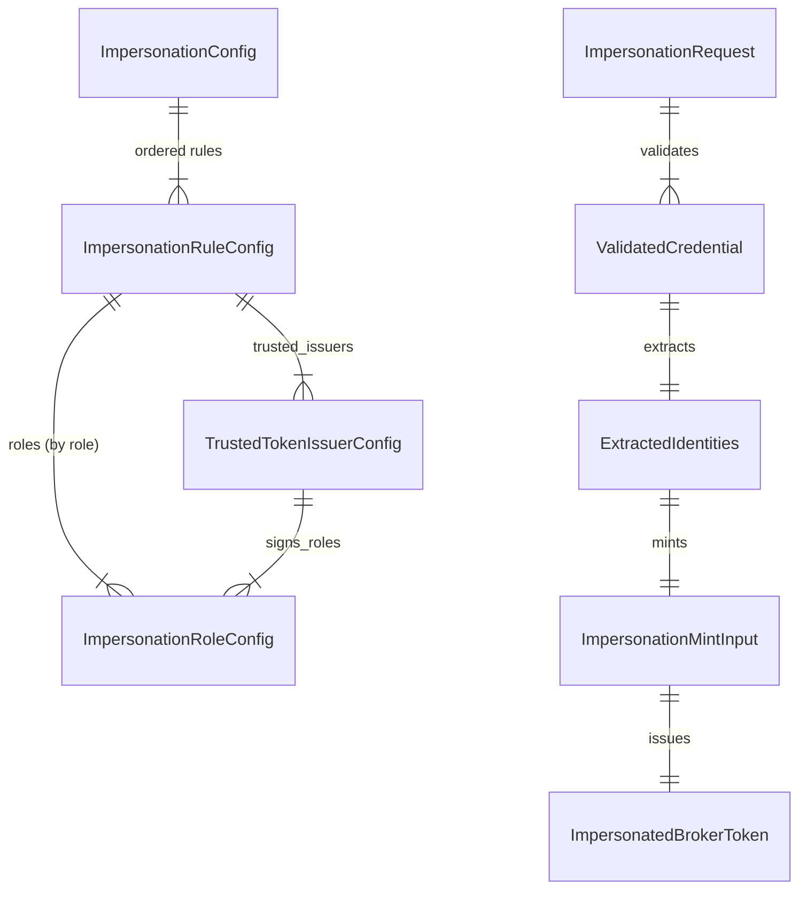

# Phase 1 Data Model: OAuth2 User Impersonation

**Feature**: 037-oauth2-user-impersonation
**Date**: 2026-08-25
**Spec**: [spec.md](spec.md) | **Research**: [research.md](research.md)

Impersonation adds no new persisted entity or migration. Each request resolves an existing typed
`storage.Agent` from the audience suffix; configuration and in-flight domain values live in
`internal/domain/impersonation/` and `internal/ports/config.go`.

---

## 1. Configuration entities (startup-validated)

All under `oauth2_authorization_server.impersonation` (`mapstructure` keys shown). Validation
failures produce indexed `domain/config.ConfigError`.

### ImpersonationConfig
`internal/ports/config.go` — optional `*ImpersonationConfig` on `OAuth2AuthServerConfig`.

| Field | mapstructure | Type | Rules |
|---|---|---|---|
| AudiencePrefix | `audience_prefix` | string | REQUIRED absolute HTTP(S) routing URI with host, no userinfo/query/fragment/trailing slash. It is not an issued-token audience. |

Cross-field startup rules: present only in `local` mode (CR-006); rejected in proxy/hybrid.

### ImpersonationRuleConfig

| Field | mapstructure | Type | Rules |
|---|---|---|---|
| Name | `name` | string | REQUIRED, unique across rules (CR-003). Operator-facing; appears in audit. |
| Roles | `roles` | `map[string]ImpersonationRoleConfig` | REQUIRED. Keyed by role name (`client_assertion`\|`actor`\|`subject`); keys outside that set rejected. MUST define all three roles (CR-003). Map keying makes a duplicate role unrepresentable. |
| TrustedIssuers | `trusted_issuers` | `[]TrustedTokenIssuerConfig` | REQUIRED, non-empty. Trust anchors only; each declares which roles it may sign (CR-008). |
| Authorization | `authorization` | `AuthorizationConfig` | REQUIRED. Reuses the token-exchange type verbatim: `type: cel` + `cel.expression` + `cel.evaluation_timeout` (CR-005). Exactly one predicate; compiles at startup. If the subject role sets `verification: none`, MUST reference `subject_token` (FR-007a, CR-005a). |

Startup rules: within a rule, `issuer_uri` unique across `trusted_issuers` and every `signs_roles`
entry covered/consistent (CR-008); the configured local issuer MUST NOT sign the `client_assertion`
role (CR-004).

### ImpersonationRoleConfig
Value under `rules[].roles[<role>]`. Role semantics declared once per role (hoisted out of the
issuer so a per-role `expected_audience`/extraction is not duplicated per issuer).

| Field | mapstructure | Type | Rules |
|---|---|---|---|
| Verification | `verification` | string | `subject` role only. `jwks` (default) = signed subject validated against a trusted issuer; `none` = unsigned unverified subject (FR-003d, ADR 031). Rejected on `client_assertion`/`actor`. |
| ExpectedAudience | `expected_audience` | string | REQUIRED when `verification` is `jwks` (per-role expected `aud`, may differ per role); FORBIDDEN when `none` (CR-003). |
| PrincipalExpression | `principal_expression` | string (CEL) | REQUIRED. Extracts the non-empty identity from claims (FR-006). Matches `ClaimExtractionConfig.PrincipalExpression`. |
| EmailExpression | `email_expression` | string (CEL) | Optional, `subject` role only. Extracts optional email (FR-006a). |

### TrustedTokenIssuerConfig

| Field | mapstructure | Type | Rules |
|---|---|---|---|
| IssuerURI | `issuer_uri` | string | REQUIRED, HTTPS (unless third-party HTTPS validation disabled). Matched against credential `iss`. |
| JWKSURI | `jwks_uri` | string | Optional; when absent, discovered from issuer metadata (ADR 029 pattern). |
| JWKSMinRefresh | `jwks_min_refresh` | duration | Optional; default 15m. |
| JWKSMaxRefresh | `jwks_max_refresh` | duration | Optional; default `max(min, 1h)`. |
| AllowedAlgorithms | `allowed_algorithms` | `[]string` | REQUIRED, non-empty; subset of `{RS256,RS384,RS512,PS256,PS384,PS512,ES256,ES384,ES512,EdDSA}`; `none` and `HS*` rejected (CR-007). |
| SignsRoles | `signs_roles` | `[]string` | REQUIRED, non-empty. Signed roles this issuer may sign; subset of the rule's signed roles; MUST NOT include a `subject` whose `verification` is `none` (CR-008). |

### CredentialRole (enum)
`client_assertion`, `actor`, `subject`. Used as the `roles` map key, for issuer `signs_roles`
matching, and audit.

---

## 2. In-flight domain value objects

### ImpersonationRequest
Parsed only after target resolution from a single audience exactly equal to
`<impersonation.audience_prefix>/<canonical AgentID>`. A bare/malformed/noncanonical suffix is
`invalid_request`; a canonical missing agent is `invalid_target`. The resolved `Target{Agent}`
supplies target policy context and minted `agent_id`.

| Field | Source param | Rules |
|---|---|---|
| Audience | `audience` | Exactly one suffixed routing URI; never copied to token `aud`. |
| ClientAssertion / Type | `client_assertion` / `client_assertion_type` | Non-empty JWT bearer assertion. |
| ActorToken / Type | `actor_token` / `actor_token_type` | Non-empty RFC 8693 JWT. |
| SubjectToken / Type | `subject_token` / `subject_token_type` | RFC 8693 JWT: signed, or unsigned `alg:none` when the matching rule declares `verification: none`. |
| RequestedTokenType | `requested_token_type` | Optional access-token type only. |
| Scope / Resource | `scope` / `resource` | Scope is optional and split on literal spaces; every requested value must be permitted by the resolved target agent's `AllowedScopes` unless the allow-list is empty or the value is a reserved refresh-token scope. Resource MUST be absent. |

Credential parameters are singleton and non-empty; legacy defaults do not apply.

### ValidatedCredential (per role)
Output of signed validation or unverified parse.

| Field | Notes |
|---|---|
| Role | `client_assertion` \| `actor` \| `subject`. |
| Claims | `map[string]interface{}` (dynamic), from `jwtToClaims` or unverified parse. |
| Issuer | Matched trusted-issuer identifier (empty for unverified). |
| Unverified | bool (subject role only). |

### ExtractedIdentities

| Field | Rules |
|---|---|
| PrivilegedClient | non-empty (FR-006). |
| Actor | non-empty → `act.sub` (FR-006/FR-008). |
| ActorIssuer | validated actor-token issuer → `act.iss` (FR-008). |
| Subject | non-empty → `sub` (FR-006). |
| SubjectEmail | optional; present only when extracted AND (signed subject OR predicate binds `subject_token.email`) (FR-006a). |

Invariant: actor == subject permitted; yields `act.sub == sub` (FR-006, clarification).

### RuleMatchResult
Per-rule evaluation outcome, feeding first-match selection and no-match precedence (FR-004a).

| Value | Meaning |
|---|---|
| Matched | all credentials validated AND predicate true → select, stop. |
| CredentialsValidPredicateFalse | all credentials validated, predicate false → contributes `access_denied` on exhaustion. |
| InvalidClientAssertion | client assertion failed → contributes `invalid_client`. |
| InvalidActorOrSubject | actor/subject failed or malformed → contributes `invalid_request`. |

No-match precedence is order-independent: `access_denied` > `invalid_request` > `invalid_client`.

### ImpersonationMintInput
Input to `ports.ImpersonationTokenIssuer.IssueImpersonationToken`.

| Field | Maps to token/context |
|---|---|
| Subject | `sub` via principal context |
| Email | optional local-policy input |
| Actor | `act.sub` |
| ActorIssuer | validated actor-token issuer → `act.iss` |
| TargetAgent | registered target supplying `agent_id`, local CEL `agent.*`, and `AllowedScopes` policy |
| Scopes | validated requested values assigned to the synthetic requester's requested and granted scopes |

Local token claims policy exclusively owns emitted `aud` and may omit it. The normal local mint path
writes the granted scopes to the JWT `scope` claim; the RFC 8693 response includes non-empty granted scope.

### ImpersonationAuditEvent
Structured `slog` event `impersonation_decision` (FR-012). Fields per research R9; NEVER contains
credential values, key material, or wholesale claims (SC-005).

---

## 3. Relationships (ER)



## 4. Selection & minting flow

```mermaid
sequenceDiagram
    participant C as Privileged Client
    participant H as TokenHandler
    participant S as ImpersonationService
    participant V as SignedValidator
    participant E as CEL Evaluator
    participant I as Local Issuer
    C->>H: POST /oauth2/token (audience=<audience_prefix>/<canonical AgentID>)
    H->>H: resolve registered Target{Agent}; reject malformed or missing targets
    H->>S: ImpersonationRequest + Target
    loop rules in order
        S->>V: validate client_assertion, actor, signed subject
        S->>S: parse unverified subject if applicable
        S->>E: evaluate predicate with target request context
        alt all valid AND predicate true
			S->>I: IssueImpersonationToken(sub, act.iss/act.sub, target agent, email?, scopes)
			I-->>S: normal local-policy signed token (granted scope; aud policy-owned)
            S-->>H: success
        else non-match
            S->>S: record outcome, fall through
        end
    end
    H-->>C: RFC 8693 response OR error (precedence) + audit event
```
